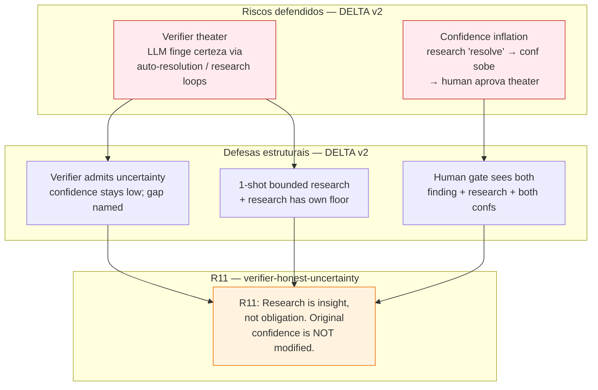

# 08 — Critical Rules (auto-grill v2)

## Resumo

Auto-grill v2 herda **R1-R10** do v0.2 (sem mudança) e adiciona **R11** (verifier-honest-uncertainty).

| Regra | Defesa | Mudou em v2? |
|---|---|---|
| R1-R10 | (10 regras herdadas — ver diagram original) | **Não** |
| R11 | Verifier admite incerteza estruturalmente; research é insight, não fix | **Nova em v2** |

O diagrama foca no delta: como R11 ataca o risco theater que v0.2 não cobria explicitamente.

---

## Diagrama — risco → defesa → regra (DELTA v2)

**Leitura:** dois novos riscos (r_theater, r_inflate) que R11 ataca. Os riscos são **específicos do anti-pattern** que LLMs (e o designer do skill) podem cair: tentar resolver em vez de admitir.

---

## R11 em detalhe

| # | Regra | Defesa contra | Risco se removida |
|---|-------|---------------|-------------------|
| **R11** | Verifier admite incerteza estruturalmente. Research é insight, não fix. Original confidence NÃO é modificado. 1-shot bounded. | Verifier theater (autoconfirmação via auto-resolution ou research loops) | Skill vira "pesquise até ficar confiante" — loop infinito de theater; human gate recebe `conf=high` falsamente inflado e aprova |

---

## Por que R11 é estrutural (não aspiracional)?

| Tentativa | Falha |
|---|---|
| Confiar que o agente "vai admitir incerteza" | LLMs inferem por default. Sem constraint no prompt + cap no fluxo, regra degrada em 30-50% das runs. |
| Documentar como "best practice" | Best practices são opcionais. R11 é inviolável. |
| Validar depois | Auto-resolution "validada depois" = autoconfirmação já aconteceu. Tem que ser estrutural no fluxo, não checkpoint. |

R11 é implementada como:

- **Constraint no prompt** — Insight Researcher template tem "informational, NOT a fixer" + "do NOT modify the original confidence" (ver `prompts/insight-researcher.md`).
- **Constraint no orchestrator** — sanity check antes de dispatch ("`--auto-research-insight` flag ON AND conf < floor AND research count < cap"). Sanity check depois ("record verbatim; do NOT modify confidence").
- **Bounded by default** — `--max-research-per-finding=1` (default). Recursion opt-in (`--research-recursion=allowed`).

---

## O que acontece se você remove R11

Você habilita `--auto-research-insight` sem a regra R11. O Insight Researcher começa a "ajudar" o Proxy — busca fontes primárias, encontra algo, infere confidence baseado em quão "completa" a busca foi, e devolve `INSIGHT_CONFIDENCE: high` mesmo quando o gap original era `low`. O orchestrator aceita e **sobrescreve** a confidence original. Human gate vê `conf=high` e aprova theater. Skill virou "pesquise até parecer bom".

---

## O que acontece se você remove APENAS o "no recursion" constraint

Você mantém R11 mas permite research loop. Researcher retorna `NO_EVIDENCE`. Orchestrator dispatcha de novo (até cap). Segundo researcher também retorna `NO_EVIDENCE`. Loop até cap. Cada iteração custa 30-90s + 2-5k tokens. Em run longa com 10+ findings low/medium, latency explode. Dumb Zone guard (R5) ainda é backstop genérico, mas a etiologia é diferente: research loop é R11 violation, não Dumb Zone.

---

## R1-R10 (herdadas de v0.2)

Sem mudança. Ver `.claude/skills/auto-grill/diagrams/08-critical-rules.md` para o diagrama completo. Resumo:

| # | Regra | Defesa |
|---|-------|--------|
| R1 | One question per round | Compromissos vagos |
| R2 | Every Q carries recommendation | Decisões não-testáveis |
| R3 | Proxy NO_EVIDENCE → low | Autoconfirmação |
| R4 | Floor 0.7 hard | Autoconfirmação + cache key |
| R5 | 100k token cap + --max-rounds | Dumb Zone |
| R6 | Never edit target | Hot-path IO leak |
| R7 | Fresh sub-agents | Carry-over bias |
| R8 | Loop state persisted | Resume context loss |
| R9 | CONTEXT.md mandatory | Vocabulário alucinado |
| R10 | Farol stable IDs checked | Doc drift |

---

## Ver também

- [15-honest-uncertainty.md](./15-honest-uncertainty.md) — diagrama do state machine + decision tree + gate output.
- [../SKILL.md](../SKILL.md) — fonte canônica das 11 regras.
- [../prompts/insight-researcher.md](../prompts/insight-researcher.md) — sub-agent prompt com constraints R11.
- [../../auto-grill/diagrams/08-critical-rules.md](../../auto-grill/diagrams/08-critical-rules.md) — diagrama v0.2 original (R1-R10).