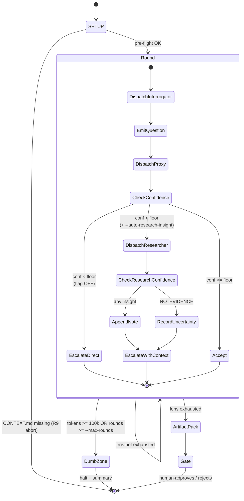
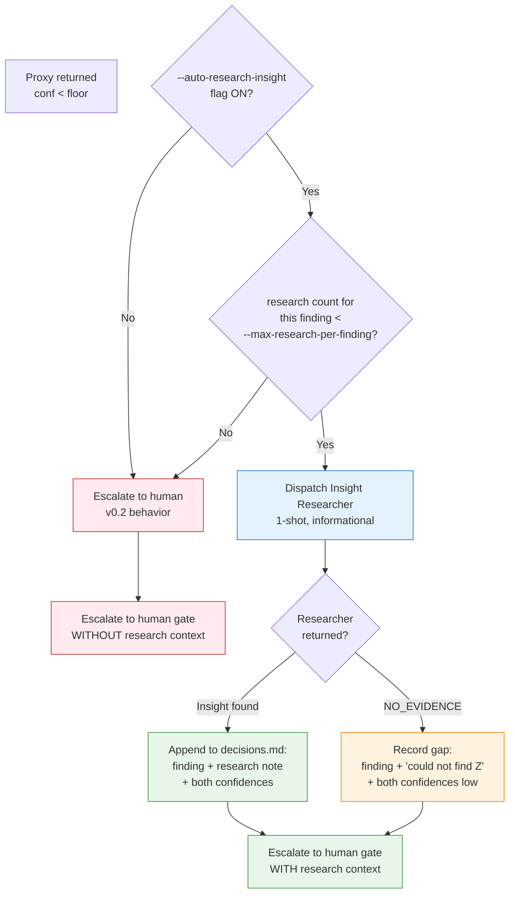

# 15 — Honest Uncertainty path (R11) — auto-grill v2

## Resumo

Este diagrama é a **única adição comportamental** do auto-grill v2 em relação ao v0.2. Tudo o mais (lenses, SETUP, sub-agent discrimination, gate contract) é herdado. O que muda é o que o orchestrator faz quando o Stakeholder Proxy retorna `low` ou `medium` confidence.

**v0.2 (sem flag):** `conf < floor` → escalate to human (blind).
**v2 (com `--auto-research-insight`):** `conf < floor` → dispatch Insight Researcher (1-shot) → append research note → escalate to human WITH context.

**Invariante crítica:** research NÃO modifica o confidence original. Human gate vê `conf=low` + research note (com seu próprio `INSIGHT_CONFIDENCE`) lado a lado. Sem inflation, sem hidden work.

---

## Diagrama 1: State machine com Honest Uncertainty path



**Leitura:** o nó `CheckConfidence` tem 3 saídas no v2 (vs 2 no v0.2). A saída do meio (DispatchResearcher) só é tomada quando o flag está ON. Caso contrário, cai direto em `EscalateDirect` (comportamento v0.2).

---

## Diagrama 2: Decision tree no CheckConfidence (v2)



**Leitura:**

- **Azul:** o novo caminho (Insight Researcher dispatch).
- **Verde:** chegada bem-sucedida ao gate COM contexto.
- **Laranja:** gap honesto (research também não achou).
- **Vermelho:** comportamento herdado do v0.2 (escalation cega).

**Invariante:** o nó final é sempre `Gate` (humano decide). O que muda é **com quanto contexto** o humano chega ao gate.

---

## Diagrama 3: Saída do gate — finding + research note lado a lado

```mermaid
flowchart LR
    subgraph DecisionsRow[decisions.md row #N]
        direction LR
        Col1["#: 7"]
        Col2["Lens: Cache Determinism"]
        Col3["Decision: spec missing<br/>tiebreak for RRF ties"]
        Col4["Conf: baixa ⚠"]
        Col5["Research Note:<br/>'WebSearch no canonical<br/>guidance; 3 secondary<br/>sources; spec gap real'"]
        Col6["Insight Conf: low"]
    end

    subgraph ResearchFile[research.md section #N]
        direction TB
        Original["Original finding (conf: baixa):<br/>spec missing tiebreak"]
        Insight["Insight Researcher note (conf: low):<br/>NO_EVIDENCE for canonical RRF tiebreak.<br/>WebSearch 'RRF tiebreak':<br/>- Source A: blog post (secondary)<br/>- Source B: blog post (secondary)<br/>- Source C: blog post (secondary)<br/>No official doc / RFC / paper found."]
        Sources["Sources cited:<br/>(none primary)"]
    end

    subgraph Gate[Human gate sees]
        direction TB
        Both[Finding + Research + Both confidences<br/>= full epistemic context]
        DecisionPath{Human decides}
        DecisionPath --> Approve[Approve<br/>'accept gap as known limitation'"]
        DecisionPath --> Reject[Reject<br/>'spec must add tiebreak<br/>before any implementation'"]
        DecisionPath --> Loop[Loop branch<br/>'more rounds on cache lens'"]
    end

    DecisionsRow --> Gate
    ResearchFile --> Gate

    style Col4 fill:#ffebee,stroke:#c62828
    style Col6 fill:#ffebee,stroke:#c62828
    style Insight fill:#fff3e0,stroke:#f57c00
    style Both fill:#e8f5e9,stroke:#388e3c
```

**Leitura:** o gate recebe **dois sinais** (decisions.md row + research.md section), ambos com suas próprias confidences. Nenhum é escondido. Nenhum é inflado. O humano decide com base em **evidência visível**, não em signal artificial de confidence.

---

## Por que isso NÃO é theater

| Theater mode | Honest Uncertainty mode |
|---|---|
| Research tenta resolver → confidence sobe → find "fechado" | Research documenta o gap → confidence fica low → find fica low + note |
| Research loopa até cap tentando ficar "certo" | Research é 1-shot bounded; researcher também pode retornar `NO_EVIDENCE` |
| Human gate vê "conf=high, all green" | Human gate vê `conf=low + research: "couldn't find X"` lado a lado |
| Verifier que "sabe tudo" via back-channel | Verifier que admite o que não sabe; traz contexto sem fingir |

A diferença é **epistemológica**, não procedural. O diagrama é o mesmo (decision tree), o que muda é a **atitude do verifier**: admitir em vez de resolver.

---

## Ver também

- [SKILL.md §Round Protocol — Honest Uncertainty path](../SKILL.md) — prosa canônica.
- [SKILL.md §Critical rules — R11](../SKILL.md) — regra estrutural.
- [prompts/insight-researcher.md](../prompts/insight-researcher.md) — sub-agent prompt template.
- [diagrams/08-critical-rules.md](./08-critical-rules.md) — diagram de risks/defenses (R11 entra aqui quando v0.2 virar default).
- [diagrams/11-round-protocol.md](./11-round-protocol.md) — round protocol herdado de v0.2.