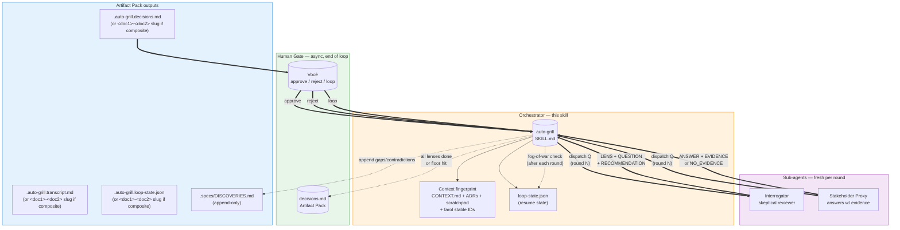

# 01 — Arquitetura

## Resumo

O `auto-grill` opera em **3 atores** com fronteiras estritas:

- **Orchestrator** (esta skill) — coordena. Carrega contexto, dispatcha sub-agents em pares Q/R por round, sintetiza Artifact Pack, gateia aprovação humana.
- **Interrogator** (sub-agent fresh) — emite UMA pergunta por turno, sempre com recomendação. Faz fact-finding no filesystem antes de perguntar.
- **Stakeholder Proxy** (sub-agent fresh) — responde a pergunta usando CONTEXT.md + ADRs + scratchpad + farol stable IDs. **Nunca inventa** — se não tem evidência, retorna `NO_EVIDENCE`.
- **Human Gate** (você) — só entra no fim, aprovando/rejeitando/loopando itens da tabela de decisões.

A diferença crucial pro `grill-with-docs` original: **humano sai do loop síncrono e vira revisor async do Artifact Pack**.

## Diagrama

## Fluxos chave (PT-BR)

### Orchestrator → Sub-agents

- Cada round = 2 dispatches (Interrogator, depois Proxy). Mesmo prompt template, fresh sub-agent.
- Sub-agents **não se veem entre si** — toda coordenação é responsabilidade do orchestrator.
- O orchestrator passa o `loop-state.json` resumido (última decisão, lens atual, transcript size) pra evitar drift entre rounds.

### Sub-agents → Orchestrator

- Interrogator retorna: `{LENS} → {QUESTION}` + recommendation compactos.
- Proxy retorna: `{ANSWER} [{confidence}] (evidence: <cite>)` ou `NO_EVIDENCE — <missing>`.
- **Proxy NUNCA inventa** — se faltar evidência, marca confidence=low e o orchestrator escala.

### Orchestrator → Human Gate

- O gate só dispara quando **todos os lenses exaustos** OU **confidence floor atingido em todas as decisões** OU **Dumb Zone (>100k tokens)** OU **`--max-rounds` cap atingido**.
- Human vê a tabela de decisões, não o transcript inteiro. Transcript fica em `<target>.auto-grill.transcript.md` pra auditoria.

### Human Gate → Orchestrator

- `approve` → fim do loop. Opcional: handoff pra `to-spec`/`to-tickets` (matt pocock).
- `reject` → o item rejeitado vira branch focada da próxima iteração (lê `loop-state.json`).
- `loop` → mantém o estado atual, deixa o usuário reavaliar depois.

## Por que 3 atores (e não 2 ou 4)?

| Tentativa | Falha |
|---|---|
| 2 atores (orchestrator + 1 agente que faz tudo) | O agente vai responder às próprias perguntas (autoconfirmação). É exatamente o bug que Matt Pocock alerta no original. |
| 4 atores (+ um "fact-checker" terceiro) | O fact-checker vira um terceiro LLM que precisa de gate próprio. Não adiciona informação nova, só multiplica pontos de falha. |

3 atores captura a separação real: **quem pergunta** (Interrogator) vs **quem responde** (Proxy) vs **quem valida** (você, no fim). O orchestrator coordena sem julgar.

## Ver também

- [02-flow.md](02-flow.md) — sequência dos 5 phases.
- [05-subagent-contracts.md](05-subagent-contracts.md) — formato exato dos prompts.
- [08-critical-rules.md](08-critical-rules.md) — regras que defendem contra autoconfirmação.
- [SKILL.md §How it works](../SKILL.md) — fonte canônica.