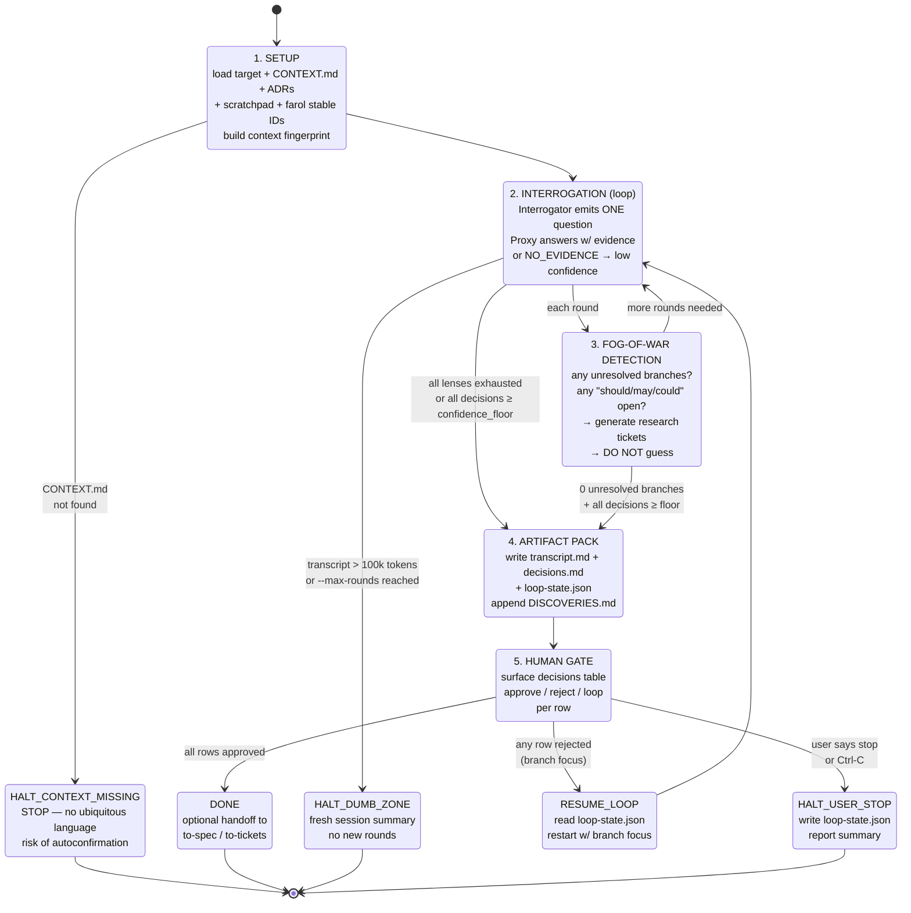

# 02 — 5-Phase Flow

## Resumo

O loop do `auto-grill` tem **5 phases canônicas** mais estados terminais (halt / gate / done). A fase 2 (INTERROGATION) é o único estado com self-loop (cada round adiciona uma pergunta/resposta ao transcript).

Phase picker: o orchestrator escolhe o lens ativo a cada round, ciclando pelos 8 lenses até exaustão (ver [03-lenses.md](03-lenses.md)).

## Diagrama

## Pontos chave (PT-BR)

### Phase 1 — SETUP

- Carrega target + contexto. Se `CONTEXT.md` não existe → **HALT_CONTEXT_MISSING** (skill aborta).
- **Workaround (2026-07-27):** se `CONTEXT.md` faltar mas você tiver `CLAUDE.md §Glossary` + product-specific glossary (e.g., `PRD.md §17`), construa temp `CONTEXT.md` antes do round 1. Sem isso, abort. Ver SKILL.md §SETUP pre-flight checklist.
- A defesa é estrutural: sem ubiquitous language, o Proxy vai inventar terminologia e o Interrogator vai concordar (risco autoconfirmação).

### Phase 2 — INTERROGATION (o loop)

- Cada round = 1 pergunta do Interrogator + 1 resposta do Proxy. Transcrição acumula.
- Pode bater Dumb Zone a qualquer momento (transcript >100k tokens) → halt + fresh-session summary.
- Pode bater `--max-rounds` cap (default 50) → halt com mesmo tratamento.
- Senão, transiciona pra Phase 4 quando todos os lenses exaustos OU todas as decisões ≥ floor.

### Phase 3 — FOG-OF-WAR

- Roda **depois de cada round** da Phase 2, não é um estado terminal.
- Detecta: branches sem resposta, modais abertos ("should/may/could"), termos fora do glossário.
- Se encontrar → gera research tickets (AFK) em vez de chutar.
- Se não encontrar E todas as decisões ≥ floor → vai pra Phase 4.

### Phase 4 — ARTIFACT PACK

- Escreve 4 arquivos:
  - `<target>.auto-grill.transcript.md` — log completo
  - `<target>.auto-grill.decisions.md` — tabela pergunta × decisão × analogia × confidence × tracer
  - `<target>.auto-grill.loop-state.json` — estado de resume
  - `.specs/DISCOVERIES.md` — append (gaps, contradições, termos)

### Phase 5 — HUMAN GATE

- Você vê a tabela de decisões. Pra cada linha: approve / reject / loop.
- `reject` → volta pra Phase 2 com foco na branch rejeitada (lê `loop-state.json`).
- `loop` → mantém estado pra você voltar depois.
- `halt_user_stop` → escreve estado, para.

## Saídas (terminators)

| Estado | Significado |
|---|---|
| `[*] → setup` | Entrada (loop start) |
| `done_all_approved → [*]` | Todos os itens aprovados, fim do loop |
| `dumb_zone → [*]` | Transcript >100k tokens, halt + summary |
| `halt_user_stop → [*]` | Você pediu pra parar |
| `context_missing → [*]` | `CONTEXT.md` não existe, skill aborta antes de começar |

## Comportamentos críticos

- **Fog-of-War é after-each-round, não terminal.** Pode disparar N vezes dentro do mesmo loop.
- **Halt é sempre gracioso.** `loop-state.json` é escrito antes de qualquer `[*]`.
- **Resume nunca perde contexto.** `loop-state.json` tem últimas N decisões, lens atual, transcript size.

## Ver também

- [01-architecture.md](01-architecture.md) — quem são os 3 atores.
- [03-lenses.md](03-lenses.md) — quais lenses o Interrogator cicla na Phase 2.
- [04-confidence.md](04-confidence.md) — o que significa "≥ floor".
- [07-loop-state.md](07-loop-state.md) — o contrato do `loop-state.json`.
- [SKILL.md §5-phase flow](../SKILL.md) — fonte canônica.