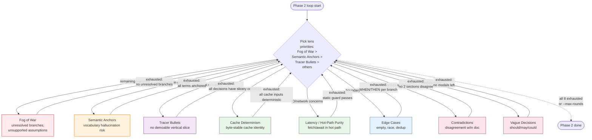

# 03 — Lenses

## Resumo

O Interrogator tem **8 lenses** que ele cicla durante a Phase 2 (INTERROGATION). Cada lens tem:

- **O que caça** — o tipo de gap/problema que a pergunta busca expor.
- **Critério de exaustão** — quando o orchestrator sabe que esse lens está "done" e pode passar pro próximo.
- **Origem** — de onde veio a ideia (Pocock / NotebookLM brainstorm / Memory Studio).

O Interrogator **NÃO** segue os lenses em ordem fixa; ele escolhe baseado no que sobrou da última round. Fog of War tem prioridade porque é o que detecta branches não-resolvidas.

## Diagrama

## Os 8 lenses em detalhe

| # | Lens | O que caça | Critério de exaustão | Origem |
|---|------|------------|----------------------|--------|
| 1 | **Fog of War** | Branches sem resposta, premissas sem suporte | 0 unresolved branches | NotebookLM brainstorm 2026-07-26 |
| 2 | **Semantic Anchors** | Termos não presentes em `CONTEXT.md` | Todos os termos do target são glossary-backed OU flagged | NotebookLM brainstorm 2026-07-26 |
| 3 | **Tracer Bullets** | Decisões que não traçam a uma vertical slice demoável | Toda decisão tem "→ slice: <demo>" | NotebookLM brainstorm + Waldemar |
| 4 | **Cache Determinism** | Decisões que quebram byte-stable cache identity (Memory Studio hot path) | Todos os inputs do cache key são determinísticos + sortáveis | Memory Studio PLAN §6 |
| 5 | **Latency / Hot-Path Purity** | Qualquer coisa que adicione `fetch()` / `await` / IO no hot path | Static guard test passa nos arquivos tocados | Memory Studio PLAN §6 |
| 6 | **Edge Cases** | Empty inputs, boundaries, races, dedup | Cada branch tem "WHEN X é edge, THEN Y" explícito | `tlc-spec-driven` discipline |
| 7 | **Contradictions** | Claims conflitantes dentro do doc | Nenhuma 2 seções discordam do mesmo fato | Pocock (implícito) |
| 8 | **Vague Decisions** | "should/may/could" sem commitment | Todos os modais viraram escolha explícita ou foram removidos | Pocock "fechar todos os ramos" |

## Fluxos chave (PT-BR)

### Priorização

O orchestrator **não** visita os lenses em ordem 1→8. A cada round, ele pergunta:

1. Fog of War tem branches abertas? → perguntar sobre isso
2. Senão, Semantic Anchors tem termos não-flagged? → perguntar
3. Senão, Tracer Bullets tem decisão sem slice? → perguntar
4. Senão, cicla pelos outros 5 lenses

Isso garante que **risco estrutural** (Fog of War) é tratado antes de **risco cosmético** (Vague Decisions).

### O que cada lens NÃO faz

- Fog of War NÃO inventa respostas — só detecta gaps e gera research tickets.
- Semantic Anchors NÃO adiciona termos ao glossário — só flagga os ausentes.
- Tracer Bullets NÃO cria slices — só verifica se as decisões existentes traçam.
- Cache Determinism NÃO roda o cache — só raciocina sobre o formato da chave.
- Hot-Path Purity NÃO executa o guard — só checa estaticamente o que o guard cobriria.
- Edge Cases NÃO escreve testes — só verifica que as branches estão documentadas.
- Contradictions NÃO edita o doc — só flagga conflitos pra você resolver.
- Vague Decisions NÃO escolhe entre opções — só flagga modais abertos.

### Quando parar de ciclar

- Todos os 8 lenses bateram seu critério de exaustão → Phase 2 done.
- `--max-rounds` cap atingido (default 50) → halt Dumb Zone.
- Transcript >100k tokens → halt Dumb Zone (mesmo tratamento).

## Por que 8 lenses (e não menos)?

| Tentativa | Risco |
|---|---|
| 3 lenses (Fog/Contradictions/Vague) | Cobre gaps textuais mas ignora semântica (Anchors), demoability (Tracer), e hot-path (Cache/IO). Auto-grill vira "grill-with-docs sem HITL". |
| 12 lenses | Lens creep. Cada lens novo adiciona rounds; lenses redundantes entre si (ex: Vague Decisions ⊂ Contradictions em alguns casos). |

8 cobre os 4 eixos: **texto** (Fog, Contradictions, Vague), **semântica** (Anchors), **execucionabilidade** (Tracer, Edge), **domínio Memory Studio** (Cache, Hot-Path).

## Ver também

- [02-flow.md](02-flow.md) — onde os lenses vivem no flow geral.
- [04-confidence.md](04-confidence.md) — como exaustão incompleta afeta o confidence de uma decisão.
- [08-critical-rules.md](08-critical-rules.md) — regra 7 (lens exhaustion ≠ permission to skip).
- [SKILL.md §Lenses](../SKILL.md) — fonte canônica.