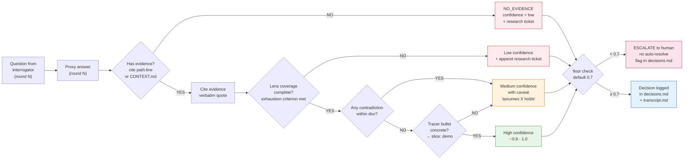

# 04 — Confidence Scoring

## Resumo

Cada resposta do Proxy vira uma **decisão** com um **nível de confidence** (high / medium / low). O nível é função de 4 critérios combinados: presença de evidência, cobertura do lens, contradições internas, e existência de tracer bullet concreto.

**Regra hard:** qualquer decisão com confidence < `confidence_floor` (default 0.7) → **ESCALATE obrigatório ao humano, sem auto-resolução**. Esse é o tripwire que ataca o "Risco de Autoconfirmação" flagado pelo NotebookLM brainstorm.

## Diagrama

## Os 4 critérios (em ordem de avaliação)

| # | Critério | Se falha | Confidence |
|---|----------|----------|------------|
| 1 | **Has evidence** (cite verbatim) | NO_EVIDENCE → low | sempre low |
| 2 | **Lens coverage** (exaustão) | ainda há branches | low |
| 3 | **No contradiction** within doc | 2 seções discordam | medium (com caveat) |
| 4 | **Tracer bullet** concreto | decisão sem "→ slice" | medium (com caveat) |

Só passa pra "high" quem **passa nos 4**.

## Mapping nível → score numérico

| Nível | Faixa | Significado |
|-------|-------|-------------|
| **High** | 0.9 – 1.0 | Ancorado em CONTEXT.md/ADR + tracer bullet + zero contradições |
| **Medium** | 0.7 – 0.9 | Ancorado mas com caveat explícito |
| **Low** | < 0.7 | Branch não resolvida, termo fora do glossário, ou Dumb Zone |

**Floor padrão: 0.7.** Ajustável via `--confidence-floor`. Subir o floor (ex: 0.85) = mais escalações, menos auto-resolução. Baixar (ex: 0.5) = mais permissivo, mas perde a defesa contra autoconfirmação.

## Por que o floor é hard, não advisory?

| Tentativa | Falha |
|---|---|
| Advisory floor ("log but proceed") | O orchestrator vai proceder toda vez que a decisão "parecer" boa o suficiente. O floor vira teatro. |
| Confidence = média das 4 | Mascara problemas: 1 critério "high" + 3 "low" ainda daria uma média aceitável, mas a decisão não é ancorada. |

Hard floor = se **qualquer** dos 4 critérios falha abaixo do limite, ESCALATE. Não tem média, não tem compensação.

## O que o human gate vê

A tabela `decisions.md` mostra o nível por linha. Linhas com confidence < floor vêm flagged com `⚠ escalate`. Você pode:

- **Aprovar mesmo flagged** (override humano) — registra no `loop-state.json`.
- **Rejeitar flagged** — volta pro loop focado na branch.
- **Não ver flagged** (passar pelo gate sem notar) — você perdeu o jogo, conforme o SKILL.md §Why this matters.

## Ver também

- [03-lenses.md](03-lenses.md) — o que é "lens coverage complete".
- [08-critical-rules.md](08-critical-rules.md) — regra R4 (floor hard).
- [SKILL.md §Confidence scoring](../SKILL.md) — fonte canônica.