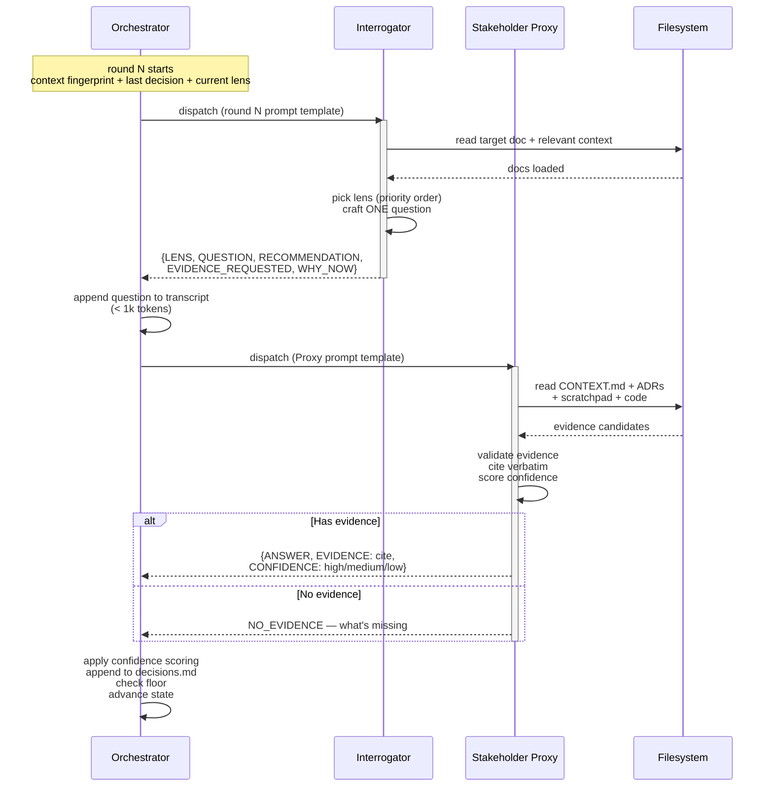

# 05 — Sub-agent Contracts

## Resumo

Cada round do auto-grill tem **dois dispatches** (Interrogator → Proxy). Os sub-agents:

- São **fresh a cada round** (contexto limpo, sem carry-over entre rounds).
- Recebem **prompt self-contained** (template fixo + contexto do round: lens ativo, decisão anterior, tamanho do transcript).
- Cumprem um **contrato de retorno** compacto e parseável.
- **Nunca se veem entre si** — toda coordenação é do orchestrator.

Esta página mostra o sequenceDiagram de 1 round e o formato exato dos 2 contratos.

## Diagrama — sequência de 1 round



## Contrato do Interrogator

**Input (prompt template):**

```
=== AUTO-GRILL — INTERROGATOR (round <N>) ===

ROLE: Skeptical reviewer. Question the target doc relentlessly.

# 1. Base engine
You are the Interrogator from `mattpocock-skills:grilling`. Apply:
- ONE question per turn (NEVER bundle).
- Every question carries a RECOMMENDATION.
- Facts vs Decisions split.

# 2. Target (single OR composite — read ALL listed before questioning)
- Doc 1: <absolute path>                    # required
- Doc 2: <absolute path>                    # only if composite; add Doc 3, 4 if more
- Treat as ONE spec. Cross-reference decisions across all listed docs.
- Lenses to cover this round: <list or "all remaining">
- Round: <N of N>
- Confidence floor: <0.7 default>

# 3. Question shape (always)
- LENS: <which lens>
- QUESTION: <one question, ≤ 30 words>
- RECOMMENDATION: <your best guess with rationale>
- EVIDENCE_REQUESTED: <what would make you confident —<br/>  CONTEXT.md? ADR? code:line?>
- WHY_NOW: <why this branch matters; what risk it carries>

# 4. Stop conditions (per-lens)
Refer to the lens table. Switch lenses when current is exhausted.

# 5. Global halt
- Transcript > 100k tokens → return HALT_DUMB_ZONE.
```

**Output (contrato de retorno):**

```
{LENS} → {QUESTION}
RECOMMENDATION: <best guess + rationale>
EVIDENCE_REQUESTED: <cite target>
WHY_NOW: <risk>
```

## Contrato do Stakeholder Proxy

**Input (prompt template):**

```
=== AUTO-GRILL — STAKEHOLDER PROXY (round <N>) ===

ROLE: Answer the Interrogator on behalf of the human.
You hold the project context.

# 1. Sources of truth (read on demand, NEVER fabricate)
- CONTEXT.md (ubiquitous language glossary — built per SETUP pre-flight if missing)
- docs/adr/*.md (architectural decisions)
- .scratch/ (working notes)
- .specs/ARCHITECTURE.md (farol stable IDs, if exists)
- <Doc 1 path>                             # required
- <Doc 2 path>                             # only if composite; add Doc 3, 4 if more
- code under src/

# 2. Answer shape (always)
- ANSWER: <the answer, ≤ 50 words>
- EVIDENCE: <path:line OR CONTEXT.md entry —<br/>  verbatim quote, never paraphrase>
- CONFIDENCE: <high | medium | low>
- IF LOW: <what's missing — what research ticket<br/>  or escalation would unblock?>

# 3. Hard rules
- NEVER answer without evidence. If you can't find<br/>  it, return NO_EVIDENCE.
- If you must invent, set confidence = low and the<br/>  orchestrator will escalate.
- Do NOT edit the target doc. You are a reader,<br/>  not a writer.
- If the question is a Decision (not a Fact), still<br/>  answer — but cite which ADR or CONTEXT.md term<br/>  it leans on. Pure inventions are forbidden.

# 4. Return contract
- "{ANSWER} [{confidence}] (evidence: <cite>)" OR
- "NO_EVIDENCE — <what's missing, what would unblock>"
```

**Output (contrato de retorno):**

Forma 1 (com evidência):

```
{ANSWER, ≤ 50 words} [{high|medium|low}]
(evidence: <path:line OR CONTEXT.md entry — verbatim quote>)
```

Forma 2 (sem evidência):

```
NO_EVIDENCE — <what's missing> + <what would unblock>
```

## Invariantes dos contratos

| Regra | Por quê |
|---|---|
| **Sub-agent não vê o chat pai** | Evita carry-over de raciocínio, força prompt self-contained |
| **Fresh a cada round** | Mesmo motivo — sem leakage de contexto |
| **Output ≤ limites (Q ≤ 30 words, A ≤ 50 words)** | Transcript cresce rápido; cap por round mantém o total gerenciável |
| **Evidence sempre verbatim** | Citações inventadas = autoconfirmação. Verbatim = auditável |
| **NO_EVIDENCE é primeira-classe** | Forçar uma resposta "provavelmente correta" é o caminho pra autoconfirmação |

## Ver também

- [01-architecture.md](01-architecture.md) — onde os sub-agents vivem na arquitetura.
- [02-flow.md](02-flow.md) — onde os rounds se encaixam no 5-phase flow.
- [04-confidence.md](04-confidence.md) — como o output do Proxy vira nível de confidence.
- [SKILL.md §Sub-agent prompt templates](../SKILL.md) — fonte canônica.