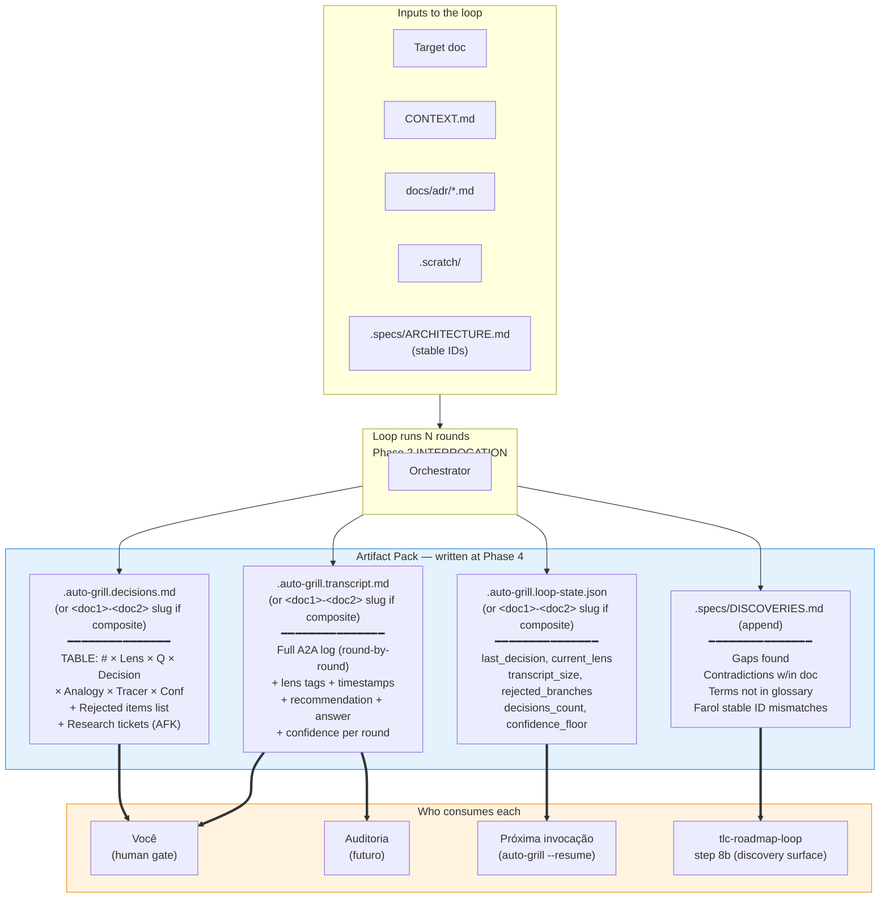

# 06 — Artifact Pack

## Resumo

Ao final da Phase 4 (ARTIFACT PACK), o orchestrator escreve **4 arquivos** com propósitos distintos:

| Arquivo | Propósito | Quem lê |
|---------|-----------|---------|
| `<target>.auto-grill.transcript.md` | Log completo A2A, audit-grade | Auditoria, você quando quiser drill down |
| `<target>.auto-grill.decisions.md` | Tabela pergunta × decisão × confidence | **Você no human gate** |
| `<target>.auto-grill.loop-state.json` | Estado de resume | Próxima invocação (ou `--resume`) |

**Composite target:** nome do arquivo vira `<doc1>-<doc2>.auto-grill.*.md` (ex: `PRD-PLAN.auto-grill.transcript.md`). Interrogator/Proxy citam `path:line` em ambos docs.
| `.specs/DISCOVERIES.md` (append) | Gaps / contradições / termos fora do glossário | Farol (`tlc-roadmap-loop` step 8b) |

## Diagrama



## Schema do `decisions.md` (o que você vê no gate)

```markdown
# Auto-Grill Decisions — <target path>

**Date:** <ISO>
**Confidence floor:** <0.7>
**Rounds run:** <N>
**Outcome:** <approved | pending-human | halted-dumb-zone>

| # | Lens | Pergunta | Decisão | Analogia (não-especialista) | Tracer Bullet | Confiança |
|---|------|----------|---------|----------------------------|---------------|-----------|
| 1 | Fog of War | <pergunta> | <resposta do Proxy> | <analogia em 1 frase> | → slice: <demo> | alta |
| 2 | Tracer Bullets | ... | ... | ... | ... | média |
| 3 | Semantic Anchors | ... | ... | ... | ... | baixa ⚠ escalate |

## Rejected items (restart loop with focus)
- <#5 — Vague Decisions: "should consider cache" → force explicit choice>

## Research tickets (AFK)
- <RT-1: confirm whether hot-path allows fetch() in error path>
```

## Schema do `loop-state.json`

```json
{
  "target": "<absolute path>",
  "started_at": "<ISO>",
  "last_round": 7,
  "current_lens": "Semantic Anchors",
  "transcript_size_tokens": 4321,
  "confidence_floor": 0.7,
  "decisions_count": 7,
  "decisions": [
    { "round": 1, "lens": "Fog of War", "question": "...", "answer": "...", "confidence": "high" },
    ...
  ],
  "rejected_branches": [],
  "halt_reason": null
}
```

## Schema do `transcript.md` (resumido)

Cada round vira uma seção:

```markdown
## Round N — <Lens>

**Question:** <pergunta>
**Recommendation:** <recomendação do Interrogator>
**Answer:** <resposta do Proxy>
**Evidence:** <path:line OR CONTEXT.md entry>
**Confidence:** <high | medium | low>
**Confidence numeric:** <0.0 - 1.0>
**Floor check:** <pass | escalate>
```

## Schema do `DISCOVERIES.md` (append)

```markdown
## <ISO> — <lens or agent> — <severity>

**Title:** <short title>
**Location:** <target doc section or stable ID>
**Detail:** <what's missing / contradicting / out-of-glossary>
**Suggested action:** <research ticket OR human review>
```

## Quando cada arquivo é escrito

| Momento | Arquivo |
|---------|---------|
| A cada round (incremental) | `transcript.md` (append), `loop-state.json` (overwrite) |
| A cada decisão (incremental) | `decisions.md` (append row) |
| Phase 4 (final) | Todos consolidados; `DISCOVERIES.md` append (se houver) |
| Antes de qualquer halt | `loop-state.json` (overwrite, halt_reason preenchido) |

## Por que 4 arquivos (e não 1)?

| Tentativa | Falha |
|---|---|
| 1 arquivo (transcript = decisions = state) | Você não consegue ler só as decisões sem abrir o transcript inteiro; resume precisa parsear o mesmo arquivo. |
| 6 arquivos (separar rejected, research tickets, etc.) | Granularidade excessiva. Os rejeitados e tickets vivem dentro de `decisions.md` como seções. |

4 arquivos captura a separação real: **humano-facing** (decisions) vs **audit-grade** (transcript) vs **machine-facing** (loop-state) vs **farol-facing** (discoveries).

## Ver também

- [02-flow.md](02-flow.md) — Phase 4 é onde o pack é escrito.
- [04-confidence.md](04-confidence.md) — schema do `decisions.md` deriva do scoring.
- [07-loop-state.md](07-loop-state.md) — o contrato do `loop-state.json`.
- [SKILL.md §Outputs](../SKILL.md) — fonte canônica.