# 08 — Critical Rules

## Resumo

O auto-grill tem **10 regras críticas** no SKILL.md. Cada uma ataca um **risco** específico. Não são boas práticas — são **defesas estruturais**. Remover uma é desproteger o lado correspondente.

O mapeamento é:

- **Autoconfirmação** (dois LLMs concordando sem checagem externa) → R1, R2, R3, R4
- **Vocabulário alucinado** (termos fora do glossário) → R9, R10
- **Compromissos vagos** ("should/may/could") → R1
- **Perda de contexto no resume** → R8
- **Hot-path IO leak** → R6
- **Cache key instável** → R4
- **Dumb Zone (degradação >100k tokens)** → R5
- **Doc drift (spec diverge do code)** → R10
- **Decisões não-testáveis** (sem tracer bullet) → R2

## Diagrama — risco → defesa → regra

```mermaid
flowchart TB
    subgraph RISKS[Riscos defendidos]
        direction TB
        r1["Autoconfirmação<br/>dois LLMs concordando<br/>sem checagem externa"]
        r2["Vocabulário alucinado<br/>termos fora do glossário"]
        r3["Compromissos vagos<br/>should/may/could sem commit"]
        r4["Perda de contexto no resume<br/>sessão morre, estado some"]
        r5["Hot-path IO leak<br/>fetch/await no caminho crítico"]
        r6["Cache key instável<br/>decisão quebra determinismo"]
        r7["Dumb Zone<br/>>100k tokens, atenção degrada"]
        r8["Doc drift<br/>spec diverge do code real"]
        r9["Decisões não-testáveis<br/>sem vertical slice demoável"]
    end

    subgraph DEFS[Defesas estruturais]
        direction TB
        d1["Sem auto-resolução abaixo do floor<br/>(evidence sempre citada)"]
        d2["Glossário é gate<br/>(CONTEXT.md é obrigatório)"]
        d3["Modais viram escolha explícita<br/>(lens Vague Decisions exaure)"]
        d4["Loop state em JSON<br/>(resume continua de onde parou)"]
        d5["Read-only no target<br/>(não edita o que está revisando)"]
        d6["Floor hard 0.7<br/>(escalate, não adivinha)"]
        d7["Token cap + --max-rounds<br/>(halt Dumb Zone)"]
        d8["Farol stable IDs cross-checked<br/>(.specs/ARCHITECTURE.md)"]
        d9["Tracer bullet por decisão<br/>(cada uma → vertical slice)"]
    end

    subgraph RULES[10 regras críticas]
        direction TB
        R1["R1: One question per round<br/>(nunca bundle)"]
        R2["R2: Every Q carries recommendation<br/>(Pocock invariant)"]
        R3["R3: Proxy NO_EVIDENCE → low<br/>(nunca inventa)"]
        R4["R4: Floor 0.7 hard<br/>(sem auto-resolução)"]
        R5["R5: 100k token cap<br/>+ --max-rounds"]
        R6["R6: Never edit target<br/>(read-only)"]
        R7["R7: Fresh sub-agents<br/>(sem carry-over)"]
        R8["R8: Loop state persisted<br/>(resume always possible)"]
        R9["R9: CONTEXT.md mandatory<br/>(STOP se ausente)"]
        R10["R10: Farol stable IDs checked<br/>(mismatch → discovery)"]
    end

    r1 --> d1
    r1 --> d6
    r2 --> d2
    r3 --> d3
    r4 --> d4
    r5 --> d5
    r6 --> d6
    r7 --> d7
    r8 --> d2
    r9 --> d3

    d1 --> R3
    d1 --> R4
    d2 --> R9
    d2 --> R10
    d3 --> R1
    d3 --> R2
    d4 --> R8
    d5 --> R6
    d6 --> R4
    d7 --> R5
    d8 --> R10

    style r1 fill:#ffebee,stroke:#c62828
    style r2 fill:#ffebee,stroke:#c62828
    style r7 fill:#ffebee,stroke:#c62828
    style R4 fill:#fff3e0,stroke:#ef6c00
    style R9 fill:#fff3e0,stroke:#ef6c00
```

## As 10 regras em detalhe

| # | Regra | Defesa contra | Risco se removida |
|---|-------|---------------|-------------------|
| **R1** | One question per Interrogator round (nunca bundle) | Compromissos vagos | Interrogator bundle = pierde rastreamento do lens; "fechar todos os ramos" vira "fechar superficialmente todos" |
| **R2** | Every question carries a recommendation | Decisões não-testáveis | Sem recommendation, Interrogator vira Sócrates; Proxy aceita default e autoconfirma |
| **R3** | Proxy answers with evidence only (NO_EVIDENCE → low) | Autoconfirmação | Proxy inventa → Interrogator concorda → você aprova theater |
| **R4** | Floor 0.7 hard (não advisory) | Autoconfirmação + cache key | Advisory = orchestrator "acha que tá bom" e segue; autoconfirmação vence |
| **R5** | Transcript >100k tokens OU `--max-rounds` cap → halt Dumb Zone | Dumb Zone degradation | Loop infinito degrada atenção do modelo; decisões finais perdem qualidade |
| **R6** | Never edit the target doc | Hot-path IO leak (indireto) | Editar = o que você está revisando vira o que você está fazendo; bias de confirmação extremo |
| **R7** | Two sub-agents, fresh each round | Carry-over bias | Contexto carregado vira viés de round anterior; novo round não tem olhos limpos |
| **R8** | Loop state persisted (loop-state.json) | Perda de contexto no resume | Sessão morre → você perde tudo; resume vira "começa do zero" |
| **R9** | CONTEXT.md mandatory (STOP se ausente) | Vocabulário alucinado | Sem glossário, Proxy e Interrogator usam termos inventados; "linguagem alucinada" |
| **R10** | Farol stable IDs cross-checked (mismatch → DISCOVERIES) | Doc drift | Target cita componente que não existe no farol; spec diverge do code real |

## Por que estruturais (não aspiracionais)?

| Tentativa | Falha |
|---|---|
| Confiar que o agente "vai" seguir a regra | LLMs não têm deontologia. Sem constraint no prompt, a regra degrada em 30-50% das runs. |
| Documentar como "best practice" | Best practices são opcionais. Regras críticas são invioláveis — diferente na linguagem, diferente no enforcement. |
| Validar depois | R4 (floor) validada depois = autoconfirmação já aconteceu. Tem que ser **estrutural no fluxo**, não checkpoint. |

Cada regra é implementada como **constraint no prompt template** + **verificação no orchestrator** (ex: R3 → Proxy template tem "NEVER answer without evidence"; R9 → orchestrator check no SETUP).

## O que acontece se você remove R4

Você passa a aceitar decisões com confidence 0.5. Em ~30% das runs, o Interrogator e o Proxy convergem em uma resposta que "parece boa" mas tem um termo alucinado ou uma contradição sutil. Você aprova porque a tabela parece ordenada. Auto-grill virou theater.

## O que acontece se você remove R9

Você roda auto-grill num projeto sem `CONTEXT.md`. O Proxy começa a usar "leading words" do tipo "stricter type narrowing", "cache invariant" sem definir. O Interrogator aceita porque o vocabulário soa técnico. Você aprova. Spec tem termos que o code não tem. Próxima phase quebra.

## Ver também

- [04-confidence.md](04-confidence.md) — R3, R4 em detalhe.
- [05-subagent-contracts.md](05-subagent-contracts.md) — R1, R2, R3, R7 em detalhe.
- [SKILL.md §Critical rules](../SKILL.md) — fonte canônica.