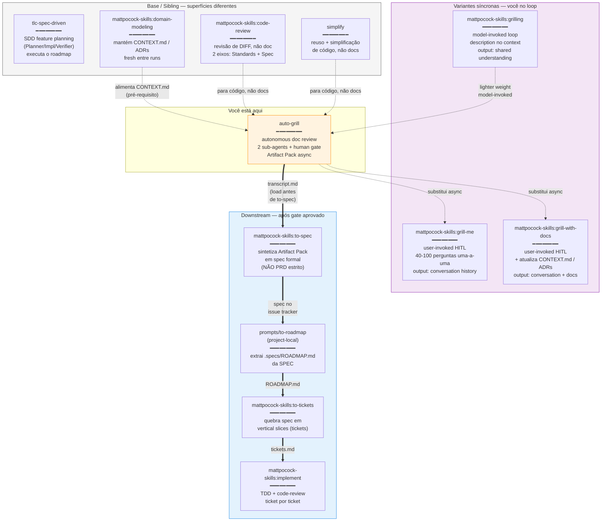

# 09 — Companion Skills

## Resumo

O auto-grill **não opera sozinho**. Tem 4 tipos de skills vizinhas:

1. **Variantes síncronas** que ele substitui (grill-me, grill-with-docs, grilling) — use quando quiser estar no loop.
2. **Downstream** que recebem o Artifact Pack aprovado em cadeia (to-spec → **to-roadmap** → to-tickets → implement) — após você aprovar no gate.
3. **Sibling/base** que cobrem superfícies diferentes (code-review, simplify, domain-modeling).
4. **Base SDD** (tlc-spec-driven) que executa após o chain downstream.

A escolha principal é: **você quer estar na linha de frente ou revisar async?**

## Diagrama



## Quando usar qual — árvore de decisão

```
Você tem um doc pra revisar?
│
├─ Quer estar no loop (sentir cada branch)?
│  └─ SIM → mattpocock-skills:grill-me
│           (síncrono, 40-100 perguntas)
│
└─ NÃO → Quer batch async + Artifact Pack?
    │
    ├─ SIM, e doc é técnico (precisa CONTEXT.md/ADRs)
    │  └─ mattpocock-skills:grill-with-docs
    │       (HITL mas mantém docs vivos)
    │
    └─ SIM, e tá OK ler decisions.md em vez de transcript
       └─ auto-grill ← VOCÊ ESTÁ AQUI
           (zero HITL, gate só no fim)
```

## Integração downstream (5 passos)

```
auto-grill (decisions.md aprovado)
        │
        ▼
mattpocock-skills:to-spec
        │  sintetiza decisões em spec formal
        │  (NÃO PRD estrito — spec é mais amplo)
        ▼
prompts/to-roadmap (project-local)
        │  extrai .specs/ROADMAP.md da SPEC
        │  append, não overwrite; SUBCHAPTER_BREAKDOWN se >15 sub-itens
        ▼
mattpocock-skills:to-tickets
        │  quebra spec em vertical slices (NÃO tarefas pra criar a spec)
        ▼
mattpocock-skills:implement
        │  TDD + code-review por ticket
        ▼
Verifier PASS → ticket done
```

Auto-grill **NÃO** faz nenhuma transição sozinho. Após aprovar todas as decisões no gate, você (humano) invoca `to-spec` → `to-roadmap` → `to-tickets` → `implement` **manualmente**. Isso é intencional — o gate é o portão, não uma rampa automática.

**Detalhe de nomenclatura (Matt Pocock v1.1):**
- `to-prd` foi renomeado → `to-spec` (PRD era restritivo demais; spec cobre técnico + não-técnico + blend).
- `to-issues` foi renomeado → `to-tickets` (issues era GitHub/Linear-bias; tickets é genérico).

## Relação com `tlc-spec-driven`

São complementares, não sobrepostos:

| Skill | Quando |
|---|---|
| `auto-grill` | **Antes** de uma phase começar — você grila o spec.md / design.md antes de commitar |
| `prompts/to-roadmap` | **Depois** de `to-spec`, antes de `to-tickets` — gera o roadmap canônico |
| `tlc-spec-driven` | **Durante** a phase — Planner/Implementer/Verifier executam o trabalho |

Regra prática: rode `auto-grill` no `spec.md` da próxima phase antes de invocar o loop. Se a phase já está `[ ]` no roadmap, é tarde — rode retroativamente pra cobrir lacunas.

## Relação com `code-review`

São de superfícies diferentes:

| Skill | Lê | Saída |
|---|---|---|
| `auto-grill` | doc (spec, design, plan) | decisions table |
| `code-review` | diff (commit range) | 2-axis review (Standards + Spec) |

Use `auto-grill` quando você quer revisar **o que foi decidido**. Use `code-review` quando você quer revisar **o que foi implementado**.

## Por que auto-grill não substitui `grill-with-docs` completamente?

| Auto-grill | grill-with-docs |
|---|---|
| Gate só no fim (você aprova async) | HITL síncrono (você responde cada pergunta) |
| Lê CONTEXT.md, **não atualiza** | Lê E atualiza CONTEXT.md / ADRs inline |
| Stack: zero attention cost | Stack: 40-100 attention turns |
| Output: 4 files structured | Output: conversation + updated docs |

`grill-with-docs` ainda é melhor quando:
- O design tension é o ponto (você QUER sentir cada branch)
- O doc precisa ser editado durante a sessão (CONTEXT.md ganha termos novos)
- A interação é rápida (você responde em < 5s por pergunta)

Auto-grill ganha quando você tem 3-4 docs pra revisar antes de um phase, e não pode sincronamente atender 300+ perguntas.

## Ver também

- [SKILL.md §Companion skills](../SKILL.md) — lista canônica.
- [02-flow.md](02-flow.md) — Phase 5 (HUMAN GATE) é onde você decide se vai pra `to-spec`.
- [06-artifact-pack.md](06-artifact-pack.md) — `decisions.md` é o input do `to-spec`.
- [../prompts/to-roadmap.md](../prompts/to-roadmap.md) — prompt template que preenche o gap entre `to-spec` e `to-tickets`.
- [../assets/decisions-ui.html](../assets/decisions-ui.html) — UI standalone pro gate (batches com 40+ decisões).