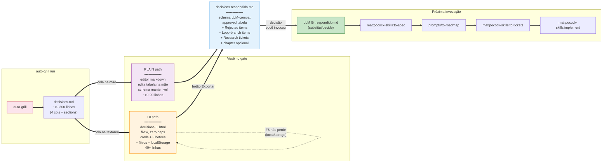

# 10 — Decisions UI Flow

## Resumo

Quando o gate do auto-grill termina, você tem N decisões pra marcar. Dois caminhos:

1. **Plain** — ler `decisions.md` no editor, mexer na tabela na mão, manter schema.
2. **UI** — abrir `assets/decisions-ui.html`, colar o mesmo conteúdo, clicar botões nos cards, exportar `decisions.respondido.md`.

Ambos produzem o **mesmo arquivo** no schema que o LLM espera ler na próxima invocação (`to-spec` / `to-roadmap` / `to-tickets`).

## Diagrama



## Plain path vs UI path — quando usar qual

```
Você tem <linhas> decisões pra marcar?
│
├─ ≤ 20 linhas, schema conhecido
│  └─ PLAIN — abrir decisions.md no editor
│     (você já conhece a sintaxe)
│
├─ 20-40 linhas, quer velocidade
│  └─ tanto faz — UI começa a pagar
│     (filtros cortam o escopo)
│
└─ 40+ linhas, ou várias lenses misturadas
   └─ UI — filtros + cards batem
      tabela seca em markdown
```

## Decisões de design (registradas na memory)

| Decisão | Por quê |
|---|---|
| Standalone HTML (zero deps, file://) | Servidor local descartado por peso. Duplo clique abre. |
| LocalStorage único | F5 não perde; sem servidor = sem backend. |
| Status `undecided` adicionado | Default natural — cards ficam neutros até decisão. |
| Loop-branch como seção própria no export | Schema Pocock só tem `## Rejected items`; loop-branch precisa viver em algum lugar pra próxima rodada saber. |
| Export filename: `<basename>.auto-grill.decisions.respondido.md` | Espelha convenção SKILL.md `<target>.auto-grill.*.md`. Sem `.md.md`. |
| Filtros por lens / confiança / status | 100+ linhas precisa cortar escopo. Não paginei — cards empilham com scroll + headers `h3` por lens. |

## O que o UI **NÃO** faz

- **Não modifica** `decisions.md` original — só lê, gera `.respondido.md` ao lado.
- **Não cria / commita** arquivo no repo — você move o download manualmente.
- **Não invoca** `to-spec` / `to-tickets` — o gate é portão, não rampa. Você invoca manualmente.
- **Não substitui** o `decisions.md` na próxima rodada do auto-grill — `.respondido.md` é input só pra você organizar; auto-grill sempre lê o target doc original.

## Ver também

- [SKILL.md §Phase 5 / Bonus UI](../SKILL.md) — referência primária.
- [README.md §Bonus UI pra batches grandes](../README.md) — orientações de uso.
- [../assets/decisions-ui.html](../assets/decisions-ui.html) — o asset em si.
- [02-flow.md](02-flow.md) — fluxo geral do skill (Phase 5 = HUMAN GATE).
- [09-companion-skills.md](09-companion-skills.md) — chain downstream (to-spec → to-roadmap → to-tickets → implement).

## Decisão crítica que costuma confundir

Três outputs do auto-grill têm papéis diferentes — não troque:

| Arquivo | Pra quem | Próximo passo |
|---|---|---|
| `decisions.md` (e o `.respondido.md` que esta UI exporta) | **Você** (humano no gate) | Lê, aprova/rejeita/loop. Pode usar UI HTML como atalho visual. |
| `transcript.md` | **Surrogate da conversation context** que `to-spec` lê | **Carregar** antes de invocar `/to-spec`. Senão `to-spec` sintetiza do que estiver visível. |
| `DISCOVERIES.md` (append) | Log compartilhado cross-run | Lê em busca de gaps globais; cross-chapter quando você roda em capítulos. |
| `loop-state.json` | Resume state | Fonte do `--resume` em re-invocação. Estado **persiste** entre runs. |

Resumindo: **decisions é pro humano, transcript é pro `to-spec`, discoveries é histórico**. Trocar = `to-spec` sintetiza parcial ou teatro.
