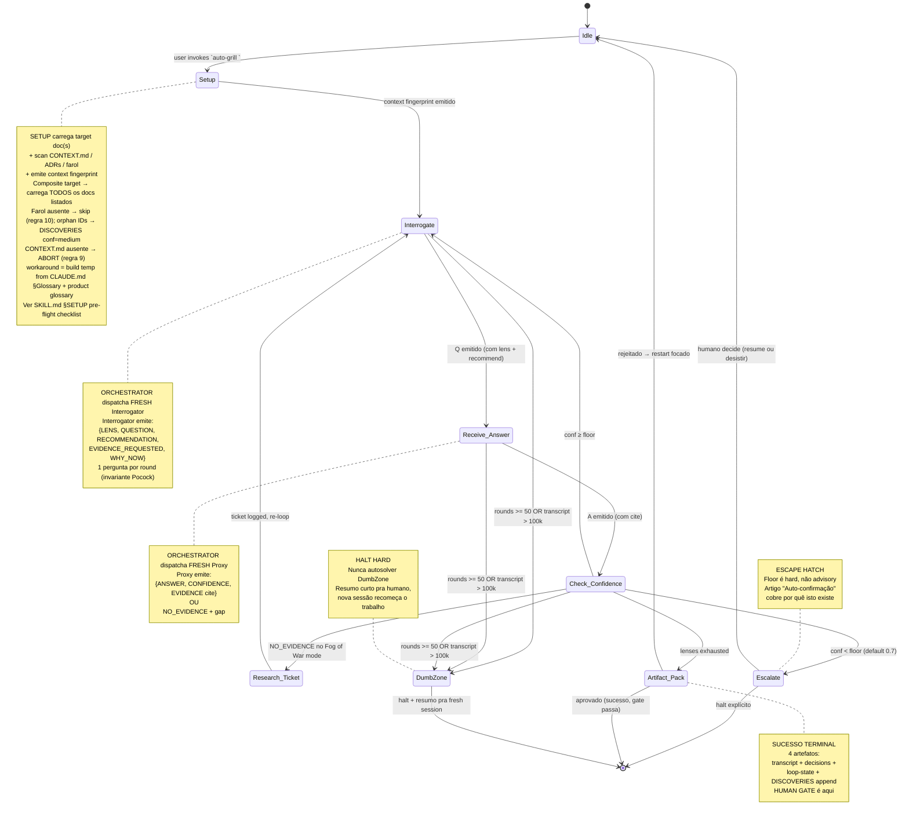

# 11 — Round Protocol (state machine)

## Resumo

Este é o **mapa de estados canônico** do loop. Resolve a pergunta "_em que momento exato eu estou, e o que dispara a transição?_".

- **Estados ativos**: Idle, Setup, Interrogate (asking), Receive_Answer, Check_Confidence
- **Estados de desvio**: Research_Ticket (Fog of War mode), Escalate (confidence < floor)
- **Estados terminais**: Artifact_Pack (sucesso), Escalate (humano no loop), DumbZone (halt)

## Diagrama

## Invariantes (numeradas conforme SKILL.md §Critical rules)

| # | Invariante | Onde aplica |
|---|---|---|
| 1 | One question per Interrogate round | `Interrogate → Receive_Answer` |
| 2 | Every question carries a recommendation | dentro de `Interrogate` |
| 3 | Proxy answers with evidence only (sem = NO_EVIDENCE) | dentro de `Receive_Answer`, transição pra `Research_Ticket` |
| 4 | Hard floor at `confidence_floor` | `Check_Confidence → Escalate` é única saída quando < floor |
| 5 | Dumb Zone guard (100k tokens OR 50 rounds) | transições FORA pra `DumbZone` |
| 6 | Never edit target doc | (cross-cutting, fora da máquina) |
| 7 | Two sub-agents, fresh each round | ver Diagram 14 |
| 8 | Loop state persisted (resume suportado) | `Artifact_Pack → Idle (rejeitado) → resume via loop-state.json` |
| 9 | CONTEXT.md mandatory | falha em `Setup` aborta tudo |
| 10 | Farol stable IDs cross-checked | dentro de `Setup` e `Check_Confidence` |

## Por que esta máquina é como é

- **`Interrogate` e `Receive_Answer` são separados** (não fundidos) pra refletir os **dois sub-agentes distintos**. Fundir implicaria 1 agente fazendo pergunta E resposta = autoconfirmação garantida.
- **`Check_Confidence` é um gate entre Proxy e orquestrador** porque o orquestrador é o único autorizado a tomar decisões baseado em confidence. O Proxy reporta; o orquestrador decide.
- **`DumbZone` é inalcançável de forma "elegante"** — qualquer estado pode cair nele se as caps baterem. É o equivalente de "pânico suave": nunca autosoluciona, sempre para.
- **Não há estado de "backtrack"** do Artifact_Pack: rejeição = restart do zero via `Idle`, não edição retroativa. Isso força clareza de decisão.

## Ver também

- [SKILL.md §5-phase flow](../SKILL.md) — descrição linear complementar.
- [02-flow.md](02-flow.md) — diagrama mais alto-nível (overview de phases, não de estados dentro de phases).
- [12-orchestrator-handoff.md](12-orchestrator-handoff.md) — close-up do que o orquestrador faz entre `Interrogate` e `Receive_Answer`.
- [14-fresh-subagent-invariant.md](14-fresh-subagent-invariant.md) — visualização da regra 7 (2 sub-agentes fresh por round).
