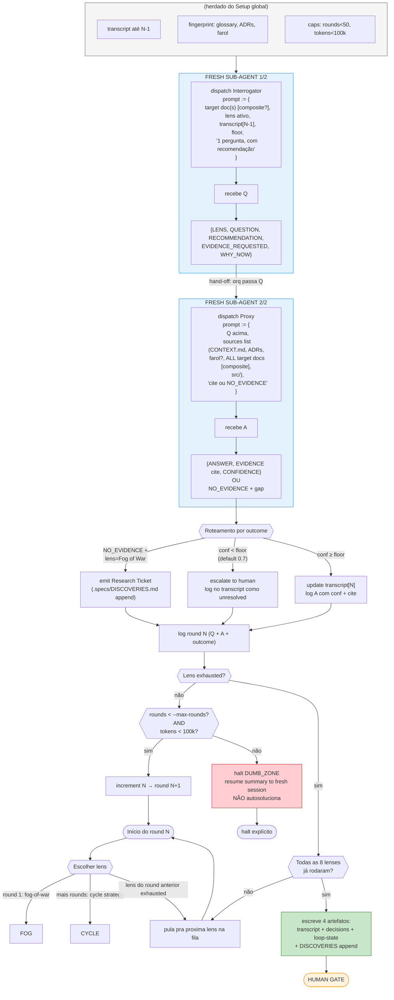
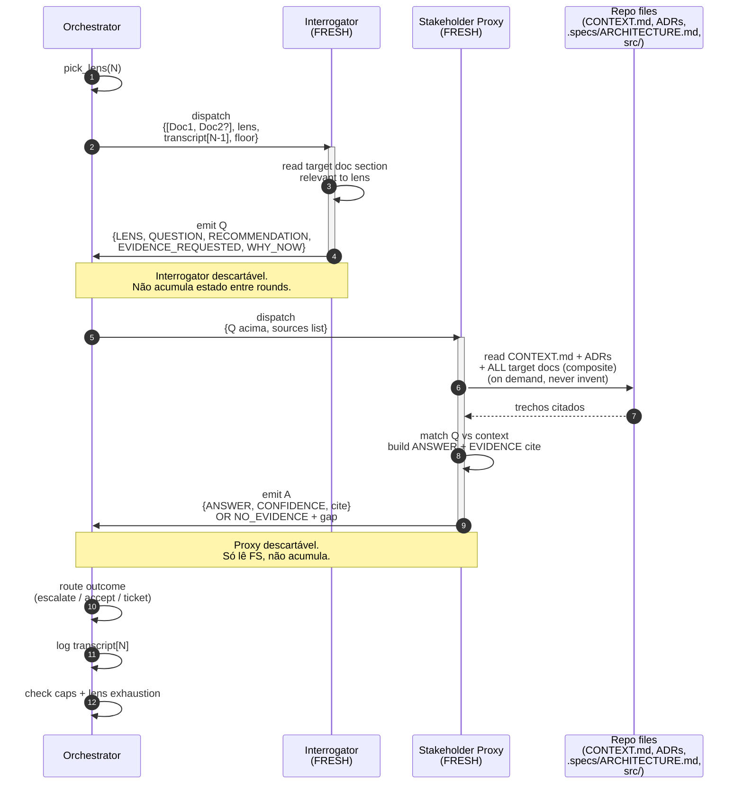

# 12 — Orchestrator Handoff (decision tree per round)

## Resumo

Zoom-in no estado `Interrogate → Receive_Answer` do Diagram 11. Mostra:

1. **Como o orquestrador escolhe lens** (lens-cycle strategy).
2. **Como ele dispatcha FRESH sub-agentes** (regra 7).
3. **Como ele decide se A é aceitável** (no-confidence routing).
4. **Como ele decide próximo passo** (next round / Artifact Pack / halt).

## Diagrama 1: fluxo principal

## Diagrama 2: sequenceDiagram do round (close-up temporal)

## Decisões de design importantes

| Decisão | Por quê | Trade-off |
|---|---|---|
| Orquestrador centraliza tudo (ele dispatcha, ele roteia) | Única entidade com visão completa do transcript + caps | Se orquestrador errar, loop inteiro trava — mas Dumb Zone cap pega |
| `Q_fmt` é formato fixo (LENS, QUESTION, RECOMMENDATION, EVIDENCE_REQUESTED, WHY_NOW) | Permite parsing determinístico no orquestrador; reduz chance de "pergunta vaga" | Restringe criatividade do Interrogator — mas é a invariante Pocock |
| ROUTE separado (orquestrador decide, Proxy só reporta) | Evita "Proxy decide se conf é alta" = autoconfirmação | Mais 1 hop; mais tokens |
| Dumb Zone = halt, não autosolução | Halts silenciosos são piores que halts explícitos | Você precisa reabrir sessão se bater |
| Lens cycle strategy explícita (Fog of War primeiro) | Fog of War é a mais barata e previne Football de "no" branches; outras lenses vêm depois | Pode ser tunado depois (opção CLI `--lens-strategy`) |

## O que ainda é "cinzento" (não documentado visualmente em nenhum lugar)

- **Lens cycle strategy** (a ordem específica de lenses) está descrita como "Fog of War primeiro" mas as 7 outras lenses estão sem ordem canônica. Hoje é manual via `--lenses` flag ou ordem do loop.
- **Lógica de "lens exhausted"** — critério é "no remaining ? branches" (Fog of War) ou "every term glossary-backed" (Semantic Anchors), etc., mas cada lens tem critério diferente. Diagram 03 lista os critérios.
- **Concurrent vs sequential rounds** — o estado atual é sequential (1 round por vez). Multi-Interrogator em paralelo reduziria wall-clock mas complicaria roteamento. Fora de escopo.

## Ver também

- [11-round-protocol.md](11-round-protocol.md) — macro-states (este é zoom-in).
- [14-fresh-subagent-invariant.md](14-fresh-subagent-invariant.md) — focus na regra 7.
- [04-confidence.md](04-confidence.md) — detalhe do critério de confidence floor.
- [../SKILL.md §Critical rules](../SKILL.md) — 10 invariantes escritas.
