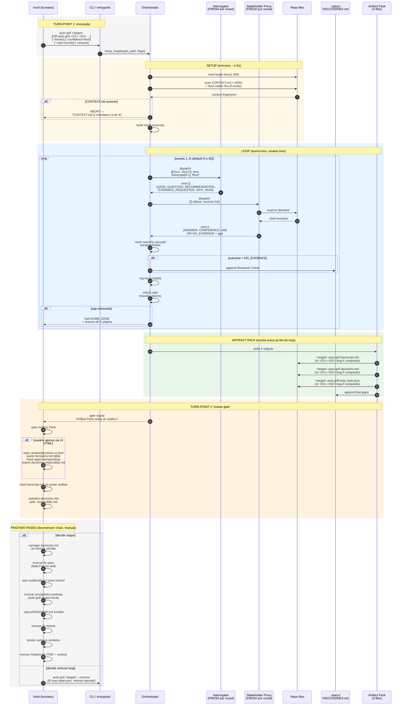

# 13 — Quickstart Procedural (perspectiva do usuário)

## Resumo

Este é o **panorama do início ao fim**, da perspectiva de quem rodou `auto-grill <target>` na CLI. Mostra:

- Você (humano) vê 2-3 interações: invocação, espera, gate.
- Orquestrador + sub-agentes fazem todo o trabalho entre invocação e gate.
- Total: **2 turn-points humanos** (start + gate). O resto é loop interno.

Resolve a pergunta: **"quando eu volto a interagir com o sistema?"**

## Diagrama

## Onde cada turn-point acontece

| Turn-point | Quando | Você vê o quê |
|---|---|---|
| **#1 Invocação** | T=0 | Você digita `auto-grill <target>`. UI/terminal mostra "loop started" e retorna o controle. |
| **(sem interaction)** | T=0..N | Você é **livre**. Pode fazer outra coisa, fechar terminal, voltar depois. |
| **#1.5 Setup error** | T=0..5s | Se `CONTEXT.md` faltar: erro imediato, loop abortado, sem trabalho desperdiçado. |
| **#1.6 Dumb Zone** | T=variável | Se transcript estourar 100k tokens OU 50 rounds: halt + 1-página resumo. **Você decide se reabre sessão ou não.** |
| **#2 Gate signal** | T=fim do loop | Orquestrador mostra os 4 caminhos dos arquivos. **Você lê.** |
| **#3 (opcional) UI workflow** | T=gateway | Se preferir, abre `assets/decisions-ui.html`, cola, marca, exporta. Senão edita o `decisions.md` direto. |
| **#4 (opcional) Downstream** | T=após gate aprovado | Você invoca `to-spec`, `to-roadmap`, `to-tickets`, `implement` **manualmente**. Auto-grill não auto-avança. |

## Quantos turn-points SÍNCRONOS no mínimo?

**2** (invocação + gate). No mais, se a UI HTML for usada, mais 1 turn-point opcional (UI workflow). Se rejeitar decisões, mais turn-points (auto-grill `--resume`).

Demais turn-points são **opcionais** e disparados por edge cases (CONTEXT.md ausente, Dumb Zone, rejeição).

## Erros comuns a evitar (do "cinzento" do Diagram 12)

- **Invocar `to-spec` antes do transcript.md estar carregado** — `to-spec` ignora `decisions.md`. Ele lê o que está na janela. Se você rodou auto-grill em sub-agente separado, **carregue o transcript.md explicitamente** antes de invocar `/to-spec`.
- **Esperar auto-grill auto-invocar `to-spec`** — não acontece. O gate é portão, não rampa.
- **Reusar mesma instância de Proxy/Interrogator entre rounds** — viola regra 7. Sempre fresh sub-agents (Diagram 14).
- **"Aprovar tudo sem ler o transcript"** — Mata a utilidade do gate. O skill vira teatro.

## Como ler este diagrama

- **Cinza escuro** = turn-points humanos (você para, age)
- **Azul claro** = loop interno (você não acompanha)
- **Amarelo claro** = Setup (você não acompanha)
- **Verde claro** = sucesso / saída feliz
- **Laranja claro** = human gate (você age)

## Ver também

- [SKILL.md §Quickstart](../SKILL.md) — versão em prosa canônica (referência primária).
- [02-flow.md](02-flow.md) — flow mais abstrato (5 phases, sem turn-points).
- [06-artifact-pack.md](06-artifact-pack.md) — o que está nos 4 outputs.
- [11-round-protocol.md](11-round-protocol.md) — macro-states (este é user-facing, 11 é interno).
