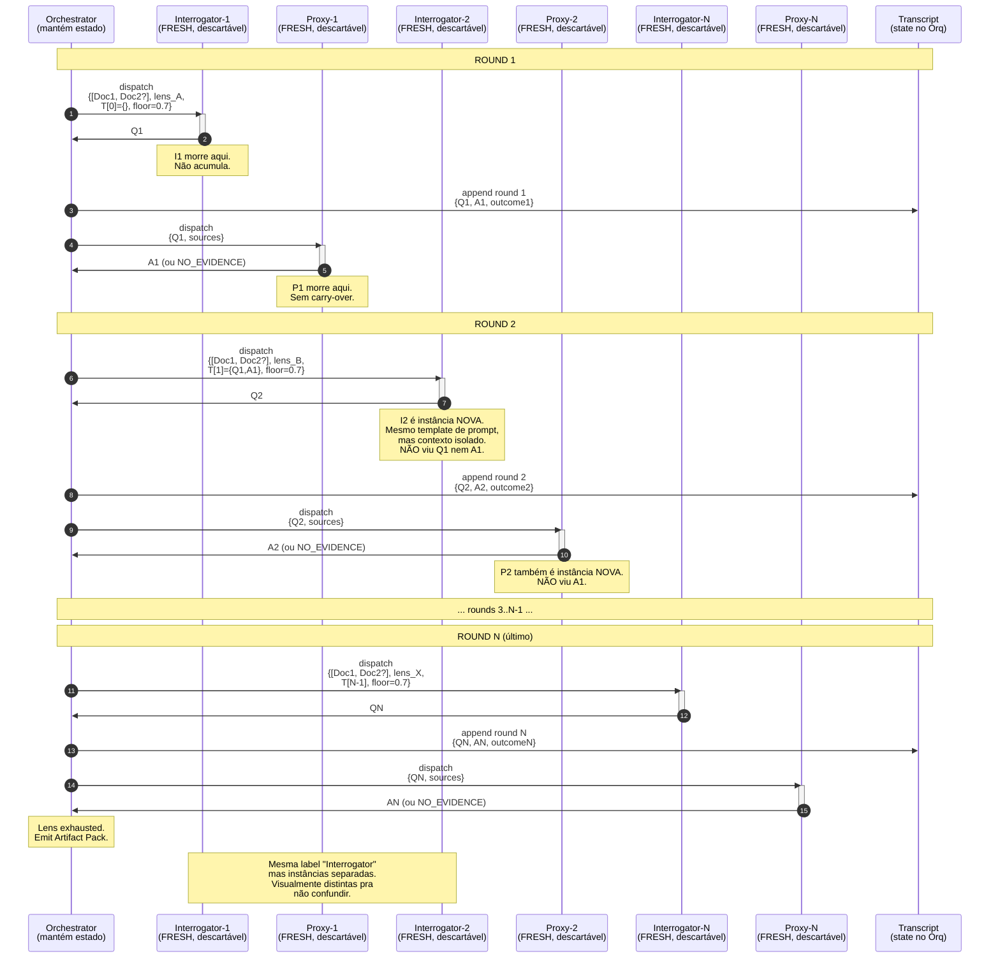

# 14 — Fresh Sub-Agent Per Round (invariante da regra 7)

## Resumo

Este diagrama torna **explícita** a regra 7 do SKILL.md:

> **Two sub-agents, fresh each round.** Author ≠ Proxy.

Mostra através de sequenceDiagram que:

1. **Cada round** tem **exatamente 2 sub-agentes instanciados novos**.
2. **Interrogator-N** é descartável — não acumula estado de Interrogator-N-1.
3. **Proxy-N** é descartável — não acumula estado de Proxy-N-1.
4. **Apenas o Orchestrator** mantém estado entre rounds (via `transcript[N-1]`).
5. **Mensagens nunca** fluem Interrogator→Proxy diretamente. Sempre via Orquestrador.

## Diagrama



**Composite targets:** `[Doc1, Doc2?]` = list of all target docs. Each Interrogator/Proxy-N loads ALL docs (read-only, no carry-over from prior rounds). Cross-reference between docs is part of the Q/A — questions may reconcile decisions across PRD + PLAN, etc.

## Por que isso importa (Anti-Auto-Confirmação)

Cenário onde a invariante é violada (1 agente faz pergunta E resposta):

```
[single-agent degenerado]
  LLM único sabe: TARGET + HISTÓRICO COMPLETO + RESPOSTAS ANTERIORES
   ↓
  emite Q1, "pensa" na resposta, emite A1
   ↓
  rodada 2: emite Q2 já polarizado pra confirmar A1
   ↓
  ...
  converge para confirmação mútua (slop)
```

Com a invariante respeitada:

```
  Interrogator-N: lê só T[N-1] + target + lens
                  NÃO viu as respostas anteriores
   ↓
  emite Q_N (pode até bater de frente com respostas anteriores — bom!)
   ↓
  Proxy-N: lê só Q_N + sources
           NÃO viu Q_{N-1} nem A_{N-1}
   ↓
  emite A_N com base só no que ele consegue citar
   ↓
  Orquestrador detecta contradições entre rounds
```

O **único com visão completa** é o Orquestrador. Esse isolamento é o que evita "two AIs agreeing" sem ninguém para quebrar o empate.

## Regras de implementação

| Regra | Onde aplica |
|---|---|
| Prompt templates são **idênticos** entre rounds | I1, I2, ..., IN usam o mesmo template (ver 05-subagent-contracts.md) |
| Contexto injetado é **mínimo** | I-N recebe só {target, lens, T[N-1], floor} — nada mais |
| **Sem estado compartilhado** entre rounds do mesmo papel | I1 ↛ I2; P1 ↛ P2 |
| **Mensagens** sempre passam via Orq | I-N → Orq → P-N. Nunca I-N → P-N direto |
| **Orq é o único que persiste** | Transcript[N-1] é injetado em I-N, mas o transcript cresce dentro do Orq |

## Edge cases da invariante

| Cenário | O que fazer |
|---|---|
| Sub-agente retorna com formato errado | Orq rejeita, dispatcha fresh (não patch no mesmo) |
| Sub-agente retorna com alucinação óbvia (não-citable) | Orq rejeita, dispatcha fresh |
| Auto-grill sendo re-rodado com `--resume` | **Sub-agentes ainda são fresh** mesmo entre runs. O que persiste é `loop-state.json`, não sub-agentes. |
| Usuário quer "freeze a personality" do Interrogator | Possível via system message customization, mas **state do sub-agente** sempre do zero |

## Comparação com sistemas que violam

| Sistema | Comportamento | Por que arrisca |
|---|---|---|
| 1 agente single-pass | Emite Q+A como chain | Sem checagem, autoconfirmação trivial |
| 2 agentes mas instâncias compartilhadas | I+P mantêm contexto | "I lembra do que P respondeu" = viés |
| I+P fresh em todo round (auto-grill) | Isolamento total | Mais tokens; paredes anti-confirmação |

## Ver também

- [SKILL.md §Critical rules — rule 7](../SKILL.md) — texto original da invariante.
- [11-round-protocol.md](11-round-protocol.md) — onde "fresh" aparece nas transições.
- [12-orchestrator-handoff.md](12-orchestrator-handoff.md) — close-up do dispatch / receive.
- [05-subagent-contracts.md](05-subagent-contracts.md) — prompt templates idênticos.
- [08-critical-rules.md](08-critical-rules.md) — table com as 10 regras e justificativa.
