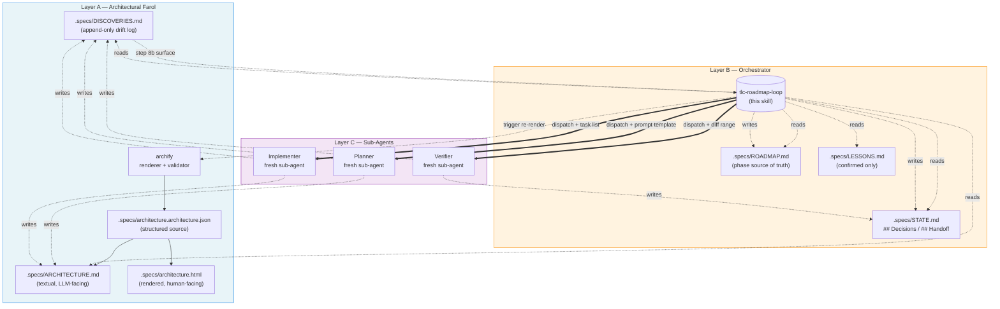

# 01 — Triple Camada (A / B / C)

## Resumo

O `tlc-roadmap-loop` opera em **3 camadas arquiteturais** com responsabilidades distintas:

- **Camada A — Farol arquitetural** (`archify` + `.specs/ARCHITECTURE.md`): referência persistente, texto legível por LLM, fonte de verdade para stable IDs. Re-renderizada quando há drift.
- **Camada B — Orchestrator** (esta skill): coordena. Lê ROADMAP, dispatcha sub-agents, gateia verdicts, atualiza STATE, decide strategy em FAIL.
- **Camada C — Sub-agents** (`Planner` / `Implementer` / `Verifier`): executam trabalho scoped em ciclos curtos. Fresh context por dispatch. Nunca se veem entre si.

## Diagrama

## Fluxos chave (PT-BR)

### Camada A — leitura

- Orchestrator (B) **lê** `ARCHITECTURE.md` (texto) como referência para stable IDs em prompts de Planner. **Não** abre o HTML.
- Sub-agents (C) recebem pointers para `ARCHITECTURE.md` no prompt — leem como texto.

### Camada A — escrita

- Apenas Orchestrator escreve `ARCHITECTURE.md` / `architecture.json` / `architecture.html`, **mediante trigger explícito** (step 8b, decisão humana).
- `archify` é invocado pelo orchestrator para validar + render.

### Camada B → Camada C

- Cada dispatch tem **prompt self-contained** (sub-agent não vê o chat pai).
- 3 roles sequenciais por phase: `Planner` → `Implementer` → `Verifier`.
- Sub-agents **não** se chamam entre si. Sequenciamento é 100% responsabilidade do orchestrator.

### Camada C → Camada A

- Sub-agents podem **append** em `.specs/DISCOVERIES.md` (severity: cosmetic / structural / critical) — **não bloqueiam** a phase se descobrirem componente novo.
- Surface ao orchestrator via step 8b, que então pergunta ao humano sobre re-render.

## Por que 3 camadas (e não 2 ou 4)?

| Tentativa | Falha |
|---|---|
| 2 camadas (orchestrator + sub-agents, sem farol) | Toda referência arquitetural vira "scroll-up no histórico" — caro, opaco. Verifier não tem ponto de verdade estável. |
| 4 camadas (separar farol renderizado e farol texto) | Renderização e fonte de verdade são a mesma Camada A. Separar duplica trabalho de sync sem ganho. |

3 camadas captura a separação real: **referência** (A) vs **coordenação** (B) vs **execução** (C).

## Ver também

- [03-skill-composition](03-skill-composition.md) — quais skills externas compõem cada camada.
- [06-discovery-surface](06-discovery-surface.md) — fluxo step 8b que liga Camada C → Camada A via orchestrator.
- [07-authority-boundaries](07-authority-boundaries.md) — quem pode escrever em cada camada.