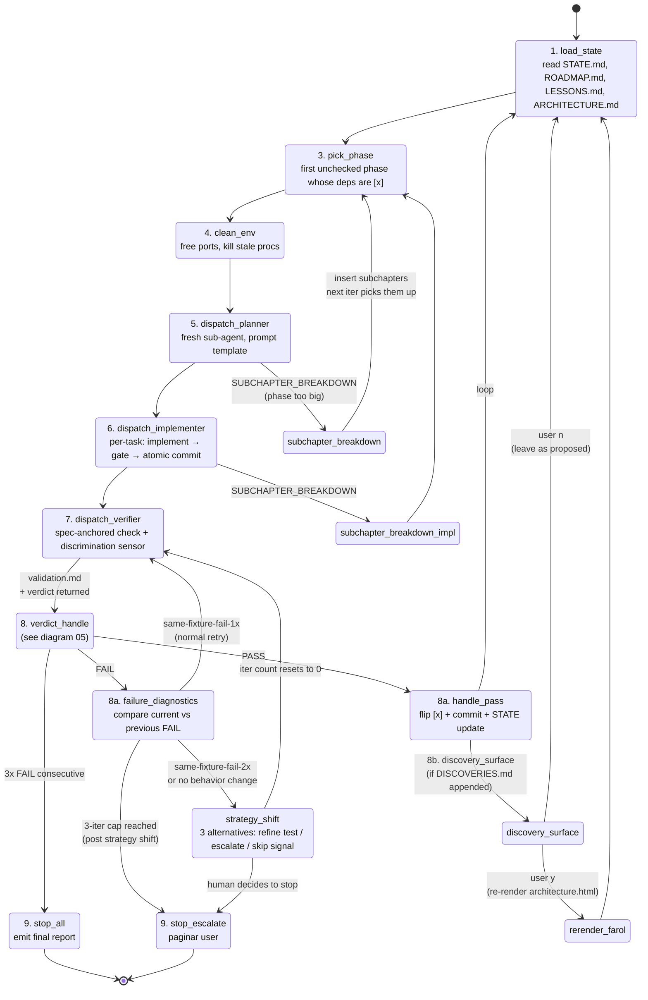

# 02 — Loop Flow

## Resumo

Ciclo principal do orchestrator. Sequência numerada conforme `SKILL.md` §Orchestrator flow (passos 1–9 + sub-passos 8a/8b). Cada estado é uma operação discreta; transições mostram **para onde o controle vai depois** (e.g., PASS → flip `[x]` + commit → volta a `load_state`; FAIL → step 8a ou re-dispatch).

## Diagrama

## Pontos chave (PT-BR)

### Self-loops e re-entrada

- `pick_phase` é re-entrante: pode ser visitado múltiplas vezes (após cada PASS ou após SUBCHAPTER_BREAKDOWN).
- `dispatch_verifier` pode ser re-visitado: 1 retry normal + retries após strategy shift (com iter count resetado).

### Saídas (terminators)

- `[*] → load_state`: entrada (loop start).
- `stop_all → [*]`: quando todas as phases estão `[x]` (loop done com sucesso) ou quando stop conditions trip.
- `stop_escalate → [*]`: quando escalado para humano (3× FAIL consecutivo, hard blocker, user interrupt).

### Step 8b (architectural drift surface)

- Dispara **sempre** após Verifier, independente de PASS/FAIL.
- Se `DISCOVERIES.md` foi appended esta phase, orchestrator pergunta ao humano sobre re-render do farol.
- Detalhes em [06-discovery-surface](06-discovery-surface.md).

### Step 8a (failure diagnostics pre-flight) — v0.2

- Dispara **antes** do retry em FAIL.
- Compara FAIL atual vs FAIL anterior (track em `validation.md` iter history).
- Same-fixture-fail-2x → strategy_shift (não auto-retry).
- Detalhes em [05-verdict-handling](05-verdict-handling.md).

## Comportamentos críticos

- **Nunca paralelo**: phases são sequenciais. Não há spawn paralelo de sub-agents.
- **Sempre fresh sub-agent**: cada dispatch é context limpo. Sem carry-over entre dispatches.
- **Auto-commit só dentro do loop**: Implementer commita per-task sem confirmação. Fora do loop, mesmas regras SDD, sem auto-commit.

## Ver também

- [05-verdict-handling](05-verdict-handling.md) — detalhe do `verdict_handle` state + step 8a.
- [09-stop-conditions](09-stop-conditions.md) — detalhe de cada escape hatch.
- [SKILL.md §Orchestrator flow](../SKILL.md) — fonte canônica (passos 1–9).