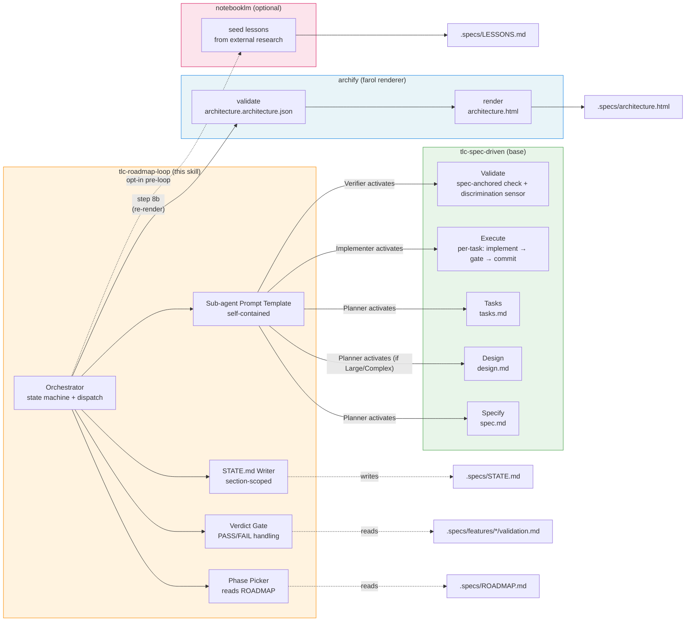

# 03 — Skill Composition

## Resumo

`tlc-roadmap-loop` é **driver only** (regra explícita do `SKILL.md` §Intro). Toda semântica de planning/implementation/validation vive em `tlc-spec-driven`. Renderização do farol vive em `archify`. Research externo opcional vive em `notebooklm`.

Esta skill **adiciona**:
- Phase picker (lê ROADMAP, escolhe próxima)
- Loop (state machine: dispatch × 3 → verdict → loop/stop)
- Verdict gate (PASS → flip; FAIL → step 8a)
- STATE.md section-scoped writes
- Sub-agent prompt template (self-contained)

Esta skill **NÃO adiciona**:
- Specify / Design / Tasks / Execute / Verify semantics → `tlc-spec-driven`
- Architectural diagram rendering → `archify`
- Lesson seeding from external research → `notebooklm` (opt-in)

## Diagrama

## Quem faz o quê

### tlc-roadmap-loop (own)

| Função | Onde no SKILL.md |
|---|---|
| Phase picker | §Orchestrator flow step 3 |
| Loop state machine | §Orchestrator flow steps 1–9 |
| Verdict gate + step 8a | §Orchestrator flow step 8 + 8a |
| STATE.md section-scoped writes | §State writes |
| Sub-agent prompt template | §Sub-agent prompt template |

### tlc-spec-driven (compõe)

| Função | Como invocado |
|---|---|
| Specify | Planner dispatch ativa pelo nome |
| Design (if Large/Complex) | Planner dispatch ativa pelo nome |
| Tasks | Planner dispatch ativa pelo nome |
| Execute | Implementer dispatch ativa pelo nome |
| Validate | Verifier dispatch ativa pelo nome |

**Regra**: sub-agent prompts referenciam `tlc-spec-driven` por nome e seguem suas regras. **Não duplicar** regras no prompt.

### archify (compõe via step 8b)

| Função | Quando |
|---|---|
| `validate` architecture.architecture.json | Antes do render |
| `render` architecture.html | Após validate success |

**Regra**: orchestrator owns o re-render, não sub-agents. Sub-agents só appendam em `DISCOVERIES.md`.

### notebooklm (opt-in pre-loop)

| Função | Quando |
|---|---|
| Seed lessons de research externo | Antes do loop rodar (opt-in, humano decide) |

**Regra**: lessons confirmadas (não candidates/quarantined) são loaded antes de Planner dispatch (passo 2 do orchestrator flow).

## Composições críticas (PT-BR)

### "Activate by name"

Sub-agent prompts dizem literalmente: *"Activate `tlc-spec-driven` by name and follow it for the assigned role"*. Isso garante que toda a semântica (test coverage matrix, atomic commits, etc.) vem da base, não desta skill.

### "Reference, don't duplicate"

Cada regra que mora em `tlc-spec-driven` (e.g., "one atomic commit per task") é referenciada pelo nome. Esta skill não redefine.

### "Orchestrator owns side effects"

Re-render de `architecture.html`, push de commits de phase-mark, atualização de STATE.md → tudo do orchestrator. Sub-agents só escrevem dentro de seu scope (spec/, code/, validation.md).

## Ver também

- [01-triple-camada](01-triple-camada.md) — visão topológica A/B/C.
- [04-subagent-contracts](04-subagent-contracts.md) — contratos in/out de cada sub-agent.
- [SKILL.md §What this skill adds](../SKILL.md) — tabela canônica de deltas.