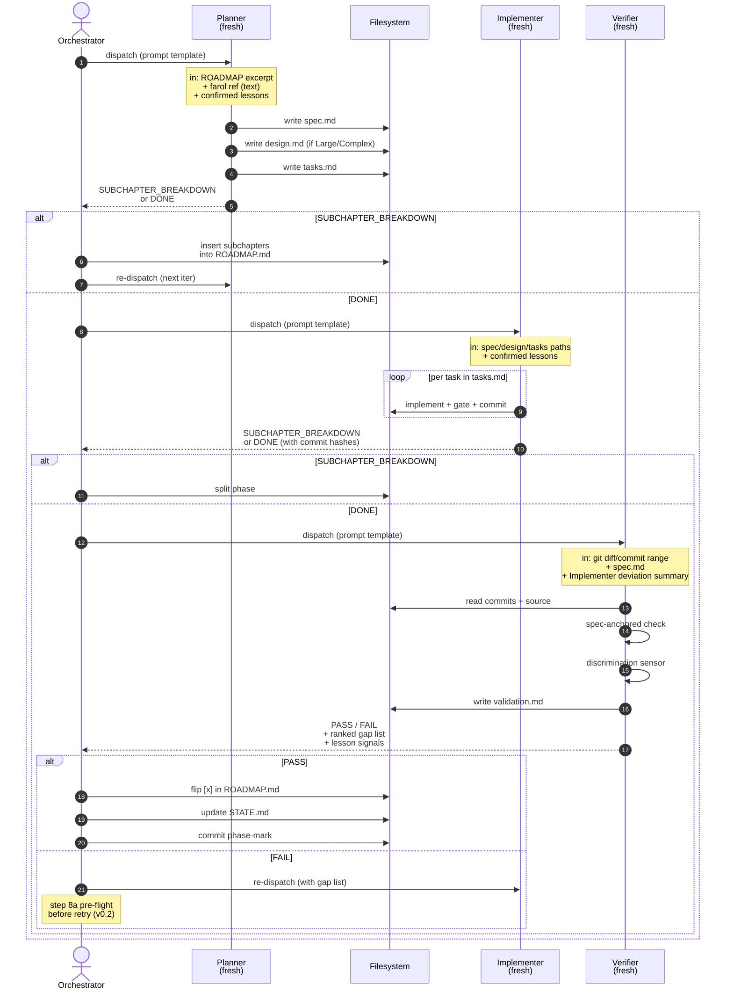

# 04 — Sub-agent Contracts

## Resumo

3 sub-agent roles sequenciais por phase. Cada um recebe **prompt self-contained** (não vê o chat pai) e retorna **compact summary**. Contratos abaixo especificam **o que entra**, **o que sai**, e **onde materializa em disco**.

## Diagrama

## Contratos (PT-BR)

### Planner

| | |
|---|---|
| **In** (do orchestrator) | ROADMAP excerpt (5–30 linhas: phase heading + Done when + Depends on + sub-items) · farol ref (text stable IDs de `.specs/ARCHITECTURE.md`) · confirmed lessons de `.specs/LESSONS.md` |
| **Out** (retorna) | `DONE` + paths de `spec.md`, `design.md?`, `tasks.md` · ou `SUBCHAPTER_BREAKDOWN: [subA, subB, ...]` |
| **Materializa em disco** | `.specs/features/<phase-slug>/spec.md` · `.specs/features/<phase-slug>/design.md` (se Large/Complex) · `.specs/features/<phase-slug>/tasks.md` (com Test Coverage Matrix + Gate Check Commands) |
| **Pode escrever em** | `.specs/DISCOVERIES.md` (append, severity) — se design.md requer componente novo não-mapeado no farol |
| **NÃO pode** | Rodar Implementer, rodar Verifier, commitar código, spawnar sub-agents |

### Implementer

| | |
|---|---|
| **In** (do orchestrator) | Paths para spec/design/tasks existentes · confirmed lessons |
| **Out** (retorna) | `DONE` + lista de commit hashes por task · ou `SUBCHAPTER_BREAKDOWN` |
| **Materializa em disco** | Source code · test code · commits atômicos (1 por task) |
| **Pode escrever em** | `.specs/DISCOVERIES.md` (se mid-phase descobrir drift) |
| **NÃO pode** | Rodar Verifier, spawnar sub-agents, batch-workers (1 Implementer só) |

### Verifier

| | |
|---|---|
| **In** (do orchestrator) | `git diff/commit range` para a phase · spec.md (source of truth) · Implementer deviation summary (se houve) |
| **Out** (retorna) | `PASS` ou `FAIL` + ranked gap list · lesson signals (grounded failures) |
| **Materializa em disco** | `.specs/features/<phase-slug>/validation.md` |
| **Pode escrever em** | `.specs/DISCOVERIES.md` (se observar drift arquitetural) |
| **NÃO pode** | Fixar código, rodar Implementer, mudar spec.md |

## Regras de contrato (cross-cutting)

1. **Self-contained prompts** — sub-agent **não** vê o chat pai. Toda info necessária vem no prompt.
2. **Section-scoped writes** — STATE.md é append-only em `## Decisions`, overwrite em `## Handoff`. Sub-agents respeitam isso quando escrevem STATE.
3. **Compact return** — sub-agent retorna resumo, não log completo. Log completo fica em disco (spec/design/tasks/validation).
4. **Discrimination sensor obrigatório** — Verifier sempre roda mutation scratch pra distinguir test discriminativo de test decorative.
5. **Author ≠ verifier** — Implementer e Verifier são fresh sub-agents em contexts separados. Nunca o mesmo processo.

## Por que sequence diagram?

Diferente do state diagram (02-loop-flow.md) que mostra **estados do orchestrator**, este aqui mostra **interações entre 3 entidades** (orch + 3 roles + filesystem). Cada sequence step é uma operação discreta; arrows mostram direção de dados.

## Ver também

- [03-skill-composition](03-skill-composition.md) — como sub-agents compõem com `tlc-spec-driven`.
- [05-verdict-handling](05-verdict-handling.md) — o que acontece após `Verifier -->> ORCH: FAIL`.
- [07-authority-boundaries](07-authority-boundaries.md) — quem autoriza cada tipo de write.
- [SKILL.md §Sub-agent prompt template](../SKILL.md) — template canônico (passos 1–7 do prompt).