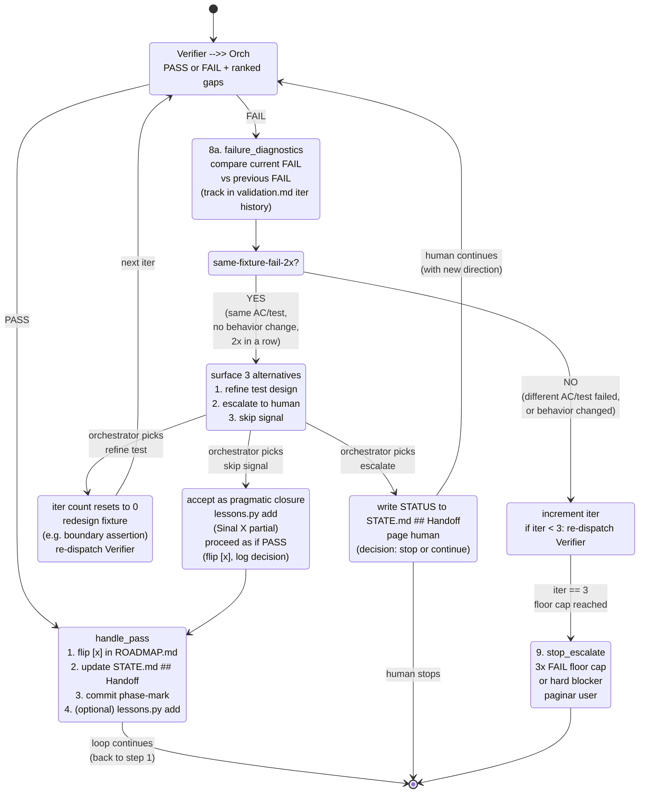

# 05 — Verdict Handling (v0.2)

## Resumo

Detalhe do estado `verdict_handle` do loop principal (vide [02-loop-flow](02-loop-flow.md)). v0.2 adiciona **step 8a — failure diagnostics pre-flight** entre FAIL e retry, evitando que o loop queime tokens re-rodando o mesmo gate.

## Diagrama



## Step 8a — Failure diagnostics pre-flight (v0.2)

### Trigger

Quando Verifier retorna FAIL, **antes** de contar para o 3-iter cap (floor, não ceiling), o orchestrator:

1. Lê `validation.md` da iter anterior (mesma phase).
2. Compara AC/test IDs que falharam.
3. Verifica se houve mudança de comportamento entre iters (commits novos? código mudou?).

### Same-fixture-fail-2x

Se **mesma AC/test** falhou nas 2 últimas iters **sem mudança comportamental**, é trigger de strategy shift. Não auto-retry.

### 3 Strategy alternatives

| # | Alternativa | Quando escolher |
|---|---|---|
| 1 | **Refine test design** | Fixture é decorative (ex: threshold permissivo), assertion não discrimina. Redesenhar antes do próximo dispatch. |
| 2 | **Escalate to human** | Stuck pattern é genuinamente ambíguo, ou humano tem contexto que sub-agents não têm. Pagar via STATE.md ## Handoff + página. |
| 3 | **Skip signal** | Sinal X pode fechar pragmaticamente sem o AC (ex: architectural alignment > behavioral fidelity). Registrar via `lessons.py add` para audit. |

### Iter count reset

Após strategy shift chosen, **iter count reseta para 0**. Floor de 3 iters **re-aplica** após shift.

### Por que pre-flight (não auto-retry)?

Sem pre-flight, Phase 4 (search) iter 1→2 reproduziu T-ORCH-19b sem atacar root cause (decorative test fixture). Cada iter custou ~30 min de sub-agent + token burn. Pre-flight detecta o "same shape" pattern **mais cedo** e força decisão de estratégia.

## PASS path (sem mudança v0.2)

```
1. Edit .specs/ROADMAP.md — flip [ ] → [x] on phase heading.
2. Update .specs/STATE.md ## Handoff (section-scoped write — never touch Decisions).
3. Commit: docs(spec): mark phase <N> complete in ROADMAP and STATE.
4. If lessons signal: run scripts/lessons.py add ... for each grounded failure.
5. Loop back to step 1 (load_state).
```

## FAIL path (v0.2 com pre-flight)

```
8. FAIL with gaps:
   - Append fix tasks to tasks.md (or queue a new fix-tasks file).
   - 8a. PRE-FLIGHT: compare with previous FAIL.
   - If same-fixture-fail-1x (first time seeing this FAIL):
     - If iter < 3: re-dispatch Verifier (after Implementer runs fix).
   - If same-fixture-fail-2x (no behavior change):
     - Surface strategy_shift alternatives.
     - After shift: iter count resets.
     - After shift: 3x cap re-applies.
   - If iter == 3 (post-shift): escalate.
```

## Mudança v0.1 → v0.2

| Aspecto | v0.1 | v0.2 |
|---|---|---|
| FAIL → retry | Direto após Implementer fix | Pre-flight compara com iter anterior |
| Same-fixture-fail-2x | Continua retry até 3x cap, depois escalate | Strategy shift após 2x, iter count reset |
| 3x cap | Teto absoluto | Floor (re-aplica após strategy shift) |
| Token burn | Linear em retries cegos | Truncado em same-shape failures |

## Ver também

- [02-loop-flow](02-loop-flow.md) — onde `verdict_handle` mora no loop principal.
- [04-subagent-contracts](04-subagent-contracts.md) — formato do retorno do Verifier.
- [09-stop-conditions](09-stop-conditions.md) — escape hatches finais (3x cap, hard blocker, user interrupt).
- [SKILL.md §Orchestrator flow step 8 + 8a](../SKILL.md) — fonte canônica.