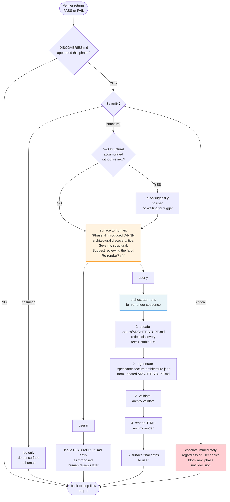

# 06 — Discovery Surface (step 8b)

## Resumo

Step 8b dispara **sempre** após Verifier (independente de PASS/FAIL). Se `DISCOVERIES.md` foi appended nesta phase, orchestrator surface ao humano. Re-render do farol é decisão humana — orchestrator não auto-renderiza.

## Diagrama



## Quem pode escrever em DISCOVERIES.md

| Role | Quando | Severities |
|---|---|---|
| **Planner** | Design.md requer componente/edge novo não-mapeado no farol | cosmetic / structural / critical |
| **Implementer** | Mid-phase descobre scope blow-up ou boundary não-mapeada | cosmetic / structural |
| **Verifier** | Observa drift arquitetural durante check | cosmetic / structural / critical |

**Regra**: append **não bloqueia** a phase. Sub-agent segue. Orchestrator surface no step 8b.

## Severities

| Severity | Significado | Comportamento |
|---|---|---|
| `cosmetic` | Renaming, relabeling, internal restructuring | Log only. NÃO surface. |
| `structural` | New edge, new component, refactor de boundary | Surface ao humano. Se >=3 acumulados sem review → auto-suggest y. |
| `critical` | Architectural boundary change (auth, persistence, authority, concurrency) | **Escalate immediately**. Block next phase até decisão. |

## Re-render sequence (orchestrator owns)

```bash
# Step 1: update .specs/ARCHITECTURE.md (text + stable IDs)
# (manual edit by orchestrator or fresh sub-agent for schema fidelity)

# Step 2: regenerate .specs/architecture.architecture.json
# (from updated ARCHITECTURE.md)

# Step 3: validate
node .agents/skills/archify/bin/archify.mjs validate architecture \
  .specs/architecture.architecture.json

# Step 4: render HTML
node .agents/skills/archify/bin/archify.mjs render architecture \
  .specs/architecture.architecture.json \
  .specs/architecture.html

# Step 5: surface paths
echo "Updated: .specs/ARCHITECTURE.md"
echo "Updated: .specs/architecture.html"
```

**Por que orchestrator owns (não sub-agent)?** Renderização é side-effect arquitetural — deve ser orquestrado, não delegado. Sub-agents podem escrever em `.specs/DISCOVERIES.md` mas não re-renderizar.

## Pre-bootstrap fallback

Se `.specs/ARCHITECTURE.md` não existe ainda (pre-bootstrap):

- Sub-agents ainda podem appendar em `DISCOVERIES.md` (criar o arquivo se missing).
- Re-render sequence fica bloqueada até farol existir.
- Orchestrator surface ao humano: "DISCOVERIES.md has N entries but no farol yet. Bootstrap farol first?"

## Ver também

- [01-triple-camada](01-triple-camada.md) — Camada A (farol) ↔ Camada B (orchestrator) ↔ Camada C (sub-agents).
- [07-authority-boundaries](07-authority-boundaries.md) — quem autoriza re-render (humano).
- [SKILL.md §Orchestrator flow step 8b](../SKILL.md) — fonte canônica.