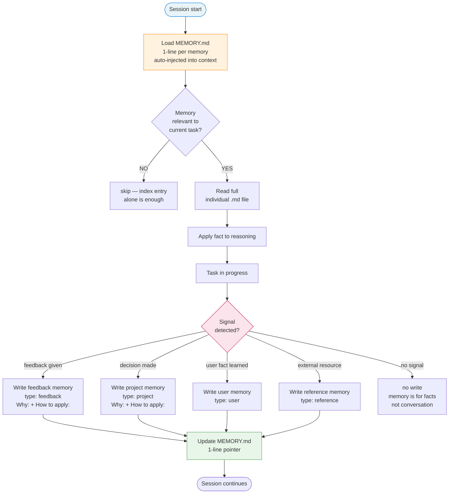

# 08 — Memory Architecture

## Resumo

Sistema de memória persistente do agente (não confundir com `.specs/STATE.md` que é específico desta skill). `MEMORY.md` é índice leve carregado automaticamente a cada início de sessão. Arquivos individuais `.md` (1 fato por arquivo, com frontmatter) são carregados sob demanda.

## Diagrama



## Os 4 tipos

| Tipo | Quando escrever | Exemplo |
|---|---|---|
| `user` | Quem é o usuário (role, expertise, preferences) | "user prefere PT-BR em replies" |
| `feedback` | Guidance que o usuário deu sobre **como trabalhar** | "skill-readiness-needs-evidence: ready só é ready com evidência fim-a-fim" |
| `project` | Trabalho em andamento, goals, constraints não-deriváveis do código | "Memory Studio v2 — production work ongoing, separate from META-tool" |
| `reference` | Pointer pra recurso externo (URL, ticket, dashboard) | "NotebookLM loop notebook ID: 6f72e66d-..." |

**Regra fundamental**: feedback deve incluir **Why** e **How to apply**. Sem isso, é fato solto.

## Anatomia de um arquivo de memória

```markdown
---
name: short-kebab-case-slug
description: one-line summary — used to decide relevance during recall
metadata:
  type: user | feedback | project | reference
---

<the fact; for feedback/project, follow with **Why:** and **How to apply:** lines.>

[link to related memories with [[name]]]
```

## MEMORY.md (índice)

```markdown
- [Title](file.md) — one-line hook
- [Title](file.md) — one-line hook
```

**Regras**:

- Carregado automaticamente a cada início de sessão.
- 1 linha por memória (descrição curta).
- Sem frontmatter (é só índice).
- Sem conteúdo de memória (link é o suficiente).

## Quando escrever (PT-BR)

### Escrever feedback quando:

- Usuário corrige approach (ex: "nao inicie, peça direção primeiro").
- Usuário confirma preferência (ex: "user prefere PT-BR").
- Usuário dá regra reusable (ex: "skill-readiness-needs-evidence").

### Escrever project quando:

- Decisão de roadmap tomada (ex: "Phase 4 BLOCKED, recovery brief committed").
- Constraint descoberto (ex: "Node 22 ESM quirk em node --test").
- Milestone fechado (ex: "Sinais 2+3+5 verdes 2026-07-23").

### Escrever user quando:

- Role identificado (ex: "user é technical lead com expertise em TypeScript").
- Preferência explícita (ex: "user odeia esquecer metadata").

### Escrever reference quando:

- URL externa que vai ser reusada (ex: "NotebookLM loop notebook ID").
- Ticket / dashboard que vale acompanhar.

### NÃO escrever:

- Conversation transcript (ruído).
- Decisões já no código (derivable).
- Estado de sessão atual (já em STATE.md).

## Quando ler

- **Auto-load**: `MEMORY.md` carregado a cada início de sessão.
- **On-demand**: arquivo individual lido quando description bate com task atual.
- **Cross-link**: dentro de uma memory, link pra outras com `[[name]]` — leitura sob demanda.

## Disciplina crítica

- **Não duplicar**: se repo já registra (CLAUDE.md, git history), não escrever memory.
- **Verificar antes de recomendar**: memory pode estar stale. Sempre verificar antes de agir com base nela.
- **Deletar memory errada**: se fact turn out wrong, deletar o arquivo. Index entry sai junto.
- **Append-only índice**: MEMORY.md cresce ao longo do tempo; nunca remover entries a menos que memory foi deletada.

## Ver também

- [07-authority-boundaries](07-authority-boundaries.md) — MEMORY.md é autoridade humana, não orchestrator.
- [SKILL.md §Project glue](../SKILL.md) — referências que sub-agents leem **on demand**, não restate.