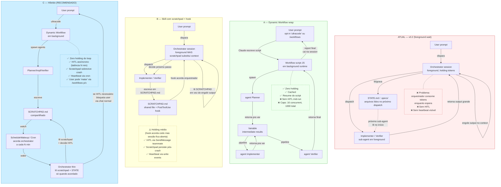

# 10 — Communication Models

## TL;DR

| Modelo | Custo holding | HITL mid-run | Cache | Resume após crash | Quando usar |
|---|---|---|---|---|---|
| **ATUAL** (v0.2) | ❌ alto | ❌ foreground | ❌ orquestrador cresce | ⚠️ STATE.md só | já está em produção; refatorar para C quando possível |
| **A** Dynamic Workflow wrap | ✅ zero | ❌ "no mid-run input" | ✅ script cached | ✅ resume do mesmo script | scripts one-shot sem HITL |
| **B** Skill com scratchpad + hook | ⚠️ médio (acorda em write) | ⚠️ via SendMessage | ⚠️ melhor (scratchpad substitui context) | ✅ scratchpad persiste | quando HITL é crítico e LATÊNCIA não é |
| **C** Híbrido (recomendado) | ✅ zero | ⚠️ assíncrono via ScheduleWakeup (latência N min) | ✅ | ✅ | **próxima iteração da skill — alvo** |

## Diagrama

## Por que essas 4 opções e não outras?

- **ATUAL** continua existindo — refatorar tudo para C é caro e arriscado mid-Phase-7a. Documentamos o trade-off mas não forçamos migração.
- **A** é o que a Anthropic recomenda em `code.claude.com/docs/en/workflows`. Resolve o problema de custo mas joga fora HITL.
- **B** é o que cabe **dentro da skill existente** com mudança mínima: adiciona SCRATCHPAD.md e um hook PostToolUse. Preserva HITL mas ainda tem holding.
- **C** é o que a **próxima versão da skill** (v0.3 ou v2) deveria mirar: combina zero holding de A com HITL assíncrono de B, com latência aceitável.

## Recomendação operacional

1. **AGORA (Phase 7a → 7b):** manter ATUAL. Já está rodando, refatorar mid-flight é maior risco que benefício.
2. **APÓS 7b (loop fechado):** rascunhar Opção A como POC — embrulha as últimas 5 phases do roadmap num script Dynamic Workflow. Medir custo.
3. **Próxima iteração da skill:** promover C. SCRATCHPAD.md + hook PostToolUse + ScheduleWakeup. Não é trabalho de uma sessão.

Ver diagrama `11-dynamic-workflow-flow.md` para a sequência de passos da opção C.
