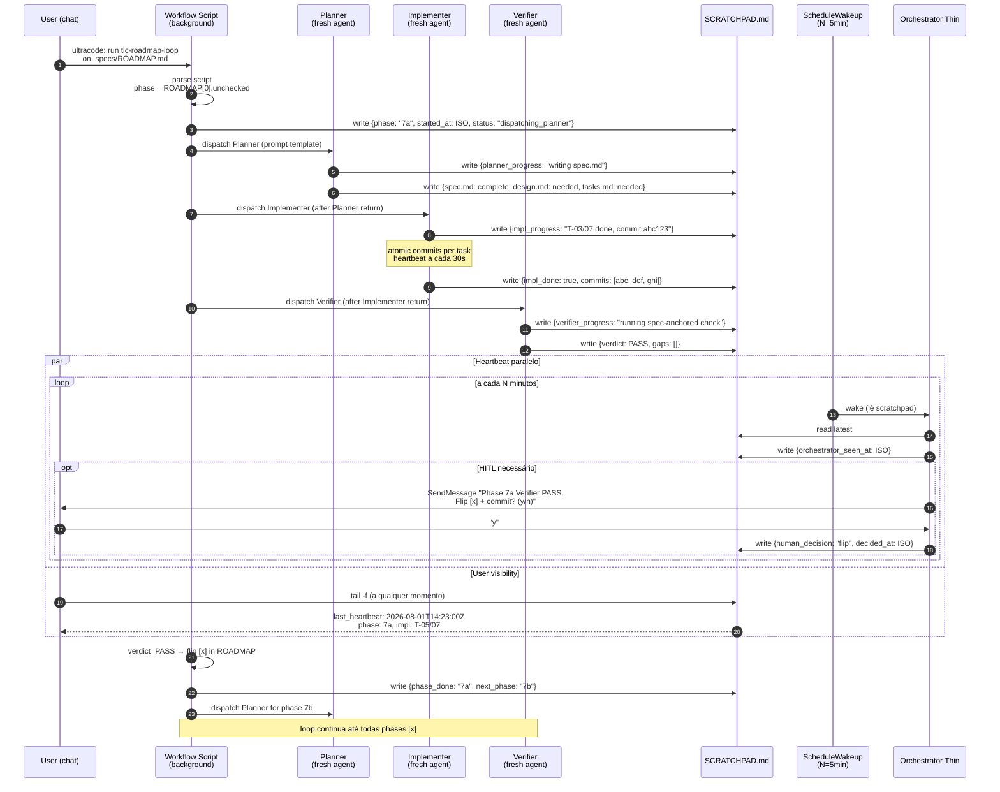
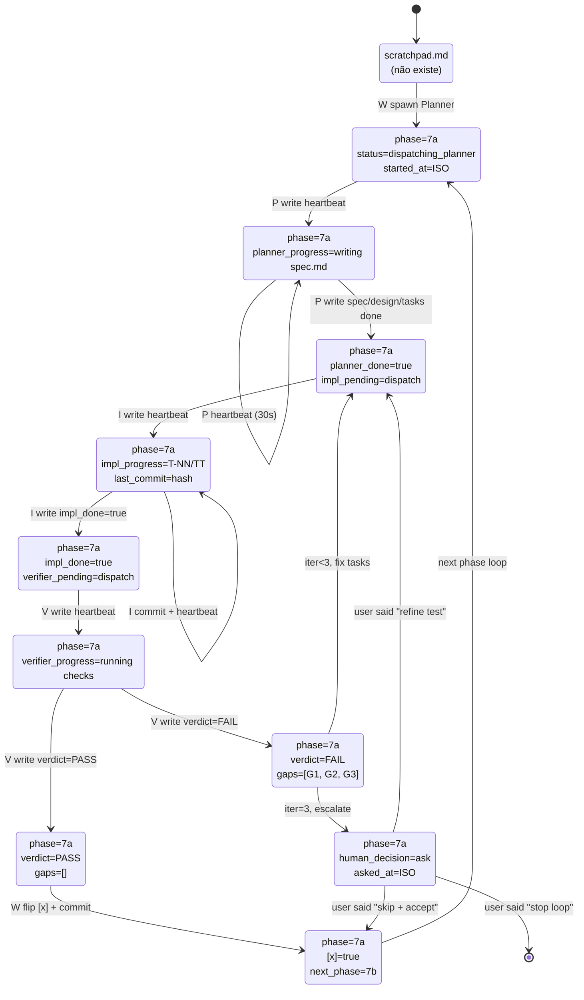
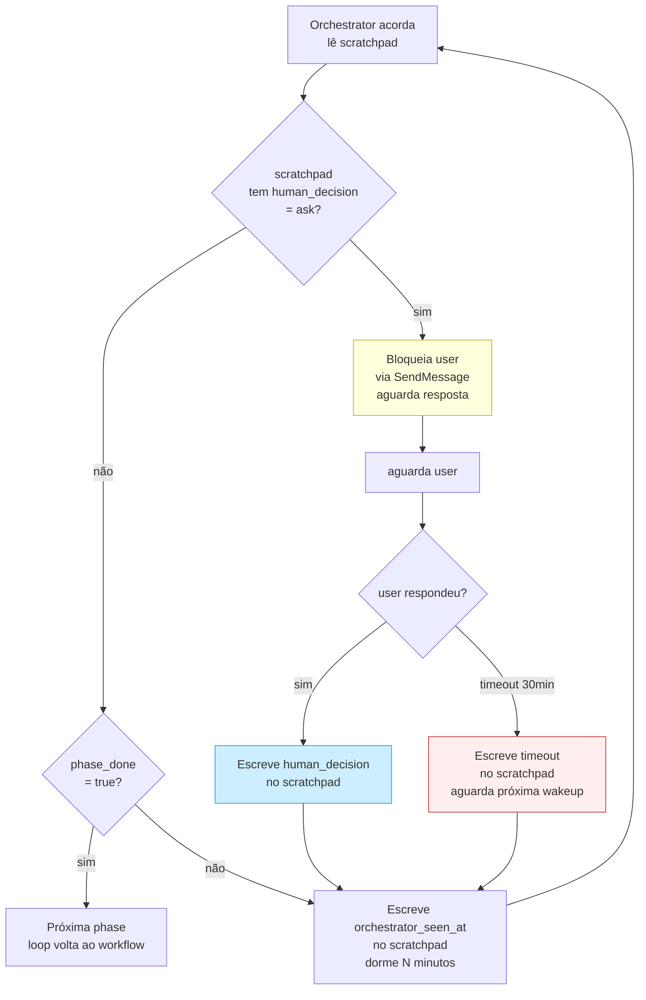
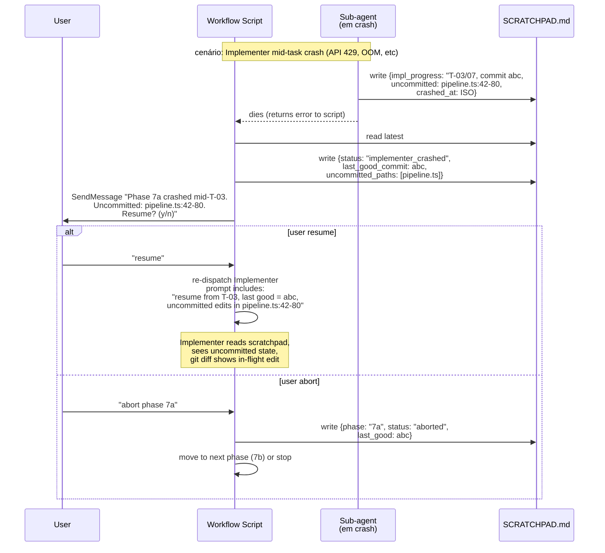

# 11 — Dynamic Workflow Flow (Opção C)

## TL;DR

**Loop principal em background, orquestrador thin acorda por cron, scratchpad é a única fonte de verdade entre agentes.**

```
┌─────────────────────────────────────────────────────────┐
│  USER (chat normal)                                     │
└──────┬──────────────────────────────────────────┬───────┘
       │ /workflows tlc-roadmap-loop               │ SendMessage
       ▼                                          ▼
┌──────────────────────┐                ┌────────────────────┐
│  Workflow Script     │                │ Orchestrator Thin   │
│  (background runtime)│                │ (ScheduleWakeup     │
│  • agent() dispatches│                │  cron N=5min)       │
│  • pipeline() chain  │◀─── lê ────────│  • lê scratchpad    │
│  • retorna final     │                │  • decide HITL      │
└──────┬───────────────┘                │  • bloqueia user    │
       │                                │    se necessário    │
       │ spawn                          └────────┬───────────┘
       ▼                                         │
┌──────────────────────┐                         │
│  Planner/Impl/       │── escreve ──────────────┤
│  Verifier agents     │                         │
│  (fresh sub-agents)  │                         ▼
└──────┬───────────────┘                ┌────────────────────┐
       │                                │  .specs/SCRATCHPAD │
       └──── lê STATE.md, ROADMAP ─────▶│  • last_heartbeat  │
                                        │  • pending_decision│
                                        │  • lesson_signal   │
                                        │  • agent_progress  │
                                        └────────────────────┘
```

## Diagrama 1 — Sequence: um phase completo end-to-end



## Diagrama 2 — State machine do SCRATCHPAD.md



## Diagrama 3 — Decisão: HITL ou autônomo?



## Diagrama 4 — Crash recovery



## Estrutura do SCRATCHPAD.md

```markdown
---
schema_version: 1
last_heartbeat: 2026-08-01T14:23:00Z
active_workflow: wf_abc123
---

# Roadmap loop state

## Current phase
- phase: 7a
- status: impl_active
- subchapter: null

## Sub-agent progress
- planner:
    dispatched: true
    completed: true
    spec_md: .specs/features/phase-7a-metrics/spec.md
    design_md: .specs/features/phase-7a-metrics/design.md
    tasks_md: .specs/features/phase-7a-metrics/tasks.md
    returned_at: 2026-08-01T14:10:00Z
- implementer:
    dispatched: true
    completed: false
    progress: "T-05/07 done, T-06 in flight"
    commits: [abc123, def456, ghi789]
    last_commit_at: 2026-08-01T14:22:30Z
- verifier:
    dispatched: false
    pending: true

## Verdicts
- last_verdict: null
- last_passed: phase_6b_4
- consecutive_fails: 0

## Pending decisions
- human_decision: null  # or "ask"
- human_asked_at: null
- human_decided_at: null

## Orchestrator heartbeat
- orchestrator_seen_at: 2026-08-01T14:23:00Z
- next_wakeup_at: 2026-08-01T14:28:00Z

## Lessons (last 5 confirmed)
- L-001: vec0 ≠ FTS5 trigger syntax
- L-002: Windows EBUSY retry
- ...

## Crash recovery
- last_crash: null
- last_good_commit: bc95558 (phase 6b.4 end)
- uncommitted_paths: []
```

## Trigger pra migrar ATUAL → C

Quando **qualquer uma** dessas virar verdade:

1. Custo de holding > 30% do budget da sessão do orquestrador
2. HITL mid-run virar requirement explícito do usuário
3. Crash mid-phase com trabalho não-commitado > 1x por sprint
4. Múltiplas workflows Memory Studio rodando em paralelo (precisa de coordenação)

Hoje: **Nenhuma** das 4 está ativa. Mas a primeira (1) já é borderline — Phase 7a teve 4h 30m de foreground wait.
