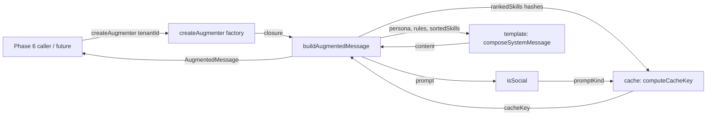

# System Message Builder Design

## Architectural Reference

This design implements two existing farol nodes and the edges that already connect them to the rest of the architecture:

- `augmenter` — the product-layer component described as "prompt → system msg". This phase delivers its public factory and the `buildAugmentedMessage` function; the `server` → `augmenter` (`delegate`) edge remains Phase 6 wiring.
- `cache` — the product-layer component described as "byte-string + sha256". This phase delivers the deterministic byte-string + sha256 cache key; the in-process lookup/store edge is a Phase 6 forwarder concern and is intentionally not implemented here.
- `social-detector` — the regex bypass guard. This phase consumes its public `isSocial(prompt: string): boolean`; the augmented `augmenter → social-detector` (`scan`, security) edge is materialized by the call site.
- `search` — the hybrid retrieval library. This phase consumes the `RankedSkill` shape and does not touch the search implementation; the augmented `augmenter → search` (`retrieve`) edge is already wired by callers using `createSearch`.
- `catalog` — the YAML + SQLite store. This phase reads `Persona` and `Rule` values supplied by the caller and never opens the catalog; no `catalog → augmenter` edge is needed.

Required stable IDs cited: **`augmenter`, `cache`, `social-detector`, `search`, `catalog`**.

No new farol component, edge, region or authority boundary is introduced. The cache key uses only Node's `crypto` module and the in-process `social-detector` function; no `cache → sqlite` edge is created because the cache is ephemeral and in-process per the locked PLAN §6 decision. Therefore no architectural discovery is required and `.specs/DISCOVERIES.md` remains unchanged.

**Spec:** `.specs/features/system-message-builder/spec.md`
**Status:** Draft (autonomous planner resolution)

---

## Approach Exploration

### Recommendation — Single factory + typed cache key + structured template

`createAugmenter({ tenantId })` binds the tenant identity once and returns a closure `buildAugmentedMessage(prompt, rankedSkills, persona?, rules?)` that: validates inputs, derives `promptKind` from `isSocial`, sorts the skill hashes, computes the cache key via the cache domain, composes the deterministic content via a template helper, and returns the `AugmentedMessage` shape required by the dispatch.

**Why chosen:** It directly delivers the dispatch's exact public contract, isolates the cache key computation in a typed separate domain (`src/cache/`) that can be independently verified, makes the social-bypass and threshold-fail branches trivial to assert (both reduce to "render without the skills section"), and keeps every layer pure so the hot-path purity constraint is enforceable by static analysis.

### Alternative A — `buildAugmentedMessage` as a free function taking `tenantId` per call

The simplest signature; no factory.

- **Pros:** No factory closure; one exported function.
- **Cons:** Either `tenantId` becomes a per-call parameter (violates the dispatch's required signature), or the cache key is forced to use a default empty tenant and the caller never sees a different cache key across tenants. The dispatch explicitly requires `tenantId` in the cache key.
- **Decision:** rejected because the dispatch's required signature has no `tenantId` slot but the cache key requires one.

### Alternative B — Factory that returns a single `buildAugmentedMessage` with the closure pre-bound

Same as recommendation, but the factory only returns the closure and the closure carries no surface beyond the four-argument signature.

- **Pros:** Identical to the recommendation.
- **Cons:** None — this is the same shape.
- **Decision:** this is the recommendation; listed for completeness.

### Alternative C — Push the cache key into social-detector / search

Treat the cache key as a derived property of the search result so the search library returns the cache key.

- **Pros:** Saves one call site.
- **Cons:** Conflates the social-bypass branch (no skills, so no search result) with the threshold-fail branch; search no longer has a single-responsibility contract; the cache key is recomputed in the wrong layer.
- **Decision:** rejected because the augmenter is the natural composition boundary and the spec is explicit about the cache key formula.

### Alternative D — Persist the cache in SQLite

Use the existing `skills.sqlite` to memoize the cache.

- **Pros:** Cache survives restarts.
- **Cons:** Farol says "cache → sqlite" is not an edge; PLAN §6 locks cache as ephemeral; the dispatch is explicit about deferring persistence; it would add an edge that violates the scope guard.
- **Decision:** rejected by architecture and dispatch.

---

## Architecture Overview



The two new domains are leaf components:

- `src/cache/` exposes `computeCacheKey(input): CacheKey` and `buildCacheByteString(input): Buffer`. It depends only on `node:crypto` and is pure.
- `src/augmenter/` exposes `createAugmenter(options)` and `AugmentedMessage`. It depends on `isSocial` from `src/social-detector/`, the `RankedSkill` type from `src/search/types.ts`, and the cache functions.

Both refuse to import network, HTTP, ONNX, Fastify, or any external service module; the static guard `AUG-20` enforces this.

---

## Code Reuse Analysis

### Existing Components to Leverage

| Component | Location | How to Use |
| --- | --- | --- |
| `isSocial(prompt): boolean` | `src/social-detector/is-social.ts` | Reuse the Phase 3 hook to derive `promptKind` and to short-circuit the skills block in the social-bypass branch. Do not re-implement the regex catalog. |
| `RankedSkill` type | `src/search/types.ts` | Import the readonly `RankedSkill` shape directly. Use `hash` for the cache key and `contentYaml` for the rendered `<skills>` block. |
| `SkillKind` literal types | `src/catalog/types.ts` | Reference `SkillKind` only if a future feature needs to type-narrow `RankedSkill`; not needed in Phase 5 because `RankedSkill` already carries the discriminator. |
| Native Node `crypto.createHash` | `node:crypto` | Use `createHash('sha256')` for the cache key, mirroring the deterministic-bytes pattern already used in `src/catalog/embedder.ts:23-60`. |
| Typed-error style | `src/catalog/errors.ts`, `src/search/errors.ts` | Mirror the existing `class XError extends Error { readonly code: CodeUnion }` pattern with an explicit `name`. |
| Native test runner | `test/social-detector.test.mjs`, `test/search/*.test.mjs` | Use `node:test` + `node:assert/strict` in `.mjs` test files. Each fixture becomes its own `test(...)` so the TAP count catches silent deletions. |
| Strict TypeScript | `tsconfig.json` | Strict mode + `noUncheckedIndexedAccess` is the contract for the new domains. No `any` except at the `unknown` input-validation boundary. |
| Existing `src/index.ts` | `src/index.ts` | Re-export the new public functions from domain files (no domain barrel per CLAUDE.md). |

### Integration Points

| System | Integration Method |
| --- | --- |
| `social-detector` | Direct ESM import of `isSocial` from `src/social-detector/is-social.ts`. Phase 5 is the first in-process caller; the dispatch already maps this edge. |
| `search` | Direct ESM type import of `RankedSkill` from `src/search/types.ts`. No runtime dependency. |
| `catalog` | No integration. The caller supplies `Persona` and `Rule` values. If a future phase needs to fetch them, it does so through the existing `src/catalog/` API and passes the result to `buildAugmentedMessage`. |
| Phase 6 forwarder | The factory's `AugmenterOptions` and the closure's `AugmentedMessage` shape are the contract; the forwarder adapts the HTTP request/response around this contract and will own the actual cache lookup/store. |
| Audit log (Phase 6) | The factory accepts `tenantId` as a string; the audit-log sha256 hash is applied by the forwarder, not here. |

---

## Components and Interfaces

### `src/cache/types.ts` — Cache domain contracts

- **Purpose:** Define the cache key inputs and the canonical `PromptKind` union.
- **Interface:**

```typescript
import type { RankedSkill } from '../search/types.ts';

export const PROMPT_KINDS = ['social', 'technical'] as const;
export type PromptKind = typeof PROMPT_KINDS[number];

export interface CacheKeyInput {
  readonly tenantId: string;
  readonly skillHashes: readonly string[];
  readonly promptKind: PromptKind;
}

export type CacheKey = string; // 64 lowercase hex chars
```

- **Dependencies:** `RankedSkill` from `src/search/types.ts` (type only).
- **Reuses:** `readonly` property style from `src/search/types.ts`.

### `src/cache/errors.ts` — Cache domain errors

- **Purpose:** Single typed error class for the cache domain.
- **Interface:**

```typescript
export type CacheErrorCode =
  | 'INVALID_TENANT_ID'
  | 'INVALID_SKILL_HASHES'
  | 'INVALID_PROMPT_KIND';

export class CacheError extends Error {
  readonly code: CacheErrorCode;
  constructor(message: string, code: CacheErrorCode) {
    super(message);
    this.name = 'CacheError';
    this.code = code;
  }
}
```

- **Dependencies:** None.
- **Reuses:** Error pattern from `src/search/errors.ts`.

### `src/cache/byte-string.ts` — Deterministic byte-string builder

- **Purpose:** Construct the canonical byte-string that the cache key hashes.
- **Interface:**

```typescript
export function buildCacheByteString(input: CacheKeyInput): Buffer;
```

- **Algorithm:**
  1. Validate `tenantId` is a non-empty string; otherwise throw `CacheError('INVALID_TENANT_ID')`.
  2. Validate `skillHashes` is an array of non-empty strings; otherwise throw `CacheError('INVALID_SKILL_HASHES')`.
  3. Validate `promptKind` is one of `'social' | 'technical'`; otherwise throw `CacheError('INVALID_PROMPT_KIND')`.
  4. Sort `skillHashes` case-sensitively ascending and remove duplicates.
  5. Concatenate `[tenantId, ...sortedUniqueHashes, promptKind].join('\n')` and encode as UTF-8 `Buffer`.
- **Dependencies:** `PROMPT_KINDS`, `CacheKeyInput`, `CacheError`.
- **Reuses:** None.

### `src/cache/hash.ts` — Cache key computation

- **Purpose:** Produce the cache key from the canonical byte-string.
- **Interface:**

```typescript
export function computeCacheKey(input: CacheKeyInput): CacheKey;
```

- **Algorithm:**
  1. Call `buildCacheByteString(input)` to obtain the canonical `Buffer`.
  2. Compute `createHash('sha256').update(buffer).digest('hex')`.
  3. Return the 64-char lowercase hex string.
- **Dependencies:** `node:crypto`, `buildCacheByteString`, `CacheKeyInput`, `CacheError`.
- **Reuses:** `sha256` counter-mode pattern from `src/catalog/embedder.ts:23-60`.

### `src/augmenter/types.ts` — Augmenter domain contracts

- **Purpose:** Define the public surface, the optional inputs, and the result shape.
- **Interface:**

```typescript
import type { RankedSkill } from '../search/types.ts';

export interface Persona {
  readonly slug: string;
  readonly content: string;
}

export interface Rule {
  readonly slug: string;
  readonly content: string;
}

export interface AugmenterOptions {
  readonly tenantId: string;
}

export interface AugmentedMessage {
  readonly content: string;
  readonly ephemeral: true;
  readonly cacheKey: string;
}

export type BuildAugmentedMessageFn = (
  prompt: string,
  rankedSkills: readonly RankedSkill[],
  persona?: Persona,
  rules?: readonly Rule[],
) => AugmentedMessage;
```

- **Dependencies:** `RankedSkill` type from `src/search/types.ts`.
- **Reuses:** `readonly` property style.

### `src/augmenter/errors.ts` — Augmenter domain errors

- **Purpose:** Single typed error class for the augmenter domain.
- **Interface:**

```typescript
export type AugmenterErrorCode =
  | 'INVALID_TENANT_ID'
  | 'INVALID_PROMPT'
  | 'INVALID_RANKED_SKILLS'
  | 'INVALID_PERSONA'
  | 'INVALID_RULES';

export class AugmenterError extends Error {
  readonly code: AugmenterErrorCode;
  constructor(message: string, code: AugmenterErrorCode) {
    super(message);
    this.name = 'AugmenterError';
    this.code = code;
  }
}
```

- **Dependencies:** None.
- **Reuses:** Error pattern from `src/search/errors.ts`.

### `src/augmenter/template.ts` — Deterministic template composer

- **Purpose:** Render the system message body in a stable, parseable, byte-stable format.
- **Interface:**

```typescript
export function composeSystemMessage(
  persona: Persona | undefined,
  rules: readonly Rule[] | undefined,
  sortedSkills: readonly RankedSkill[], // already sorted by hash
): string;
```

- **Algorithm:**
  1. Build a `sections: string[]` array.
  2. If `persona` is defined, push `<persona>\n{persona.content}\n</persona>`.
  3. If `rules` is a non-empty array, sort it by `slug.localeCompare`, render each line as `[slug] content`, and push `<rules>\n{lines.join('\n')}\n</rules>`.
  4. If `sortedSkills` is non-empty, render each line as `[slug] contentYaml`, and push `<skills>\n{lines.join('\n')}\n</skills>`.
  5. Return `sections.join('\n\n')`. No trailing newline.
- **Dependencies:** `Persona`, `Rule`, `RankedSkill`.
- **Reuses:** None.

### `src/augmenter/augmenter.ts` — Public factory and `buildAugmentedMessage`

- **Purpose:** Bind `tenantId` once, validate inputs, derive `promptKind`, sort skills, compute the cache key, compose the content, and return the `AugmentedMessage`.
- **Interface:**

```typescript
export function createAugmenter(options: AugmenterOptions): BuildAugmentedMessageFn;
```

- **Algorithm:**
  1. Validate `options.tenantId` is a non-empty string; throw `AugmenterError('INVALID_TENANT_ID')` otherwise.
  2. Return the closure `buildAugmentedMessage(prompt, rankedSkills, persona?, rules?)`:
     1. Validate `prompt` is a string, `rankedSkills` is an array, `persona` is undefined or a valid `Persona`, `rules` is undefined or an array of valid `Rule`. Throw `AugmenterError` with the matching code on any failure.
     2. Compute `promptKind = isSocial(prompt) ? 'social' : 'technical'`.
     3. Compute `sortedSkills = rankedSkills.length === 0 ? [] : [...rankedSkills].sort((a, b) => a.hash.localeCompare(b.hash))`. When `promptKind === 'social'` AND `rankedSkills.length > 0`, use `[]` for the rendered skills (the social-bypass branch) but keep the original `rankedSkills` for the cache key — the cache key encodes the actual selection, not the rendered output.
     4. Compute `cacheKey = computeCacheKey({ tenantId, skillHashes: sortedSkills.map(s => s.hash), promptKind })`.
     5. Compute `content = composeSystemMessage(persona, rules, sortedSkills)`.
     6. Return `{ content, ephemeral: true, cacheKey }`.
- **Dependencies:** `isSocial` from `src/social-detector/is-social.ts`; `computeCacheKey` from `src/cache/hash.ts`; `composeSystemMessage` from `src/augmenter/template.ts`; `AugmenterError`.
- **Reuses:** Validated input pattern from `src/search/search.ts:111-141`.

---

## Data Models

### `CacheKeyInput`

```typescript
interface CacheKeyInput {
  tenantId: string;          // non-empty
  skillHashes: readonly string[];  // each non-empty string
  promptKind: 'social' | 'technical';
}
```

**Invariants:** `tenantId` non-empty; `skillHashes` may be empty; `promptKind` is one of the two literals.

### `AugmentedMessage`

```typescript
interface AugmentedMessage {
  content: string;   // deterministic UTF-8
  ephemeral: true;   // literal type, not boolean
  cacheKey: string;  // 64-char lowercase hex sha256
}
```

**Invariants:** `content` is a deterministic UTF-8 string with no trailing newline; `ephemeral` is the literal `true` (the type narrows accordingly); `cacheKey` is the lowercase hex digest of `sha256(buildCacheByteString(input))`.

### `Persona` and `Rule`

```typescript
interface Persona { slug: string; content: string; }
interface Rule { slug: string; content: string; }
```

**Invariants:** `slug` is a non-empty string; `content` is a string (may be empty, but the empty-string case is unusual and not separately tested).

---

## Determinism Strategy

```text
buildAugmentedMessage(prompt, rankedSkills, persona, rules)
  ├── sortedHashes = uniqueSort(rankedSkills.map(s => s.hash))   // case-sensitive, ascending
  ├── promptKind = isSocial(prompt) ? 'social' : 'technical'
  ├── cacheKey = sha256(tenantId + '\n' + sortedHashes.join('\n') + '\n' + promptKind)
  ├── renderedSkills = (promptKind === 'social' ? [] : sortedSkills)  // social bypass
  └── content = composeSystemMessage(persona, rules, renderedSkills)
```

- The cache key uses the **actual** skill set (post-sort, dedup) regardless of `promptKind`. The rendered content uses the **displayed** skill set (possibly empty under social-bypass). This separation is what lets the cache key identity reflect the selection while the rendered content respects the social-detector edge.
- All sort orders are locale-aware (`localeCompare`) so PT-BR slugs sort the same way across processes.
- The cache domain uses Node's `crypto` module only; no platform-specific byte representation (no `Buffer.from(str, 'ucs2')`); UTF-8 is the canonical encoding.
- The static guard `AUG-20` ensures no `Date.now()`, `Math.random()`, `crypto.randomBytes()`, or wall-clock input is invoked in the augmenter or cache.

---

## Error Handling Strategy

| Scenario | Handling | Caller Impact |
| --- | --- | --- |
| `createAugmenter` called with non-string or empty `tenantId` | Throw `AugmenterError('INVALID_TENANT_ID')`. | Config-time failure; no closure is returned. |
| `buildAugmentedMessage` called with non-string `prompt` | Throw `AugmenterError('INVALID_PROMPT')`. | Caller bug; the function never produces a partial augmented message. |
| `buildAugmentedMessage` called with non-array `rankedSkills` | Throw `AugmenterError('INVALID_RANKED_SKILLS')`. | Caller bug. |
| `buildAugmentedMessage` called with non-`Persona` `persona` or non-Rule element in `rules` | Throw `AugmenterError('INVALID_PERSONA')` or `AugmenterError('INVALID_RULES')`. | Caller bug. |
| `computeCacheKey` receives invalid input | Throw `CacheError` with the appropriate code. | Caller bug; the cache key is never computed. |
| `isSocial(prompt)` returns `true` (social bypass) | Render base persona + rules only; no `<skills>` block; no error. | Expected normal branch. |
| `rankedSkills` is empty (threshold fail) | Render base persona + rules only; no `<skills>` block; no error. | Expected normal branch. |
| Network / LLM / IO requested from inside the augmenter or cache | Static guard `AUG-20` fails the test suite. | Defense-in-depth; the design has no runtime path to the network. |

The dispatch explicitly forbids an error path for `C3` (social bypass) and `C4` (threshold fail); both are encoded as return values, not exceptions.

---

## Testing Strategy

- **Unit:** cache contracts and errors, byte-string builder, sha256 cache key, template composer, public augmenter factory and closure.
- **Integration:** `createAugmenter({ tenantId })` + `buildAugmentedMessage` exercising the four mandatory scenarios (determinism, social bypass, threshold fail, persona/rules injection) plus the social+empty-skills edge.
- **Static guard:** `AUG-20` reads every file under `src/augmenter/` and `src/cache/` and asserts zero `fetch(`, `http.request`, `require('http')`, `require('https')`, `require('node-fetch')`, `from 'http'`, or `from 'https'` matches.
- **Coverage:** Native Node 22 coverage applied to `src/augmenter/**/*.ts` and `src/cache/**/*.ts` separately, with `--test-coverage-lines=80` per the project convention.
- **Mutation targets (for the Verifier's discrimination sensor):** cache byte-string sort order, social-bypass branch, threshold-fail branch, ephemeral literal type, promptKind branch, tenantId branch, `localeCompare` ↔ `<` comparison, `[slug] content` vs `<slug>content` rendering, `composeSystemMessage` `\n\n` vs `\n` separator.

---

## Risks & Concerns

| Concern | Location | Impact | Mitigation |
| --- | --- | --- | --- |
| `cacheKey` and `content` can drift out of sync if the sort order is encoded differently in the two domains | `src/cache/byte-string.ts`, `src/augmenter/augmenter.ts` | Provider cache miss or renderer order collision. | Single shared `localeCompare` rule documented in the determinism strategy; the integration test asserts identical `(content, cacheKey)` for repeated calls. |
| `Persona` and `Rule` are loosely typed and could accept `null`/`undefined` as `content` | `src/augmenter/types.ts` | A malformed persona or rule would render `[slug] undefined`. | Strict validation in `buildAugmentedMessage` rejects non-string `content`; the test fixture asserts a precise known-good output. |
| `isSocial` is currently a private regex catalog; the dispatch forbids any change to `src/social-detector/**` | `src/social-detector/is-social.ts` | Phase 5 cannot extend social detection. | Use the existing public hook as-is; the dispatch already maps this edge. |
| `ephemeral: true` literal type forces `as const` everywhere; careless serialization could produce a `boolean` instead | `src/augmenter/types.ts`, `src/augmenter/augmenter.ts` | Downstream typing sees `boolean` instead of `true`. | Return a literal object with `ephemeral: true as const`; the test fixture asserts `Object.is(message.ephemeral, true)` and that the field type narrows to `true`. |
| Static guard regex must not match `fetchPresence` or `httpRequests` accidentally | `test/augmenter/no-network.test.mjs` | False negatives. | The regex anchors `fetch(` with the open paren and `require('http')` with the literal quotes; the test asserts the exact pattern list. |
| Coverage command portability across Windows PowerShell and POSIX shells | `package.json` | Phase 4 hit this exact issue (T-ORCH-25 sprint). | The task spec instructs the implementer to add `test:coverage:augmenter` and `test:coverage:cache` scripts that expand globs through `node --test`, not through the shell. |
| `RankedSkill.hash` is a SHA-256 hex but the field is typed as `string`; the cache key uses the literal value | `src/augmenter/augmenter.ts` | A malformed `hash` (e.g. with embedded `\n`) would break the byte-string format. | The byte-string joins with `\n` between components; the cache key treats the hash as opaque. The integration test asserts determinism with realistic hashes; the byte-string builder does not validate the inner content of each hash. |
| Large `persona.content` or `rules[i].content` could cause O(n²) `localeCompare` calls | `src/augmenter/template.ts` | Latency under heavy payloads. | The catalog is small (hundreds of items); the public budget is p50 < 50ms. The test asserts no `await` or `setTimeout` is used so the timing is purely synchronous. |

---

## Tech Decisions

| Decision | Choice | Rationale |
| --- | --- | --- |
| Public API entry point | Factory `createAugmenter({ tenantId })` returns the four-argument closure | The dispatch's required signature has no `tenantId` slot but the cache key requires one; the factory is the only way to bind tenant identity without changing the function signature. |
| Cache key byte-string | `tenantId + '\n' + sortedUniqueHashes.join('\n') + '\n' + promptKind` UTF-8 | Explicit separators prevent collisions; LF is canonical on every supported platform. |
| Sort algorithm | `localeCompare` (locale-aware) | PT-BR slugs sort the same way across processes; the comparison is stable and deterministic. |
| Section format | `<persona>`, `<rules>`, `<skills>` tags; lines joined by `\n`; sections by `\n\n`; no trailing newline | Parseable by both humans and LLMs; the format is symmetric across sections. |
| `ephemeral` field | Literal `true` (type narrows) | The dispatch explicitly says "cache_control ephemeral marker" — the literal is the contract. |
| `Persona` and `Rule` types | Lightweight `{ slug, content }` records | The augmenter does not need full `SkillRecord` metadata; simpler types reduce the caller's surface. |
| Persistence | None. Cache is ephemeral and in-process. | PLAN §6 locks cache as ephemeral; farol reserves the persistence edge for a future phase. |
| Top-level re-export | `src/index.ts` re-exports `createAugmenter`, `BuildAugmentedMessageFn`, `AugmentedMessage`, `computeCacheKey`, `buildCacheByteString` from individual files | Mirrors the existing `src/index.ts` discovery pattern; no domain barrel. |
| Static guard | A `node:test` test that reads source files and asserts zero forbidden imports | Catches regressions automatically; not a manual review step. |
| Barrel files for `src/cache/` and `src/augmenter/` | None | CLAUDE.md: "Sem barrel exports". Consumers import directly from the file. |

All decisions are feature-local applications of existing PLAN/ROADMAP/CLAUDE.md constraints; no new project-level `AD-NNN` is required.
