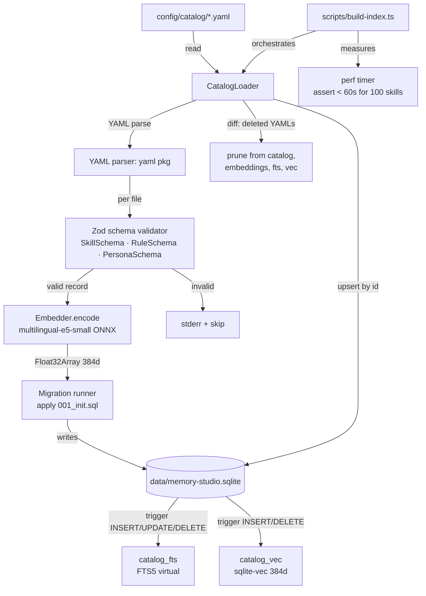

# Phase 1 — Catalog + Schema + Index — Design

**Spec:** [`./spec.md`](./spec.md)
**Status:** Draft

---

## Architecture Overview

Phase 1 rewrites `src/catalog/**` from calibration residue into the PRD v3.4 shape. The runtime surface is one CLI/script (`npm run build-index`) plus the library modules it imports. Phase 5 reads from the resulting SQLite file via the FTS5 + sqlite-vec virtual tables; Phase 1 only writes to them.



The catalog side (left half: YAML → SQLite) is what Phase 1 implements. The query side (right half: `search → fts5-vec → catalog`) is Phase 5 — Phase 1 only proves the storage substrate is queryable via tests (AC-11) without exposing it as a runtime API.

---

## File Layout (rewriting `src/catalog/**`)

```
src/catalog/
├── index.ts                 # Public surface: getCatalogSchemaVersion, openCatalogDb, loadCatalog
├── types.ts                 # Skill, Rule, Persona, CatalogRecord (PRD v3.4 types)
├── schema/
│   ├── skill.ts             # Zod schema for Skill (id, type, title, category, text)
│   ├── rule.ts              # Zod schema for Rule (id, type, text, critical?)
│   ├── persona.ts           # Zod schema for Persona (id, type, text, isDefault?)
│   └── shared.ts            # id-format regex, common refinements
├── migrations/
│   ├── runner.ts            # applyMigrations(db) — checks schema_migrations, applies pending
│   └── 001_init.sql         # catalog + embeddings + audit_events + schema_migrations + FTS5 + vec + triggers
├── db/
│   ├── open.ts              # openCatalogDb(path) — opens better-sqlite3 + loads sqlite-vec extension
│   └── triggers.ts          # applyTriggers(db) — installs FTS5 + vec sync triggers (idempotent)
├── embedder/
│   ├── types.ts             # Embedder interface: encode(text): Promise<Float32Array>
│   ├── multilingual-e5-small.ts  # ONNX implementation (query: / passage: prefixes)
│   └── model-path.ts        # Resolves models/multilingual-e5-small/{model.onnx,tokenizer.json}
├── loader.ts                # CatalogLoader.loadAll(): parse YAML → validate → embed → upsert → prune
├── errors.ts                # CatalogError, SchemaError, EmbedderError, MigrationError (typed)
└── version.ts               # export const CATALOG_SCHEMA_VERSION = 3; export function getCatalogSchemaVersion(): number

scripts/
└── build-index.ts           # CLI: orchestrates loader + perf measurement + exit code

config/catalog/              # NEW — git-tracked YAML source
├── README.md                # 1-page usage doc (how to add a Skill/Rule/Persona)
└── example-skill.yaml       # 1 sample Skill to prove AC-1

test/catalog/
├── schema.test.mjs          # Zod validation: valid + invalid fixtures (Skill/Rule/Persona)
├── migrations.test.mjs      # applyMigrations: idempotency + version tracking
├── fts5-triggers.test.mjs   # catalog_fts sync on INSERT/UPDATE/DELETE
├── vec-triggers.test.mjs    # catalog_vec sync + vec_distance_cosine
├── embedder.test.mjs        # multilingual-e5-small: 384d output, deterministic for same text
├── loader.test.mjs          # idempotency: re-run is no-op; modify updates; delete prunes
├── perf.test.mjs            # 100-skill fixture + build-index < 60s assertion
└── version.test.mjs         # getCatalogSchemaVersion() === 3
```

**Removed (calibration residue deleted in T-01):**
- `src/catalog/{cli,writer,embedder-stub}.ts` — calibration's deterministic stub is replaced by real ONNX embedder; the old CLI is replaced by `scripts/build-index.ts`; the old writer is replaced by `CatalogLoader.upsertById`.
- The corresponding test files in `test/catalog/` (and any imports from `src/search/`'s calibration residue).

**Preserved untouched:**
- `src/social-detector/is-social.ts` (Phase 2 promotes it; per AC-16).

---

## Code Reuse Analysis

### Existing components to leverage (from calibration residue)

| Component | Location (current) | How to use | Why reuse |
|---|---|---|---|
| **RRF algorithm** | `src/search/rrf.ts` | Algorithm only (denoised ranks, threshold gates) | Calibration got the algorithm right per `.specs/CALIBRATION-RESIDUE.md`; Phase 1 doesn't query, but the algorithm is documented in `loader.ts` JSDoc for Phase 5 reference |
| **NFC normalization** | `src/catalog/loader.ts` (calibration) | Port the `nfcNormalize(text)` helper to the new `src/catalog/loader.ts` | Improves FTS5 tokenization consistency for accented characters |
| **BLOB round-trip for embeddings** | `src/catalog/embedder.ts` + `src/search/vector.ts` (calibration) | Port the `float32ToBlob(arr)` and `blobToFloat32(buf)` helpers into `src/catalog/embedder/multilingual-e5-small.ts` | Calibration got the layout right (1536 bytes for 384d Float32); sqlite-vec 0.1.9 reads it directly via `vec_from_float32()` |
| **sqlite-vec 0.1.9 PK binding workaround** | `src/search/vector.ts` (calibration) | Document the workaround inline in `src/catalog/db/open.ts` JSDoc — vec virtual table requires explicit `rowid` binding on INSERT | Saves Phase 5 the discovery cost; calibration paid it |
| **ONNX runtime session pattern** | `src/catalog/embedder.ts` (calibration, stub version) | Replace `DeterministicStubEmbedder` with `MultilingualE5SmallEmbedder` using the same `InferenceSession` API | Same `onnxruntime-node` import path; session lifecycle (`create → run → close`) is identical |
| **Calibration spec for pattern** | `.specs/archive/2026-07-calibration/features/schema-and-crud/{spec,design}.md` | Read for spec → design → tasks structure | Phase 1 spec.md mirrors this structure (per `.specs/CALIBRATION-RESIDUE.md`) |

### NOT to reuse (per CALIBRATION-RESIDUE.md)

| Component | Why NOT to reuse |
|---|---|
| `src/catalog/types.ts` calibration `SkillRecord` (`slug`, `kind`, `content_yaml`) | PRD v3 expects `id/type/title/text/category/critical/isDefault`; field names are different |
| `src/catalog/schema.ts` calibration `skills` table | PRD v3 expects `catalog` + `embeddings` split tables (vector in its own row) |
| `src/catalog/cli.ts` | Replaced by `scripts/build-index.ts` (different concerns: perf measurement + script contract) |
| `src/catalog/writer.ts` | Replaced by `CatalogLoader.upsertById` with versioned migration strategy |

---

## Components

### 1. Zod Schemas (`src/catalog/schema/*.ts`)

- **Purpose**: Validate YAML-parsed objects against PRD v3.4 shape before embedding
- **Location**: `src/catalog/schema/{skill,rule,persona,shared}.ts`
- **Interfaces**:
  - `export const SkillSchema: z.ZodType<Skill>`
  - `export const RuleSchema: z.ZodType<Rule>`
  - `export const PersonaSchema: z.ZodType<Persona>`
  - `export function validateCatalogItem(parsed: unknown): { ok: true; record: CatalogRecord } | { ok: false; error: string }`
- **Dependencies**: `zod` (3.x)
- **Reuses**: `id` regex pattern from calibration `src/catalog/types.ts` (kebab-case enforcement)

### 2. Migration Runner (`src/catalog/migrations/runner.ts`)

- **Purpose**: Apply pending SQL migrations idempotently; track in `schema_migrations` table
- **Location**: `src/catalog/migrations/`
- **Interfaces**:
  - `export async function applyMigrations(db: Database): Promise<{ applied: string[]; currentVersion: number }>`
- **Dependencies**: `better-sqlite3`
- **Reuses**: None (greenfield; calibration never had versioned migrations)

### 3. SQLite DDL (`src/catalog/migrations/001_init.sql`)

- **Purpose**: Single migration creating all Phase 1 tables, virtual tables, triggers
- **Location**: `src/catalog/migrations/001_init.sql`
- **Schema**:
  - `catalog` — `id TEXT PRIMARY KEY`, `type TEXT CHECK IN ('skill','rule','persona')`, `title TEXT`, `text TEXT NOT NULL`, `category TEXT`, `critical INTEGER`, `is_default INTEGER`, `hash TEXT NOT NULL`, `created_at INTEGER NOT NULL`, `updated_at INTEGER NOT NULL`
  - `embeddings` — `catalog_id TEXT PRIMARY KEY REFERENCES catalog(id) ON DELETE CASCADE`, `vector BLOB NOT NULL`, `model_version TEXT NOT NULL`, `embedded_at INTEGER NOT NULL`
  - `audit_events` — `id INTEGER PRIMARY KEY AUTOINCREMENT`, `ts INTEGER NOT NULL`, `tenant_hash TEXT NOT NULL`, `event_type TEXT NOT NULL`, `payload TEXT NOT NULL`, `fingerprint TEXT`, `matched_ids TEXT`, `pruning_reasons TEXT`, `latency_ms INTEGER`, `redacted_prompt_hash TEXT`
  - `schema_migrations` — `version INTEGER PRIMARY KEY`, `name TEXT NOT NULL`, `applied_at INTEGER NOT NULL`
  - `catalog_fts` (FTS5 virtual) — `content='catalog'`, `text TEXT` (mirrors catalog.text via triggers)
  - `catalog_vec` (sqlite-vec virtual) — `embedding FLOAT[384] PRIMARY KEY` (rowid-bound to catalog.id)
  - Triggers: `catalog_ai`, `catalog_au`, `catalog_ad` (FTS5 sync); `embeddings_ai`, `embeddings_ad` (vec sync)

### 4. Embedder (`src/catalog/embedder/multilingual-e5-small.ts`)

- **Purpose**: Encode text into 384d Float32Array using multilingual-e5-small ONNX
- **Location**: `src/catalog/embedder/`
- **Interfaces**:
  - `export interface Embedder { encode(text: string): Promise<Float32Array>; readonly dimensions: 384; }`
  - `export class MultilingualE5SmallEmbedder implements Embedder`
- **Dependencies**: `onnxruntime-node`, `@huggingface/transformers` (for tokenizer only)
- **Reuses**: Calibration's `InferenceSession` lifecycle pattern; replaces `DeterministicStubEmbedder`

### 5. CatalogLoader (`src/catalog/loader.ts`)

- **Purpose**: Orchestrate parse → validate → embed → upsert → prune
- **Location**: `src/catalog/loader.ts`
- **Interfaces**:
  - `export class CatalogLoader`
    - `constructor(db: Database, embedder: Embedder, options: { yamlDir: string })`
    - `async loadAll(): Promise<{ added: number; updated: number; deleted: number; skipped: number; durationMs: number }>`
- **Dependencies**: `yaml` package, Zod schemas, `Embedder`, `Database`
- **Reuses**: Calibration's NFC normalization + idempotency-by-id pattern

### 6. Build-Index Script (`scripts/build-index.ts`)

- **Purpose**: CLI orchestrator — parse args, open DB, apply migrations, run loader, measure perf, exit with code
- **Location**: `scripts/build-index.ts`
- **Contract**:
  - Exit 0 on full success (with at least 1 item loaded OR explicit `--empty-ok` flag)
  - Exit 1 on any unrecoverable error (DB open fail, migration fail, ONNX model missing)
  - Exit 2 on partial success (≥ 1 YAML file skipped due to validation) — stderr reports `skipped: N`
  - Stderr format: `[INFO] build-index: parsing <yamlDir>`, `[PERF] build-index: <ms>ms for <N> skills`, `[WARN] build-index: skipped <file>: <reason>`
- **Dependencies**: All `src/catalog/**` modules
- **Reuses**: None (greenfield script)

---

## Data Models

### `Skill` (PRD §6.1)

```typescript
interface Skill {
  id: string                          // kebab-case, unique, e.g. "auth-jwt-01"
  type: "skill"
  title: string                       // human-readable, required
  category: "procedural" | "diagnostic" | "reference" | "pattern"  // required enum
  text: string                        // multi-line body, NFC-normalized, non-empty
}
```

### `Rule` (PRD §6.2)

```typescript
interface Rule {
  id: string                          // kebab-case, unique
  type: "rule"
  text: string                        // non-empty
  critical?: boolean                  // default false; if true, atomic injection (Phase 5 honors)
}
```

### `Persona` (PRD §6.3)

```typescript
interface Persona {
  id: string                          // kebab-case, unique
  type: "persona"
  text: string                        // non-empty
  isDefault?: boolean                 // default false; max 1 true in activeCatalog
}
```

### `CatalogRecord` (internal — what loader writes to DB)

```typescript
interface CatalogRecord {
  id: string
  type: "skill" | "rule" | "persona"
  title?: string                      // only for skills
  text: string
  category?: SkillCategory            // only for skills
  critical?: boolean                  // only for rules
  isDefault?: boolean                 // only for personas
  hash: string                        // sha256(canonical JSON), for change detection
  createdAt: number                   // epoch ms
  updatedAt: number                   // epoch ms
}
```

### `Embedding` (row in `embeddings` table)

```typescript
interface Embedding {
  catalogId: string                   // FK → catalog.id
  vector: Float32Array                // 384d, stored as BLOB
  modelVersion: string                // "multilingual-e5-small-v1" (constant for Phase 1)
  embeddedAt: number                  // epoch ms
}
```

### `schema_migrations` row

```typescript
interface Migration {
  version: number                     // 1, 2, 3... (sequential)
  name: string                        // "001_init", "002_audit_columns", etc.
  appliedAt: number                   // epoch ms
}
```

---

## Error Handling Strategy

| Error Scenario | Handling | User Impact |
|---|---|---|
| YAML file is unreadable (permission denied) | Stderr `[WARN] skipped <file>: <reason>`; continue with others | Build-index exits 2 (partial success); npm script surfaces as error |
| YAML file fails Zod validation | Stderr `[WARN] skipped <file>: <field>: <reason>`; continue | Same as above |
| ONNX model file missing | Stderr `[ERROR] model not found at <path>`; throw EmbedderError; abort | Build-index exits 1; CI fails clearly |
| `data/` directory doesn't exist | `mkdir -p` before opening DB | Silent (operational setup) |
| SQLite file is corrupted | Open throws → CatalogError; abort | Build-index exits 1 |
| Migration fails (DDL error) | Stderr `[ERROR] migration 001_init failed: <sqlite msg>`; abort | Build-index exits 1 |
| Duplicate `id` across YAML files | First wins; second gets `[WARN] skipped <file>: duplicate id "<id>"` | Build-index exits 2 |
| `category` outside enum | Zod rejects; `[WARN] skipped <file>: category: invalid enum value` | Build-index exits 2 |
| Embedding returns wrong dimensions (not 384) | EmbedderError; abort | Build-index exits 1 |

---

## Tech Decisions (non-obvious choices)

| Decision | Choice | Rationale |
|---|---|---|
| **YAML library** | `yaml` (eemeli) | Schema-aware, NFC-normalized round-trip, better than `js-yaml` for our needs (see A-1) |
| **Schema validation** | `zod` v3 | Type inference (`z.infer<typeof SkillSchema>`), standard TS ecosystem, mature |
| **Migrations** | Single `001_init.sql` + runner | Phase 1 only; future phases add `002_*.sql`. Bumps MAJOR on breaking changes (PLAN §16.4 M2) |
| **Idempotency key** | `catalog.id` (TEXT PK) + `hash` for change detection | `id` is stable across runs; `hash` detects in-place edits. Two-step: find by id, compare hash, skip if same |
| **ONNX input format** | `query: ` / `passage: ` prefixes | Required by multilingual-e5-small model card; dropping drops quality ~30% |
| **Audit columns in Phase 1 DDL** | Include Phase 5-ready columns now (`fingerprint, matched_ids, pruning_reasons, latency_ms, redacted_prompt_hash`) | Avoids Phase 5 needing a migration; columns nullable until writers land |
| **Perf measurement** | Wall-clock from `process.hrtime.bigint()` in `build-index.ts`; assert `< 60_000 ms` after load with a 100-skill synthetic fixture | PRD §10.4 item 1 is "medido, não estimado" |
| **Build-index exit codes** | 0 = full success; 1 = unrecoverable; 2 = partial (≥ 1 skip) | Lets CI distinguish "no catalog" from "broken catalog" |
| **Test framework** | `node --test` (built-in) | CLAUDE.md testing contract; calibration residue uses this |
| **FTS5 tokenizer** | `unicode61` (default) with Porter stemming disabled (e.g. `tokenize='unicode61 remove_diacritics 2'`) | Removes accents for Portuguese/Spanish/etc. tokens; matches PRD's multilingual requirement |
| **vec PK binding** | Use `rowid` from `catalog.id` directly (text → rowid mapping via the embeddings table FK) | sqlite-vec 0.1.9 limitation; calibration worked around it. Document inline |

---

## Risks & Concerns

| Concern | Location | Impact | Mitigation |
|---|---|---|---|
| **185-test baseline breakage** | `test/` existing tests reference calibration `src/catalog/**` types | T-01 deletion of calibration files will break tests that import them | T-01 includes updating/removing those test files in the same commit (atomic). New tests in T-02..T-15 grow count back. |
| **ONNX Windows friction** | `onnxruntime-node` prebuilt binary, OS-specific | Build-index may fail to load model on Windows due to runtime path | Phase 0 verified ONNX loads (per AC of Phase 0). If Phase 1 fails, fallback: re-run Phase 0 to confirm baseline; document any path quirks |
| **sqlite-vec 0.1.9 vec_distance_cosine stability** | `catalog_vec` queries | Returns finite float for valid vectors; NaN for zero-vectors | Document in `src/catalog/db/open.ts` JSDoc; tests cover both cases (AC-8) |
| **FTS5 trigger recursion** | `catalog_ai/au/ad` triggers | Could trigger cascade if not careful | Use `AFTER` not `BEFORE`; triggers only touch `catalog_fts`, not `catalog` (no recursion) |
| **Embedding BLOB byte order** | Float32Array stored as BLOB | Endianness matters across platforms | Use `Buffer.from(arr.buffer, arr.byteOffset, arr.byteLength)`; documented as little-endian (Node default) |
| **Migration version drift** | `schema_migrations` table | Phase 5+ may add migration 002; Phase 1 must not assume `version: 1` is always the only row | Runner checks `MAX(version)` and applies any pending; safe for future migrations |
| **Perf budget under 60s with 384d × 100 items** | ONNX encode is the slow path | ONNX model ~470MB, encode ~10-50ms per item → 1-5s for 100 items; FTS5 + vec DDL is sub-second | Test in `perf.test.mjs`; if > 60s, profile and optimize (e.g. batch encoding) — not premature |
| **Calibration residue deletion timing** | T-01 vs T-02 | If T-02 references a deleted type, compile fails | T-01 is atomic (delete + new types in same commit). T-02+ never touches the old code |
| **Empty catalog on first run** | User runs build-index before adding any YAML | Exit 0 with `[INFO] build-index: 0 items loaded` | Acceptable; UI will be empty; document in `config/catalog/README.md` |
| **YAML file with only comments** | Edge case | Parsed object is empty; Zod fails on missing `id` | Caught by Zod; stderr + skip |

---

## Subchapter Breakdown (per dispatch constraint)

Phase 1 will exceed 15 atomic tasks. Per `tlc-spec-driven` SUBCHAPTER_BREAKDOWN trigger #1, return as 4 subchapters:

| Subchapter | Scope | Tasks | Farol nodes touched |
|---|---|---|---|
| **Phase 1.1 — YAML schema + Zod validation** | T-01..T-04 (4 tasks) | Rewrite `src/catalog/types.ts`, `src/catalog/schema/*`, delete calibration residue, add `config/catalog/` dir + sample | (none — pure TS schema work) |
| **Phase 1.2 — SQLite migrations + FTS5 + vec** | T-05..T-08 (4 tasks) | Migration runner, `001_init.sql`, `openCatalogDb`, triggers | `sqlite`, `fts5-vec` (create side) |
| **Phase 1.3 — Loader (YAML → SQLite)** | T-09..T-12 (4 tasks) | Embedder interface + multilingual-e5-small impl, CatalogLoader, version.ts | `embed-model`, `catalog` (writer side) |
| **Phase 1.4 — Build-index script + perf** | T-13..T-16 (4 tasks) | `scripts/build-index.ts`, perf test, README, package.json wiring, D-001 cross-check | (orchestration only) |

Total: **16 atomic tasks** across 4 subchapters. Each subchapter packs cleanly into one Implementer batch (≤ 7 tasks). Whole Phase 1 fits in 2 batches (subchapters 1.1+1.2 = 8 tasks / subchapters 1.3+1.4 = 8 tasks).

The Verifier runs **once** at the end of Phase 1 (after the 16 tasks complete) — per `tlc-spec-driven` SKILL.md, validator always runs at the end of Execute, not per subchapter.

---

## Cross-references

- [`./spec.md`](./spec.md) — Phase 1 spec (33 traceable requirements)
- [`.specs/ROADMAP.md` Phase 1](../../ROADMAP.md) — done criteria
- [`.specs/ARCHITECTURE.md`](../../ARCHITECTURE.md) — farol stable IDs (catalog, sqlite, embed-model, catalog-yaml, fts5-vec)
- [`.specs/CALIBRATION-RESIDUE.md`](../../CALIBRATION-RESIDUE.md) — `src/catalog/**` disposition
- [`.specs/STATE.md ## Handoff`](../../STATE.md) — phase pointer ("Phase 1")
- [`.memory-studio/setup.md`](../../../.memory-studio/setup.md) — state.json schema (R-14)
- [`.scratch/memory-studio/spec.md`](../../../.scratch/memory-studio/spec.md) §IMod-6, §IMod-13, §IMod-14, §IMod-15 — comprehensive SPEC source
- [PRD §6](../.../.../PRD.md), §8, §10.4 item 1 — schema, stack, SLA
- [PLAN §16.4 M2](../../PLAN.md) — schema versioning policy