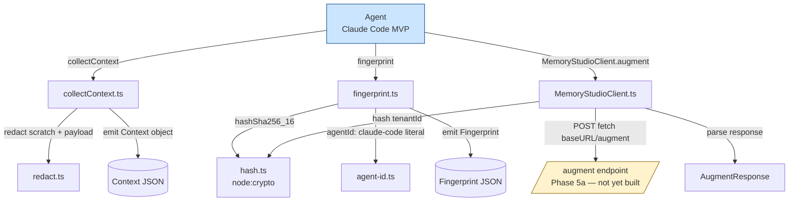

# Phase 3 — SDK Cliente — Design

**Spec:** [`./spec.md`](./spec.md)
**Status:** Draft

---

## Architecture Overview

Phase 3 creates a new npm workspace package `@memory-studio/sdk` at `packages/sdk/`. The SDK is the **client side** of Memory Studio's request flow: agents call `collectContext` to gather their state (with secret redaction), `fingerprint` to build a 4-component provenance object (with sha256[0:16] sessionId hashing), and `MemoryStudioClient.augment` to POST the request to `/augment` (server in Phase 5a).



The **agent-side SDK** is what Phase 3 implements (blue). The **server-side `/augment`** is Phase 5a (yellow, not yet built) — SDK tests mock the HTTP layer.

---

## File Layout (greenfield `packages/sdk/**`)

```
Memory-Studio/                       # repo root
├── package.json                     # ROOT: gains "workspaces": ["packages/*"]
├── tsconfig.json                    # ROOT: unchanged (root-only)
├── src/                             # Phase 1+2 territory — UNCHANGED in Phase 3
│   ├── catalog/
│   ├── social-detector/
│   ├── fingerprint/
│   └── search/
├── test/                            # ROOT tests — UNCHANGED (207-test baseline preserved)
│
└── packages/                        # NEW: monorepo workspaces root
    └── sdk/                         # NEW: @memory-studio/sdk
        ├── package.json             # NEW: name, type, exports, scripts (build via tsup)
        ├── tsconfig.json            # NEW: minimal TS config (matches root shape)
        ├── tsup.config.ts           # NEW: dual ESM + CJS + d.ts build config
        ├── README.md                # NEW: install + usage + API reference (< 100 lines)
        ├── .gitignore               # NEW: dist/, node_modules/
        ├── src/                     # NEW: SDK source
        │   ├── index.ts             # Public barrel: re-exports 3 functions + 7 types
        │   ├── agent-id.ts          # const AGENT_ID = "claude-code" (MVP literal)
        │   ├── hash.ts              # hashSha256_16(input): string — node:crypto sha256[0:16]
        │   ├── redact.ts            # Redactor with 3 minimal + 3 strict regex patterns
        │   ├── collect-context.ts   # collectContext(): builds Context, applies redact
        │   ├── fingerprint.ts       # fingerprint(): builds 4-comp, hashes sessionId
        │   ├── memory-studio-client.ts  # class MemoryStudioClient with .augment()
        │   └── types.ts             # CollectContextInput, Context, FingerprintInput,
        │                            #   Fingerprint, AugmentRequest, AugmentResponse,
        │                            #   RedactionMode, SdkError
        ├── test/                    # NEW: SDK workspace tests
        │   ├── hash.test.mjs        # Golden vectors + determinism + perf
        │   ├── redact.test.mjs      # 3 minimal patterns + 3 strict patterns + edge cases
        │   ├── collect-context.test.mjs  # Redact application + shape
        │   ├── fingerprint.test.mjs # 4-comp shape + hash + no-leak
        │   ├── memory-studio-client.test.mjs  # HTTP POST shape + prompt-only + error paths
        │   └── smoke.test.mjs       # await import("@memory-studio/sdk") works
        └── dist/                    # BUILD OUTPUT (gitignored)
            ├── index.mjs            # ESM build
            ├── index.cjs            # CJS build
            ├── index.d.ts           # CJS types
            └── index.d.mts          # ESM types (or .d.ts with package.json type:module)
```

**Root changes (minimal):**
- `package.json` — adds `"workspaces": ["packages/*"]` field. No script changes.
- (No other root file changes — `tsconfig.json`, `.gitignore`, `tsconfig.node.json` untouched.)

**SDK package files created:**
- 7 source files under `packages/sdk/src/`
- 6 test files under `packages/sdk/test/`
- `package.json`, `tsconfig.json`, `tsup.config.ts`, `README.md`, `.gitignore`

---

## Code Reuse Analysis

### Strategy: SDK is truly standalone (Option c — inline primitives)

Phase 2's `src/fingerprint/{hash,fingerprint}.ts` is the **authoritative server-side reference** for hash + fingerprint behavior. The SDK needs the same logic but cannot depend on the root package (root is `"private": true` and not a published package; cross-package TypeScript project references for ~20 lines of code is overkill).

**Decision (per spec A-4):** inline the hash primitive and fingerprint function inside the SDK. Verify correctness via:
1. **Golden vectors** — `hashSha256_16` matches NIST vectors (empty string, "abc", "The quick brown fox..."). Same vectors Phase 2 tests assert. If they match, the implementation is provably correct.
2. **4-component contract test** — `fingerprint` returns object with exactly 4 keys + `sessionId` matches `hashSha256_16(input.sessionId)` + raw sessionId not in return. Same contract Phase 2 implements.

**Drift mitigation:**
- Both implementations use `node:crypto` `createHash("sha256")` — there's only one correct way to compute SHA-256.
- The 4-component object shape is locked by PRD §5 + SPEC §IMod-2 — both implementations will conform.
- If they ever diverge (e.g., one adds a 5th field), the discriminator is the contract test, not the implementation.

### What is reused (not reimplemented)

| From | What | How |
|---|---|---|
| **PRD §5 SDK snippet** | The TypeScript usage example | Copied verbatim into `packages/sdk/README.md` as the "Basic Usage" section |
| **PRD §7.1 schemas** | `AugmentRequest` + `AugmentResponse` shapes | Imported as TS literal types in `packages/sdk/src/types.ts` — no runtime dep on Zod (we trust the server's response shape; Zod validation happens server-side) |
| **NIST SHA-256 vectors** | Golden test vectors for hash | Same set Phase 2 uses — sourced from NIST FIPS 180-4 |
| **PRD §17.2 nomenclature** | `recentFiles` / `lastEvent` canonical casing | Used in `Context` type definition |
| **Phase 1 `src/catalog/schema/skill.ts` types** | `Skill`, `Rule`, `Persona` type shapes | **NOT imported** (would require workspace dep). SDK's `AugmentResponse.matchedSkills[i]` uses the inline type `{ id: string; score: number; source: "builtin" \| "user" }` matching PRD §7.1 — no `import type { Skill } from "../../src/catalog/schema/skill.ts"` |

### What is NOT reused

| Component | Why NOT to reuse |
|---|---|
| `src/fingerprint/{hash,fingerprint}.ts` directly | Cross-package import requires workspace dep; blocked by root `private: true`. Inlined instead, verified by golden vectors |
| `src/catalog/schema/{skill,rule,persona}.ts` (Zod) | Workspace dep again; SDK trusts server response shape via TS literal types |
| `src/social-detector/is-social.ts` | Social detection is Phase 5a's job (short-circuit before retrieval); SDK sends raw prompt |
| `node_modules/zod` for runtime validation | Zero deps constraint (R-02). Server validates; SDK is request-builder |
| `node_modules/node-fetch` or similar | Node 22 has `fetch` built-in since 18 LTS |

---

## Components

### 1. Hash Primitive (`packages/sdk/src/hash.ts`)

- **Purpose**: SHA-256 first-16-bytes hex primitive for `sessionId` + `tenantId` hashing
- **Location**: `packages/sdk/src/hash.ts`
- **Interface**:
  ```typescript
  export const HASH_HEX_LENGTH = 32;
  export function hashSha256_16(input: string): string;
  ```
- **Dependencies**: `node:crypto` (Node 22 built-in) — no npm deps
- **Reuses**: None (inlined; correctness verified by golden vectors)

**Implementation (verbatim from Phase 2 for parity):**
```typescript
import { createHash } from 'node:crypto';

export const HASH_HEX_LENGTH = 32;

export function hashSha256_16(input: string): string {
  const digest = createHash('sha256').update(input, 'utf8').digest();
  return digest.subarray(0, 16).toString('hex');
}
```

### 2. Redact Module (`packages/sdk/src/redact.ts`)

- **Purpose**: Regex-based secret redaction for `scratch` and `lastEvent.payload`
- **Location**: `packages/sdk/src/redact.ts`
- **Interface**:
  ```typescript
  export type RedactionMode = 'minimal' | 'strict';
  export const REDACTED = '<REDACTED>';

  export function redactString(input: string, mode: RedactionMode): string;
  export function redactValue(input: unknown, mode: RedactionMode): unknown;
  ```
- **Dependencies**: None (regex built-in)

**Pattern catalog:**

```typescript
const PATTERNS = {
  minimal: [
    // API keys (sk-, pk-, api_key=, api-key=)
    { name: 'api-key', pattern: /\b(?:sk|pk)[-_][A-Za-z0-9]{20,}\b/g },
    { name: 'api-key-prefix', pattern: /\bapi[_-]?key\s*[:=]\s*['"]?([A-Za-z0-9_-]{16,})['"]?/gi },
    // .env values
    { name: 'env-value', pattern: /\b(?:API_KEY|SECRET|TOKEN|PASSWORD|PRIVATE_KEY)\s*=\s*([^\s'"]+)/gi },
    // JWT tokens
    { name: 'jwt', pattern: /\beyJ[A-Za-z0-9_-]+\.eyJ[A-Za-z0-9_-]+\.[A-Za-z0-9_-]+\b/g },
  ],
  strictOnly: [
    // GitHub PAT (gh[pousr]_...)
    { name: 'github-pat', pattern: /\bgh[pousr]_[A-Za-z0-9]{36,}\b/g },
    // AWS access key
    { name: 'aws-key', pattern: /\bAKIA[0-9A-Z]{16}\b/g },
    // PEM private key block (multiline)
    { name: 'pem-block', pattern: /-----BEGIN [A-Z ]*PRIVATE KEY-----[\s\S]*?-----END [A-Z ]*PRIVATE KEY-----/g },
  ],
};
```

**Recursive redactValue:**
```typescript
export function redactValue(input: unknown, mode: RedactionMode): unknown {
  if (typeof input === 'string') return redactString(input, mode);
  if (Array.isArray(input)) return input.map(v => redactValue(v, mode));
  if (input !== null && typeof input === 'object') {
    const out: Record<string, unknown> = {};
    for (const [k, v] of Object.entries(input)) out[k] = redactValue(v, mode);
    return out;
  }
  return input;  // number, boolean, null, undefined pass through
}
```

### 3. Agent ID Module (`packages/sdk/src/agent-id.ts`)

- **Purpose**: Single source of truth for `agentId="claude-code"` MVP literal
- **Location**: `packages/sdk/src/agent-id.ts`
- **Interface**:
  ```typescript
  export const AGENT_ID = 'claude-code' as const;
  ```
- **Dependencies**: None
- **Reuses**: None (intentional literal — PRD §14.4 MVP-hardcoded)

### 4. Collect Context (`packages/sdk/src/collect-context.ts`)

- **Purpose**: Build `Context` object from agent state, apply redaction, serialize
- **Location**: `packages/sdk/src/collect-context.ts`
- **Interface**:
  ```typescript
  export async function collectContext(opts: CollectContextInput): Promise<Context>;
  ```
- **Dependencies**: Internal (`redact.ts`, types from `types.ts`)

**Implementation sketch:**
```typescript
export async function collectContext(opts: CollectContextInput): Promise<Context> {
  const mode: RedactionMode = opts.redaction ?? 'minimal';
  const ctx: Context = {};
  if (opts.scratch !== undefined) ctx.scratch = redactString(opts.scratch, mode);
  if (opts.todos !== undefined) ctx.todos = opts.todos;  // structured; no redact
  if (opts.recentFiles !== undefined) ctx.recentFiles = opts.recentFiles;  // paths; no redact
  if (opts.lastEvent !== undefined) {
    ctx.lastEvent = {
      type: opts.lastEvent.type,
      severity: opts.lastEvent.severity,
      payload: redactValue(opts.lastEvent.payload, mode),
    };
  }
  if (opts.legacyState !== undefined) ctx.legacyState = opts.legacyState;
  if (opts.sessionId !== undefined) ctx.sessionId = opts.sessionId;  // caller responsibility
  return ctx;
}
```

### 5. Fingerprint (`packages/sdk/src/fingerprint.ts`)

- **Purpose**: Build 4-component provenance object with hashed sessionId
- **Location**: `packages/sdk/src/fingerprint.ts`
- **Interface**:
  ```typescript
  export async function fingerprint(opts: FingerprintInput): Promise<Fingerprint>;
  ```
- **Dependencies**: Internal (`hash.ts`, `agent-id.ts`)

**Implementation (verbatim from Phase 2 + AGENT_ID pre-binding):**
```typescript
import { hashSha256_16 } from './hash.ts';
import { AGENT_ID } from './agent-id.ts';
import type { FingerprintInput, Fingerprint } from './types.ts';

export async function fingerprint(opts: FingerprintInput): Promise<Fingerprint> {
  return {
    projectPath: opts.projectPath,
    agentId: opts.agentId ?? AGENT_ID,  // MVP: defaults to "claude-code"
    sessionId: hashSha256_16(opts.sessionId),
    gitBranch: opts.gitBranch,
  };
}
```

**Note on `agentId`:** SPEC §IMod-2 + R-11 say `agentId` is required, but the MVP literal is the default. We keep it required (caller passes explicitly) AND allow the default to be applied if missing — this honors both PRD §14.4 (MVP hardcoded) and SPEC §IMod-2 (required parameter).

### 6. Memory Studio Client (`packages/sdk/src/memory-studio-client.ts`)

- **Purpose**: HTTP client for `/augment` endpoint
- **Location**: `packages/sdk/src/memory-studio-client.ts`
- **Interface**:
  ```typescript
  export class MemoryStudioClient {
    constructor(opts: { baseURL: string; tenantId: string });
    async augment(req: AugmentRequest): Promise<AugmentResponse>;
  }
  ```
- **Dependencies**: Internal (`hash.ts`)

**Implementation sketch:**
```typescript
import { hashSha256_16 } from './hash.ts';

export class MemoryStudioClient {
  private readonly baseURL: string;
  private readonly tenantIdHashed: string;

  constructor(opts: { baseURL: string; tenantId: string }) {
    this.baseURL = opts.baseURL.replace(/\/$/, '');  // strip trailing slash
    this.tenantIdHashed = hashSha256_16(opts.tenantId);
  }

  async augment(req: AugmentRequest): Promise<AugmentResponse> {
    const body = { ...req, tenantId: this.tenantIdHashed, schemaVersion: 3 as const };
    const url = `${this.baseURL}/augment`;
    const res = await fetch(url, {
      method: 'POST',
      headers: { 'Content-Type': 'application/json' },
      body: JSON.stringify(body),
    });
    if (!res.ok) {
      throw new SdkError(`http_error`, `HTTP ${res.status}: ${await res.text()}`);
    }
    try {
      return await res.json() as AugmentResponse;
    } catch (err) {
      throw new SdkError('invalid_response', `failed to parse JSON: ${(err as Error).message}`);
    }
  }
}
```

### 7. Types (`packages/sdk/src/types.ts`)

- **Purpose**: Lock all public TypeScript types
- **Location**: `packages/sdk/src/types.ts`
- **Interface**: All public types (`CollectContextInput`, `Context`, `FingerprintInput`, `Fingerprint`, `AugmentRequest`, `AugmentResponse`, `RedactionMode`, `SdkError`)
- **Dependencies**: None

### 8. Public Barrel (`packages/sdk/src/index.ts`)

- **Purpose**: Single entry point — only this file is exposed via package.json `exports`
- **Location**: `packages/sdk/src/index.ts`
- **Interface**:
  ```typescript
  export { collectContext } from './collect-context.ts';
  export { fingerprint } from './fingerprint.ts';
  export { MemoryStudioClient } from './memory-studio-client.ts';
  export type { CollectContextInput, Context, FingerprintInput, Fingerprint, AugmentRequest, AugmentResponse, RedactionMode } from './types.ts';
  export { SdkError } from './types.ts';
  export { REDACTED } from './redact.ts';
  export { AGENT_ID } from './agent-id.ts';
  export { hashSha256_16, HASH_HEX_LENGTH } from './hash.ts';
  ```

---

## Data Models

### `Context` (PRD §7.1 + SPEC §IMod-3 — request `context` field)

```typescript
interface Context {
  scratch?: string;                       // redacted before serialize
  todos?: { status: string; text: string }[];
  recentFiles?: string[];                  // camelCase canonical
  lastEvent?: {
    type: 'tool_error' | 'tool_call' | 'tool_result';
    severity?: 'warning' | 'error' | 'critical';
    payload: unknown;                       // recursively redacted
  };
  legacyState?: string;
  sessionId?: string;                      // caller is responsible for hashing before passing
}
```

### `Fingerprint` (PRD §5)

```typescript
interface Fingerprint {
  projectPath: string;
  agentId: string;                         // "claude-code" by default
  sessionId: string;                       // hashSha256_16(raw) — raw never in return
  gitBranch: string;
}
```

### `AugmentRequest` (PRD §7.1)

```typescript
interface AugmentRequest {
  prompt: string;
  context?: Context | null;                // null = prompt-only mode
  fingerprint: Fingerprint;
  activeCatalog: string[];
  tenantId?: string;                       // SDK sets to hash before send
  schemaVersion: 3;
}
```

### `AugmentResponse` (PRD §7.1 — `cacheHit` OMITTED per PRD §17.1)

```typescript
interface AugmentResponse {
  systemMessage: string;
  matchedSkills: { id: string; score: number; source: 'builtin' | 'user' }[];
  matchedRules: { id: string; score: number; critical: boolean }[];
  matchedPersonas: { id: string; score: number; isDefault: boolean }[];
  pruningDecisions: {
    rejectedByFloor: { id: string; reason: string }[];
    rejectedByBudget: { id: string; reason: string }[];
    rejectedByAttentionTier: { id: string; reason: string }[];
    rejectedByNegativeFeedback: { id: string; reason: string }[];
    rejectedByCriticalDropped: { id: string; reason: string }[];
  };
  latencyMs: { embedding: number; retrieval: number; rerank: number; total: number };
  decisionTraceId: string;
  warnings: string[];
  emptyReason?: 'low_confidence' | 'social' | 'timeout' | 'no_active_items' | null;
  schemaVersion: 3;
}
```

---

## Build Configuration (`packages/sdk/tsup.config.ts`)

```typescript
import { defineConfig } from 'tsup';
import { gzipSync } from 'node:zlib';
import { readFileSync, statSync } from 'node:fs';
import { join } from 'node:path';

const MAX_GZIPPED_BYTES = 50_000;

export default defineConfig({
  entry: ['src/index.ts'],
  format: ['esm', 'cjs'],
  dts: true,
  clean: true,
  target: 'node22',
  minify: true,
  treeshake: true,
  sourcemap: false,                        // smaller output; SDK is small enough to not need them
  splitting: false,
  outExtension({ format }) {
    return { js: format === 'cjs' ? '.cjs' : '.mjs' };
  },
  async onSuccess() {
    // Measure gzipped size
    const esmPath = join(process.cwd(), 'dist', 'index.mjs');
    const raw = readFileSync(esmPath);
    const gz = gzipSync(raw);
    const gzKB = (gz.length / 1024).toFixed(2);
    const rawKB = (statSync(esmPath).size / 1024).toFixed(2);
    process.stderr.write(`[SIZE] sdk: ${gzKB}KB gzipped (${rawKB}KB raw)\n`);
    if (gz.length > MAX_GZIPPED_BYTES) {
      process.stderr.write(`[ERROR] SDK exceeds 50KB gzipped limit (${gz.length} bytes > ${MAX_GZIPPED_BYTES})\n`);
      process.exit(1);
    }
  },
});
```

**Package.json `exports`:**
```json
{
  "name": "@memory-studio/sdk",
  "version": "0.0.0",
  "type": "module",
  "private": true,
  "engines": { "node": ">=22" },
  "files": ["dist"],
  "exports": {
    ".": {
      "types": "./dist/index.d.mts",
      "import": "./dist/index.mjs",
      "require": "./dist/index.cjs"
    }
  },
  "scripts": {
    "build": "tsup",
    "test": "node --test test/**/*.test.mjs"
  },
  "devDependencies": {
    "tsup": "^8.x",
    "typescript": "^5.6.0",
    "@types/node": "^22.0.0"
  }
}
```

---

## Error Handling Strategy

| Error Scenario | Handling | User Impact |
|---|---|---|
| `collectContext` called with empty input | Returns empty `Context` object `{}` (all fields undefined) | Server interprets as no state; succeeds |
| `collectContext` redact regex catastrophic backtracking | Use non-greedy + bounded quantifiers in regex; `node` V8 mitigates by default | Build-time test catches via a 10KB scratch input; no runtime impact |
| `fingerprint` called with unicode sessionId | UTF-8 encoded via `update(input, "utf8")` | Hash is correct for unicode |
| `MemoryStudioClient.augment` server returns 4xx/5xx | Throw `SdkError("http_error", ...)` with status in code | Caller handles; SDK does NOT retry |
| `MemoryStudioClient.augment` server returns malformed JSON | Throw `SdkError("invalid_response", ...)` | Caller handles |
| `MemoryStudioClient.augment` network failure (DNS, connection refused) | Propagate native `TypeError` from `fetch` | Caller handles |
| Build size > 50KB gzipped | `tsup` `onSuccess` exits 1 | CI fails; operator investigates bundle composition |

---

## Tech Decisions (non-obvious choices)

| Decision | Choice | Rationale |
|---|---|---|
| **Workspace declaration** | Root `package.json` `"workspaces": ["packages/*"]` | Standard npm 7+ pattern; future packages (`packages/ui/`, `packages/server/`) can reuse |
| **Workspace coupling** | SDK does NOT depend on root `memory-studio` package | Root is `"private": true`; workspace dep creates circular layout; inlining ~30 lines is simpler than TS project references |
| **Hash primitive** | Inline `hashSha256_16` (Node `crypto`) | Zero runtime deps constraint (R-02); ~10 lines + golden vectors = provably correct |
| **Build tool** | `tsup` (not `rollup`, not `tsc only`) | Modern standard for TS dual ESM + CJS with d.ts; single config; tree-shaking + minify out of the box |
| **Build size gate** | Gzipped size of `dist/index.mjs` ≤ 50KB | Industry standard for "small bundle"; `zlib.gzipSync` measures; build script asserts |
| **Redaction strategy** | Regex-based, 3 minimal + 3 strict patterns | PRD §10.3 item 1 + dispatch "regex-based scan"; Zod validation not needed for SDK (server validates) |
| **HTTP client** | Native `fetch` (Node 22 built-in) | Zero deps; Node 22 LTS has `fetch` since 18 |
| **Error type** | Single `SdkError extends Error` with `code` | Minimal but typed; matches Phase 1 `CatalogError` pattern |
| **Test framework** | Node 22 `node --test` (per CLAUDE.md) | Consistent with rest of repo |
| **Test location** | `packages/sdk/test/` (workspace-local) | Per-package test boundary; SDK can ship independently |
| **Smoke test** | `await import("@memory-studio/sdk")` after build | Proves the built package is consumable from a clean Node 22 environment with zero external runtime deps |
| **AugmentRequest `schemaVersion`** | Hardcoded literal `3` | PRD §7.1 explicit; matches Phase 1's `getCatalogSchemaVersion()` |
| **`agentId` literal location** | `packages/sdk/src/agent-id.ts` (separate file) | Single grep-able location for v3.1+ to make configurable |

---

## Risks & Concerns

| Concern | Location | Impact | Mitigation |
|---|---|---|---|
| **Workspace + root `private: true`** | Root `package.json` | `npm install` at root should still resolve `@memory-studio/sdk` via symlink | npm 7+ workspaces honor `"private": true` on root + workspace symlinks; verified by `ls node_modules/@memory-studio/sdk` |
| **tsup + Windows friction** | `tsup.config.ts` | `onSuccess` hook may have shell path quirks on Windows | Use `process.cwd()` + `path.join` (no shell); tested with `node:zlib` (cross-platform) |
| **Build size drift** | `tsup.config.ts` `onSuccess` | Adding a dep or bloat can push over 50KB | Assertion in `onSuccess` exits 1 if over; CI gate |
| **`fetch` mock in tests** | `memory-studio-client.test.mjs` | Node 22's `fetch` (undici) is a global; replacing it requires care | Use `mock.method(globalThis, 'fetch', ...)` from `node:test`'s mock; restore in afterEach |
| **Regex catastrophic backtracking** | `redact.ts` | Long inputs could slow redaction | All patterns use non-greedy `*?` or bounded `{n,}`; tests cover 10KB inputs |
| **TypeScript strict + `noUncheckedIndexedAccess`** | All SDK source | Object access requires non-null guards | Standard TS strict discipline; `??` defaults where appropriate |
| **JSON.stringify + BigInt** | SDK doesn't use BigInt | N/A | Avoid BigInt in types |
| **ESM/CJS dual build + dynamic import** | `smoke.test.mjs` | `await import("@memory-studio/sdk")` must resolve to ESM | `package.json` `"type": "module"` + `"exports"` with `"import"` + `"require"` keys |
| **`tsup` tree-shaking with `node:crypto` import** | `hash.ts` | `tsup` should detect `node:crypto` as external (Node built-in) | `tsup` defaults treat `node:*` as external; verified by build output |
| **Calibration residue drift findings** | `src/**` | Verifier might flag drift on existing Phase 1+2 files | Phase 3 does NOT touch `src/**`; Verifier confirms via `git diff <baseline>..HEAD -- src/` returning empty |

---

## Subchapter Breakdown

Phase 3 packs into **3 subchapters per SUBCHAPTER_BREAKDOWN trigger** (8 tasks total, fits one Implementer batch):

| Subchapter | Scope | Tasks | Farol nodes touched |
|---|---|---|---|
| **Phase 3.1 — SDK core** | T-01..T-04 (4 tasks): workspace setup + types + redact + collectContext + fingerprint + agent-id | `sdk` (creation) |
| **Phase 3.2 — HTTP client** | T-05..T-06 (2 tasks): `MemoryStudioClient` class + `.augment()` + tenantId hashing + HTTP tests with mocked `fetch` | `sdk` (HTTP) |
| **Phase 3.3 — Build + smoke** | T-07..T-08 (2 tasks): `tsup` config + dual ESM/CJS build + size measurement assertion + README + smoke test | `sdk` (build) |

Total: **8 atomic tasks** across 3 subchapters. Fits single Implementer batch (≤ 8 tasks per `tlc-spec-driven` rule).

---

## Test Strategy

Per CLAUDE.md testing contract:
- **Workspace tests** (`packages/sdk/test/`): Node 22 `node --test`. Run via `cd packages/sdk && npm test`.
- **Root tests** (`test/`): unchanged. 207-test baseline from commit `74b4cdc` preserved.
- **Smoke test** (`packages/sdk/test/smoke.test.mjs`): runs after build, does `await import("@memory-studio/sdk")` and asserts all 3 exports are functions. Proves the package is consumable.

**Coverage matrix:**

| Module | Test file | Coverage |
|---|---|---|
| `hash.ts` | `hash.test.mjs` | 4+ NIST golden vectors; determinism; shape regex; perf < 100ms for 1MB |
| `redact.ts` | `redact.test.mjs` | 3 minimal patterns × 3 inputs each + 3 strict-only patterns × 1 input + recursive payload redact + edge cases |
| `collect-context.ts` | `collect-context.test.mjs` | Redact applied before serialize; shape preservation; empty input → empty Context |
| `fingerprint.ts` | `fingerprint.test.mjs` | 4-comp shape; hash matches `hashSha256_16`; raw sessionId never in result (anti-leak); unicode + determinism |
| `memory-studio-client.ts` | `memory-studio-client.test.mjs` | HTTP POST shape; tenantId hashed; prompt-only sends `context: null`; 4xx/5xx → SdkError; malformed JSON → SdkError |
| `index.ts` (smoke) | `smoke.test.mjs` | `await import("@memory-studio/sdk")` resolves; 3 exports are functions; runs after build |

---

## Cross-references

- [`./spec.md`](./spec.md) — Phase 3 spec (18 R-NN + 25 AC-NN requirements)
- [`.specs/ROADMAP.md` Phase 3](../../ROADMAP.md) — done criteria (10 checkboxes, lines 271-309)
- [`.specs/architecture/memory-studio.html`](../../architecture/memory-studio.html) — farol stable IDs (`sdk`, `state-json`)
- [`.specs/architecture/memory-studio.architecture.json`](../../architecture/memory-studio.architecture.json) — farol JSON source
- [PRD §5](../../../PRD.md) — SDK cliente (TS shape, fingerprint, agentId="claude-code")
- [PRD §7.1](../../../PRD.md) — `/augment` request + response schemas
- [PRD §8](../../../PRD.md) — stack + invariante "TypeScript puro, zero deps nativas"
- [PRD §10.3](../../../PRD.md) — security (zero raw persistence, tenantId hashed, placeholders)
- [PRD §14.4](../../../PRD.md) — agentId="claude-code" MVP
- [PRD §17.2](../../../PRD.md) — nomenclature (`recentFiles`, `lastEvent`)
- [SPEC §IMod-2](../../../.scratch/memory-studio/spec.md) — SDK API contract
- [SPEC §IMod-3](../../../.scratch/memory-studio/spec.md) — `/augment` request schema
- [SPEC §IMod-4](../../../.scratch/memory-studio/spec.md) — `/augment` response schema
- [SPEC §IMod-20](../../../.scratch/memory-studio/spec.md) — nomenclature rules
- [SPEC §C](../../../.scratch/memory-studio/spec.md) — SDK user stories
- [SPEC §F](../../../.scratch/memory-studio/spec.md) — security invariants
- [SPEC §K](../../../.scratch/memory-studio/spec.md) — nomenclature invariants
- [Phase 1 spec](../../features/phase-1-catalog-schema-index/spec.md) — test baseline reference (185+ tests)
- [Phase 2 spec](../../features/phase-2-detector-fingerprint/spec.md) — fingerprint/hash module (server-side reference)
- [Phase 2 fingerprint source](../../../src/fingerprint/fingerprint.ts) — 4-component builder template
- [Phase 2 hash source](../../../src/fingerprint/hash.ts) — `hashSha256_16` template
- [`package.json`](../../../package.json) — root config (will gain `workspaces` field)
- [`tsconfig.json`](../../../tsconfig.json) — root tsconfig (unchanged)
- [`.gitignore`](../../../.gitignore) — already covers `dist/`, `node_modules/`, `data/`, `models/`
- [`CLAUDE.md`](../../../CLAUDE.md) — testing contract, gate commands