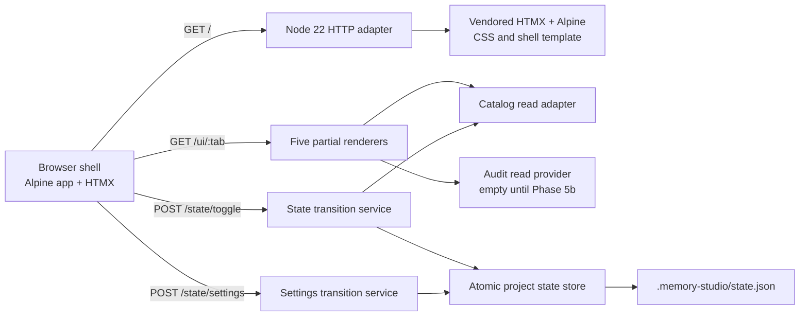

# Phase 4 — UI Panel Design

## Architectural Reference

Primary farol stable ID: [`ui-panel`](../../ARCHITECTURE.md#stable-id-registry). Adjacent stable IDs: `state-toggle` (mutation boundary) and `state-json` (per-project persistence). Phase 4 materializes `ui-panel`, supplies a minimal Phase-4 adapter for `state-toggle`, and persists to `state-json`; Phase 5b later subsumes the HTTP endpoint without changing its request/response contract.

**Spec**: `.specs/features/phase-4-ui-panel/spec.md`
**Status**: Approved by autonomous roadmap-loop contract

---

## Recommended Architecture

Use **`packages/ui/` as the `@memory-studio/ui` workspace**, containing static assets/templates plus TypeScript state/catalog/view helpers, and **`scripts/ui-server.mjs` as a thin executable launcher**. The server uses Node 22 built-ins (`node:http`, `node:fs/promises`, `node:path`, `node:net`) only. It binds to `127.0.0.1`, scans ports 41823–42823 in ascending order, renders the shell and five HTMX partials, and delegates state transitions to testable package functions.

The browser shell owns only interaction state through one Alpine component: active hash tab, selected item, search query, persona-cap message, and Critical Rule confirmation modal. HTMX fetches tab partials. Toggle and settings mutations always cross the local HTTP boundary; localStorage is not a state source.



### Alternatives considered

| Approach | Trade-offs | Decision |
| --- | --- | --- |
| Recommended: `packages/ui` core + thin `scripts/ui-server.mjs`, Node built-ins | Testable package boundaries; follows SDK workspace precedent; no Fastify/build step; later endpoint adapter can be replaced. Slightly more files than a one-off script. | **Chosen** |
| One monolithic `scripts/ui-server.mjs` with inline HTML/state logic | Fastest initial code, but couples routing, rendering, persistence, and validation; difficult to mutate-test or subsume in Phase 5b. | Rejected |
| Fastify UI plugin in future `packages/server` | Natural final server composition, but prematurely creates/touches Phase 5 architecture and violates explicit Phase 4 constraint. | Rejected |

---

## Package and File Layout

```text
packages/ui/
├── package.json
├── tsconfig.json
├── src/
│   ├── index.ts                 # public server factory/start contracts
│   ├── server.ts                # Node http routing and bounded JSON parsing
│   ├── port.ts                  # first-free-port scan
│   ├── state.ts                 # schema-v3 type, validation, atomic/serialized writes
│   ├── transitions.ts           # toggle + settings domain guards
│   ├── catalog.ts               # read-only adapter over config/catalog YAML
│   ├── audit.ts                 # injected read provider / empty default
│   └── render.ts                # shell + five escaped partial renderers
├── public/
│   ├── index.html               # buildless shell/template
│   ├── styles.css
│   ├── htmx.min.js              # vendored local runtime
│   ├── alpine.min.js            # vendored local runtime
│   └── app.js                   # Alpine component registration and HTMX actions
└── test/
    ├── port.test.mjs
    ├── state.test.mjs
    ├── transitions.test.mjs
    ├── partials.test.mjs
    ├── server.test.mjs
    └── performance.test.mjs

scripts/ui-server.mjs            # project-cwd launcher, selected URL output, shutdown
```

`src/ui/**` remains an allowed touch location but is intentionally unused: `@memory-studio/ui` is a package and keeping its implementation inside the workspace avoids two competing UI roots.

---

## HTTP and Navigation Contracts

| Route | Method | Purpose | Response |
| --- | --- | --- | --- |
| `/` | GET | Static shell | `text/html; charset=utf-8` |
| `/assets/styles.css` | GET | Minimal responsive CSS | `text/css` |
| `/assets/htmx.min.js` | GET | Local HTMX runtime | JavaScript |
| `/assets/alpine.min.js` | GET | Local Alpine runtime | JavaScript |
| `/assets/app.js` | GET | Browser component/actions | JavaScript |
| `/ui/skills` | GET | Skills list/search/detail partial | HTML partial |
| `/ui/rules` | GET | Rules list + critical warning partial | HTML partial |
| `/ui/personas` | GET | Personas list + cap status partial | HTML partial |
| `/ui/audit?limit=N` | GET | Last N audit events or empty state | HTML partial |
| `/ui/settings` | GET | State-backed settings form | HTML partial |
| `/state` | GET | Current schema-v3 state for UI refresh/tests | JSON |
| `/state/toggle` | POST | Real Phase 4 toggle transition | JSON; 200/400/409/500 |
| `/state/settings` | POST | Phase 4 settings transition | JSON; 200/400/409/500 |

All unknown routes return 404. Unsupported methods return 405. Mutation bodies must be JSON and ≤64 KiB. Error responses use `{ "error": { "code": string, "message": string } }` and never include file contents or secrets.

### Hash routing strategy

The root shell has anchors `#skills`, `#rules`, `#personas`, `#audit`, and `#settings`. Alpine’s single `uiPanel()` component normalizes an unknown/empty hash to `skills`, updates the active tab, and instructs HTMX to load `/ui/<tab>` into one content region. This provides simple direct-link semantics without adding a router.

### HTMX partial strategy

The server returns initial list markup and escaped data attributes. Filtering is client-side Alpine for instant response over the small catalog; selection opens a shared side-panel component without a second network trip. Mutations use `fetch` from `app.js` so the confirmation and persona-cap flows can handle precise JSON/status codes, then trigger an HTMX refresh event. HTMX remains responsible for partial loading and replacement.

---

## Components and Interfaces

### Server lifecycle and port discovery

- **Location**: `packages/ui/src/port.ts`, `packages/ui/src/server.ts`, `scripts/ui-server.mjs`
- **Purpose**: Find first free port, create the loopback-only server, and expose deterministic start/close handles for tests.
- **Interfaces**:

```typescript
export type PortRange = readonly [start: number, end: number]
export async function findFirstFreePort(range: PortRange, host?: string): Promise<number>
export function createUiServer(options: UiServerOptions): UiServer
export interface UiServer {
  start(): Promise<{ url: string; port: number }>
  close(): Promise<void>
}
```

- **Rules**: inclusive ascending scan; each probe closes before binding; bind race after probing retries the next port; exhaustion raises a typed error.
- **Reuses**: package/workspace conventions from `packages/sdk`; project Node 22 ESM convention.

### Project state store

- **Location**: `packages/ui/src/state.ts`
- **Purpose**: Load, validate, initialize, serialize, and atomically replace project state.
- **Interfaces**:

```typescript
export interface ProjectStateV3 {
  schemaVersion: 3
  activeCatalog: string[]
  thresholds: { minCosineSimilarity: number; minFtsHits: number }
  fastAgent: { model: string; baseURL: string }
  integrationMode: "proxy" | "hook" | "mcp"
  agentId: string
  tenantId?: string
  embeddingModel?: string
  ui: { portRange: [number, number]; stack: "htmx+alpine" }
}

export interface ProjectStateStore {
  read(): Promise<ProjectStateV3>
  update(mutator: (current: ProjectStateV3) => ProjectStateV3): Promise<ProjectStateV3>
}
```

- **Persistence**: resolve path from injected project root, never process-global hidden state. `update` queues mutations, reads latest state, validates before and after mutation, writes sibling temp file, fsync/close if supported, then renames over target. Clean up temp files on error.
- **Defaults**: match `.memory-studio/setup.md`; `embeddingModel` defaults to `multilingual-e5-small`, and tenant defaults to an empty/display placeholder until configured.

### Catalog read adapter

- **Location**: `packages/ui/src/catalog.ts`
- **Purpose**: Supply normalized Skill/Rule/Persona records for rendering and state-transition validation without modifying Phase 1 files.
- **Interfaces**:

```typescript
export type UiCatalogItem =
  | { id: string; type: "skill"; title: string; category: string; text: string }
  | { id: string; type: "rule"; title?: string; critical: boolean; text: string }
  | { id: string; type: "persona"; title?: string; isDefault: boolean; text: string }

export interface CatalogReader {
  list(): Promise<readonly UiCatalogItem[]>
  get(id: string): Promise<UiCatalogItem | undefined>
}
```

- **Reuse**: import Phase 1 catalog schema/loader exports if their public read contract fits; otherwise use an injected adapter local to `packages/ui` that reads YAML through existing `yaml`, but do not edit `src/catalog/**`.

### State transition service

- **Location**: `packages/ui/src/transitions.ts`
- **Purpose**: Keep Critical Rule and Persona-cap invariants independent from HTTP/browser implementation.
- **Interfaces**:

```typescript
export type ToggleRequest = {
  itemId: string
  action: "on" | "off"
  critical_confirm?: string
}

export async function toggleCatalogItem(
  request: ToggleRequest,
  catalog: CatalogReader,
  store: ProjectStateStore,
): Promise<{ itemId: string; active: boolean; state: ProjectStateV3 }>

export type SettingsPatch = {
  minCosineSimilarity: number
  minFtsHits: number
  tenantId: string
  integrationMode: ProjectStateV3["integrationMode"]
  embeddingModel: string
}
```

- **Order**: validate request → resolve item → read current state → enforce critical/persona guard → create de-duplicated active set → atomic update.
- **Idempotency**: repeated current-state action returns success; no duplicate active IDs.

### Shell and five partial renderers

- **Location**: `packages/ui/src/render.ts`, `packages/ui/public/index.html`, `packages/ui/public/app.js`
- **Purpose**: Return safe, accessible markup and keep browser state within one Alpine root.
- **Interfaces**:

```typescript
export function renderShell(): string
export function renderCatalogPartial(type: "skill" | "rule" | "persona", model: CatalogViewModel): string
export function renderAuditPartial(events: readonly AuditViewEvent[]): string
export function renderSettingsPartial(state: ProjectStateV3): string
```

- **Safety**: all catalog/audit text uses HTML escaping or `textContent`; no raw `innerHTML` from data. Controls have labels, status regions use `aria-live`, and modal focus returns to its source toggle.

### Audit read provider

- **Location**: `packages/ui/src/audit.ts`
- **Purpose**: Decouple the Phase 4 visual contract from Phase 5b persistence.
- **Interface**:

```typescript
export interface AuditViewEvent {
  timestamp: string
  redactedPrompt: string
  matchedIds: string[]
  pruningReasons: string[]
  latencyMs: number
}
export interface AuditReader { latest(limit: number): Promise<readonly AuditViewEvent[]> }
```

Default provider returns `[]`. Tests inject events. Phase 5b can supply the real provider without changing rendering.

---

## UI Interaction Model

### Catalog lists and side panel

- Three catalog tabs share visual primitives but receive type-specific data.
- Search normalizes lowercase and includes ID/title/category/text keywords.
- Selection stores a plain object in Alpine state; display fields bind with `x-text`.
- The shared side panel is a complementary region, remains within the tab, and closes via button/Escape.

### Critical Rule flow

1. User attempts to switch an active critical Rule off.
2. Browser restores/holds the visible toggle and opens a modal.
3. Modal repeats the exact D-004 example and asks for `CONFIRMAR`.
4. Confirm button remains disabled until value is exactly `CONFIRMAR`.
5. Confirm submits `{ itemId, action: "off", critical_confirm: "CONFIRMAR" }`.
6. HTTP 200 refreshes Rule state; any error keeps it active and renders an inline error.
7. Server independently repeats all checks, so direct requests cannot bypass the rule.

### Persona cap flow

Browser counts active Persona IDs and blocks a fourth before request, displaying an inline error. Server counts active catalog records of type Persona and rejects a fourth even if the browser is bypassed. Disabling one releases a slot.

### Responsive layout

At ≥1024 px, shell navigation and primary content fit within the viewport. Catalog partials use a two-column grid (list + side panel), with `minmax(0, ...)` to prevent intrinsic overflow. Long IDs/text wrap. At narrower widths, columns stack as a non-gated enhancement.

---

## Performance Measurement

A Node acceptance test launches `scripts/ui-server.mjs` in a fresh child process with a temporary project root, captures the selected URL, and records:

```javascript
const coldStartedAt = Date.now()
const coldResponse = await fetch(url)
const coldFirstByteMs = Date.now() - coldStartedAt

const warmStartedAt = Date.now()
const warmResponse = await fetch(url)
const warmFirstByteMs = Date.now() - warmStartedAt
```

Both responses must be 200 and both recorded values `<1000`. “Cold” is explicitly the first root request after a fresh server process; “warm” is the immediate second request. The report includes both measured integers. This is first-byte/headers timing, not full browser paint, because Node’s built-in test environment can measure it deterministically without adding browser automation dependencies.

---

## Error Handling Strategy

| Error scenario | Handling | User impact |
| --- | --- | --- |
| Port occupied between probe and bind | Continue scanning the next port | Startup succeeds on next free port |
| Entire range occupied | Typed startup failure, non-zero launcher exit | Clear exhausted-range message |
| Missing state | Initialize schema-v3 defaults on first successful mutation | UI remains usable |
| Invalid/unsupported state | 409 error; preserve original bytes | User sees state repair message; no data loss |
| Invalid mutation/body | 400 JSON error; no write | Inline validation feedback |
| Critical toggle missing exact confirmation | 400 `CRITICAL_CONFIRMATION_REQUIRED` | Rule remains active; modal stays open |
| Fourth Persona | 400 `PERSONA_LIMIT_EXCEEDED` | Inline cap-3 message |
| Atomic write failure | 500, cleanup temp, preserve prior target | UI reports save failed |
| Catalog unavailable/malformed | 500 partial with safe error state; no mutation | Screen explains catalog could not load |
| Audit provider absent | Empty-state partial, not an error | “No audit events yet” |
| Untrusted catalog/audit HTML | Escape before output and bind as text | No script/markup execution |

---

## Code Reuse Analysis

### Existing components to leverage

| Component/pattern | Location | How to use |
| --- | --- | --- |
| Workspace package shape | `packages/sdk/package.json`, `packages/sdk/tsconfig.json` | Mirror package metadata, ESM, Node 22, strict TypeScript, package-local test scripts. |
| Root workspace glob | `package.json` (`"workspaces": ["packages/*"]`) | Keep unchanged; verify adding package is automatically discovered (L-003). |
| Catalog schemas/read path | `src/catalog/**` | Import stable public read types/functions only; never modify these files. |
| State defaults | `.memory-studio/setup.md`, `.memory-studio/state.json` | Preserve schemaVersion 3 and existing field names/defaults. |
| Node test conventions | `test/**/*.test.mjs`, `packages/sdk/test/**/*.test.mjs` | Use `node:test`, strict assertions, temp dirs, injected dependencies, and behavior-focused assertions. |
| Canonical terminology | `.scratch/memory-studio/spec.md` §IMod-20 | Use literal `recentFiles` in Audit tooltips. |

### Integration points

| System | Integration method |
| --- | --- |
| Phase 1 catalog | Read-only `CatalogReader`; no writes or schema changes. |
| Project state | `ProjectStateStore` rooted at launcher cwd/injected root. |
| Future Phase 5b server | Preserve `/state/toggle` JSON contract so Fastify can delegate to the same transition service or replace only the adapter. |
| Future audit store | Implement `AuditReader` and inject into existing renderer/server options. |

---

## Risks & Concerns

| Concern | Location | Impact | Mitigation |
| --- | --- | --- | --- |
| SPEC says Phase 5 owns `/state/toggle`, while ROADMAP requires it in Phase 4 | `.scratch/memory-studio/spec.md:440-450`; ROADMAP Phase 4 | Mocking it would leave Phase 4 acceptance unproven; duplicate implementation could drift. | Option (a): implement minimal real adapter now, isolate transition service, freeze request/status contract for Phase 5b subsumption. |
| Existing setup prose calls `state.json` machine-owned while PRD allows project-specific human control | `.memory-studio/setup.md:31-37` | Concurrent or partial writes could corrupt state. | Serialized atomic store and schema validation; do not hand-edit setup docs in this phase. |
| Remote CDN conflicts with local-only privacy/offline reliability | PRD §§8/10.3 vs ROADMAP “CDN setup” wording | UI could fail offline or contact third parties. | Vendor static HTMX/Alpine assets into package; record checksums/source in package metadata if introduced. |
| No browser-test framework exists | repository tests | Pure rendering tests can miss interaction/layout defects. | Test domain/HTTP contracts in Node; execute browser JS in a minimal DOM harness only if already available, otherwise add a focused dev dependency in the workspace; use a deterministic 1024px layout assertion/screenshot-free browser test. |
| “UI <1s” is underspecified as load/paint/TTFB | PRD §10.4 | Incomparable measurements. | Spec fixes Phase 4 gate to cold/warm first-byte using `Date.now()`; record both values. |
| `package.json` workspaces residue risk L-003 | root `package.json` | A package-specific removal or hardcoding could break SDK scripts. | Do not replace `packages/*`; test workspace discovery and existing root/package scripts before each subchapter close. |
| Catalog text is user-controlled YAML | `config/catalog/*.yaml` | XSS if inserted as markup. | Escape server-rendered content and use `textContent`/`x-text` only. |
| Local server has no auth | UI server | Other local processes can call mutations. | Bind loopback only, validate body/content type/size. Authentication is outside current local-only contract and logged as N/A. |

---

## Tech Decisions

| Decision | Choice | Rationale |
| --- | --- | --- |
| `/state/toggle` split | Option (a), real minimal Phase 4 endpoint | Only option that proves ROADMAP persistence and enforcement now; isolated for Phase 5b. |
| Server | Node 22 `http` + filesystem; no Fastify | Keeps Phase 5 ownership clean and adds no server framework. |
| Workspace | `packages/ui` + thin root launcher | Mirrors `packages/sdk` and makes core reusable/testable. |
| Browser stack | Local static HTMX + Alpine, no build | Satisfies buildless/local-only invariants. |
| Navigation | Hash-based Alpine shell, HTMX partial region | No router dependency; five direct states. |
| State | Canonical `activeCatalog` plus additive settings fields | Avoids competing toggle stores and preserves schema v3. |
| Persistence | Serialized temp-write + atomic rename | Protects state-transition integrity. |
| Audit | Injected read provider; empty default | Delivers UI contract without claiming Phase 5b writes. |
| Performance evidence | Cold/warm `Date.now()` to fetch headers | Measured, repeatable, dependency-free first-byte gate. |

These are feature-local adapter choices. They conform to active AD-001/AD-002 and do not supersede project-level decisions.

---

## Subchapter Breakdown

| Subchapter | Cohesive outcome | Tasks | Dependency |
| --- | --- | ---: | --- |
| **4.1 UI workspace + state schema** | Package scaffold, local server/port lifecycle, schema-v3 atomic state store, buildless shell/assets | 4 | None |
| **4.2 Skills + Rules + Personas** | Catalog reader/rendering/search/detail, toggle service, Critical Rule modal/enforcement, Persona cap | 4 | 4.1 |
| **4.3 Audit + Settings** | Audit provider/partial/`recentFiles` tooltips and settings partial/persistence validation | 2 | 4.2 |
| **4.4 Enforcement integration + performance + responsive closeout** | HTTP contract integration, exact D-004 example, 1024px behavior, cold/warm measurement, full gates | 3 | 4.3 |

**Total: 13 atomic tasks.** Each subchapter is a semantic execution unit and should be dispatched sequentially by the roadmap loop; no Implementer receives the full phase at once.
