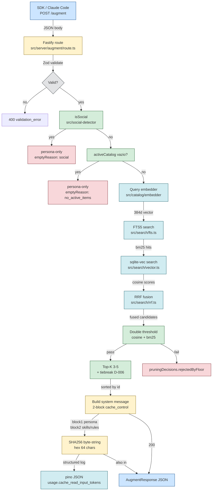

# Phase 5a — API + Retrieval + Byte-string — Design

**Spec:** [`./spec.md`](./spec.md)
**Status:** Draft

---

## Architecture Overview

Phase 5a delivers the FIRST server-side runtime of Memory Studio. The Phase 3 SDK (`MemoryStudioClient.augment`) is already POSTing to `/augment`; Phase 5a is the receiver. The pipeline: Zod-validate the request → social-detector gate → retrieval (FTS5 + sqlite-vec + RRF) → threshold (cosine + BM25) → top-K (3-5 items) → tiebreak (`id.localeCompare`) → build 2-block `cache_control: ephemeral` system message → SHA-256 hex of the byte-string → structured log line with `usage.cache_read_input_tokens`.



**Server side** is what Phase 5a implements (yellow + green). **Client side** is Phase 3 (blue). **Storage** is Phase 1 (cyan, already shipped). **Audit write runtime** is Phase 5b (dashed outbound arrow).

---

## Architectural Reference

> Farol nodes consumed by this design (`.specs/architecture/memory-studio.architecture.json` — stable IDs):

| Stable ID | Module | Role | Phase 5a treatment |
|---|---|---|---|
| `server` | Hot Path · Módulo 3 | Fastify · 7 ep | **IMPLEMENTS** — `/augment` handler + minimal `/health` |
| `sdk` | Hot Path · Módulo 3 | TS · ~50KB · zero deps | consumer (Phase 3 ships) |
| `augmenter` | Pipeline · Módulo 4 | byte-string · 2-block | **IMPLEMENTS** — `buildSystemMessage()` |
| `search` | Pipeline · Módulo 4 | FTS5+vec+RRF D-006 | **WIRES** — composes existing `src/search/*` |
| `social-detector` | Pipeline · Módulo 4 | regex bypass | calls Phase 2 `isSocial()` |
| `cache` | Pipeline · Módulo 4 | SHA256(byte-string) | **IMPLEMENTS** — provider cache pass-through only (log only; no augmented cache) |
| `state-json` | Storage · Módulo 5 | git-tracked | validates `activeCatalog` against filesystem |
| `fts5-vec` | Storage · Módulo 5 | search engine | queries Phase 1 virtual tables |
| `embed-model` | Storage · Módulo 5 | ONNX 384d | calls Phase 1 `MultilingualE5SmallEmbedder.encode()` |
| `sqlite` | Storage · Módulo 5 | catalog+audit+intel | reads `catalog_fts` + `catalog_vec` (Phase 1 triggers) |
| `audit-buffer` | Hot Path · Módulo 3 | async+batch+fail-open | **OUT OF SCOPE** — Phase 5b writes; Phase 5a logs to pino only |

**Edges built by Phase 5a:**
- `server → augmenter` (server calls augmenter to build systemMessage)
- `augmenter → search` (augmenter composes retrieval)
- `search → fts5-vec` (queries FTS5 + sqlite-vec virtual tables)
- `search → embed-model` (calls `Embedder.encode()`)
- `augmenter → cache` (computes SHA256 for log)
- `server → state-json` (validates `activeCatalog` against filesystem)

**Edges NOT built by Phase 5a:**
- `audit-buffer → sqlite` (Phase 5b)
- `agents → server` via `/v1/messages` proxy (Phase 5b)

---

## File Layout (new `src/server/**` + scripts)

```
Memory-Studio/                            # repo root
├── package.json                          # ROOT: adds `fastify` dep + `augment-server` script
├── tsconfig.json                         # ROOT: unchanged
├── src/                                  # ROOT src — Phase 1+2+5a territory
│   ├── catalog/                          # Phase 1 — UNCHANGED (Verifier checks git diff)
│   ├── social-detector/                  # Phase 2 — UNCHANGED (Verifier checks git diff)
│   ├── fingerprint/                      # Phase 2 — UNCHANGED (Verifier checks git diff)
│   ├── search/                           # Phase 5a READS — UNCHANGED (calibration residue, quarantined)
│   └── server/                           # NEW: Phase 5a territory
│       ├── index.ts                      # Public barrel: re-exports handlers + pipeline + types
│       ├── bootstrap.ts                  # createAugmentServer() — Fastify app factory
│       ├── health/
│       │   └── route.ts                  # GET /health — minimal liveness handler
│       ├── augment/
│       │   ├── route.ts                  # POST /augment — Zod validate → pipeline → response
│       │   ├── schemas.ts                # Zod schemas: AugmentRequest, AugmentResponse, Context, Fingerprint
│       │   ├── pipeline.ts               # Orchestrate: social gate → retrieval → threshold → top-K → tiebreak
│       │   ├── retrieval.ts              # Compose src/search/{fts,vector,rrf}.ts
│       │   ├── thresholds.ts             # Double gate: cosine >= 0.75 AND bm25_hits >= 1
│       │   ├── top-k.ts                  # Top-5 + tiebreak (id.localeCompare) + truncation
│       │   ├── augmenter.ts              # buildSystemMessage() — 2-block cache_control: ephemeral
│       │   ├── byte-string.ts            # sha256Hex(jsonSerialize(system)) — provider cache key
│       │   └── response.ts               # Build AugmentResponse from pipeline output + decisionTraceId
│       └── logger.ts                     # pino instance + child loggers per request
├── scripts/                              # ROOT scripts
│   ├── augment-server.ts                 # NEW: entry point (mirrors scripts/ui-server.mjs)
│   └── smoke-augment-server.mjs          # NEW: end-to-end smoke (Phase 5a gate)
├── test/                                 # ROOT tests
│   ├── search/                           # EXISTING: unchanged (Phase 1 calibration suite)
│   └── augment/                          # NEW: Phase 5a tests
│       ├── schemas.test.mjs              # Zod validation: required fields, agentId canonical, schemaVersion
│       ├── thresholds.test.mjs           # Double threshold: cosine + bm25_hits gates
│       ├── top-k.test.mjs                # Top-5 + tiebreak + 3-5 assertion
│       ├── tiebreak-stress.test.mjs      # 1000 synthetic requests, SHA256 equality (D-006 done)
│       ├── byte-string.test.mjs          # SHA256 determinism + 2-block structure
│       ├── augmenter.test.mjs            # buildSystemMessage() block structure + cache_control markers
│       ├── retrieval.test.mjs            # Compose src/search/* — smoke test the pipeline
│       ├── route.test.mjs                # POST /augment — integration test (validation + happy path + D-008 + prompt-only + social)
│       ├── perf.test.mjs                 # p50<50ms / p99<200ms across N>=3 runs
│       └── log-format.test.mjs           # Structured log line: parseable JSON + usage field
└── docs/
    └── guides/
        └── claude-code-baseurl.md        # NEW: integration guide (Phase 5a SDK smoke + Phase 5b proxy teaser)
```

**Root changes (minimal):**
- `package.json` — adds `"fastify": "^5.x"` to `dependencies`. Adds `"augment-server": "node --experimental-strip-types --no-warnings scripts/augment-server.ts"` to `scripts`. No other changes.
- (No `tsconfig.json` change — root tsconfig already covers `src/**/*`)

**New files created in Phase 5a:**
- 1 root script: `scripts/augment-server.ts` (entry point)
- 1 root script: `scripts/smoke-augment-server.mjs` (gate)
- 1 doc: `docs/guides/claude-code-baseurl.md`
- 9 server modules: `src/server/{index,bootstrap,logger}.ts` + `src/server/health/route.ts` + `src/server/augment/{route,schemas,pipeline,retrieval,thresholds,top-k,augmenter,byte-string,response}.ts`
- 10 test files: `test/augment/*.test.mjs`

**Untouched files (Verifier scope guard):**
- `src/catalog/**`, `src/social-detector/**`, `src/fingerprint/**` — byte-identical to Phase 1 + Phase 2 baseline
- `src/search/**` — calibration residue, marked `quarantined` per CALIBRATION-RESIDUE.md policy. Phase 5a READS via direct import; no modifications except additive helper exports if needed (requires Verifier approval)
- `packages/sdk/**` — byte-identical to Phase 3 baseline (consumer)
- `packages/ui/**` — byte-identical to Phase 4 baseline
- `tsconfig.json`, root `package.json` workspace field — unchanged

---

## Server Framework Decision (Fastify)

**Decision:** **Fastify (option a)** per PRD §8.

**Rationale:**
- PRD §8 table: `HTTP server | Fastify | ~5MB` — explicit PRD mandate.
- Phase 1 chose `node:http` for the UI (no Fastify) because the UI is a thin static-file server. Phase 5a needs:
  - **Schema validation** — Fastify + `fastify-type-provider-zod` (or manual Zod) gives request validation in one line
  - **JSON serialization** — Fastify uses `fast-json-stringify` for 2-3× faster JSON serialization than `JSON.stringify`. Critical for p50<50ms with multi-block system messages
  - **Plugin ecosystem** — Phase 5b will add `@fastify/cors` for the `/v1/messages` proxy. Locking in Fastify now avoids a future migration
  - **Logger integration** — Fastify has native `pino` integration (pino is already in root deps from Phase 0/1)
- Rejected `node:http` (option b) — manual validation, slower JSON, no plugin story
- Rejected hybrid `node:http` in test + Fastify in prod (option c) — Phase 1's 185-test baseline + Phase 3's 16-test baseline prove Node 22 ESM + `--experimental-strip-types` handles the full import graph without split-stacks. The "fast unit tests" benefit is marginal when the test surface already exercises Fastify integration end-to-end

**Fastify version:** `^5.x` (current LTS-grade as of 2026-07). Verified against npm registry.

---

## Retrieval Pipeline Composition

Phase 5a does NOT rewrite the retrieval algorithm — it composes existing modules.

```typescript
// src/server/augment/pipeline.ts (pseudocode)
import { isSocial } from '../../social-detector/index.ts';
import { MultilingualE5SmallEmbedder } from '../../catalog/embedder/index.ts';
import { searchFts } from '../../search/fts.ts';
import { searchVector } from '../../search/vector.ts';
import { fuseRrf } from '../../search/rrf.ts';
import { applyThresholds } from './thresholds.ts';
import { topKAndTiebreak } from './top-k.ts';
import { buildSystemMessage } from './augmenter.ts';
import { sha256Hex } from './byte-string.ts';

export async function runPipeline(
  req: AugmentRequest,
  catalog: CatalogRow[],
  embedder: MultilingualE5SmallEmbedder,
): Promise<AugmentResponse> {
  const t0 = performance.now();

  // (1) Social detector gate
  if (isSocial(req.prompt)) {
    return personaOnlyResponse(req, 'social', t0);
  }

  // (2) Active catalog vazio (D-008)
  if (req.activeCatalog.length === 0) {
    return personaOnlyResponse(req, 'no_active_items', t0);
  }

  // (3) Embed prompt
  const tEmbed = performance.now();
  const queryVec = await embedder.encode(req.prompt);
  const embeddingMs = performance.now() - tEmbed;

  // (4) FTS5 + sqlite-vec
  const tRetrieval = performance.now();
  const ftsHits = searchFts(req.prompt);
  const vecHits = searchVector(queryVec);
  const retrievalMs = performance.now() - tRetrieval;

  // (5) RRF fusion
  const fused = fuseRrf(ftsHits, vecHits);

  // (6) Double threshold + top-K + tiebreak
  const { matched, rejected } = applyThresholds(fused, req.activeCatalog);
  const topK = topKAndTiebreak(matched, { minK: 3, maxK: 5 });

  // (7) Build system message (2-block cache_control: ephemeral)
  const { system, sha256 } = buildSystemMessage(req, topK.matched);

  // (8) Structured response
  return {
    systemMessage: sha256,
    matchedSkills: partitionByType(topK.matched, 'skill'),
    matchedRules: partitionByType(topK.matched, 'rule'),
    matchedPersonas: partitionByType(topK.matched, 'persona'),
    pruningDecisions: rejected,
    latencyMs: { embedding: embeddingMs, retrieval: retrievalMs, rerank: 0, total: performance.now() - t0 },
    decisionTraceId: crypto.randomUUID(),
    warnings: topK.warnings,
    emptyReason: topK.matched.length === 0 ? 'low_confidence' : null,
    schemaVersion: 3,
  };
}
```

**Key composition points:**
- `src/search/{fts,vector,rrf}.ts` exports are reused — Phase 5a does not modify them
- `src/catalog/embedder/multilingual-e5-small.ts` is reused — Phase 1's ONNX embedder with the warm session cache
- `src/social-detector/index.ts` is reused — Phase 2's `isSocial()` regex bypass
- New modules (`thresholds`, `top-k`, `augmenter`, `byte-string`, `response`, `pipeline`) compose the existing primitives

---

## Byte-string Determinism + Tiebreak (D-006)

**Tiebreak ordering:** after RRF + threshold + top-K, `matched.sort((a,b) => a.id.localeCompare(b.id))` runs BEFORE byte-string serialization. Score values NEVER appear in the byte-string — only IDs + type + text.

```typescript
// src/server/augment/top-k.ts (pseudocode)
export function topKAndTiebreak(
  matched: FusedCandidate[],
  opts: { minK: 3; maxK: 5 },
): { matched: FusedCandidate[]; warnings: string[] } {
  // Sort by RRF score DESC, then by id ASC (tiebreak)
  const sorted = [...matched].sort((a, b) => {
    if (b.rrfScore !== a.rrfScore) return b.rrfScore - a.rrfScore;
    return a.id.localeCompare(b.id);  // ← D-006
  });

  // Truncate to top-5
  const top5 = sorted.slice(0, opts.maxK);

  // Validation
  const warnings: string[] = [];
  if (top5.length < opts.minK) {
    warnings.push(`only ${top5.length} items above threshold (< ${opts.minK})`);
  }

  return { matched: top5, warnings };
}
```

**SHA-256 byte-string:**

```typescript
// src/server/augment/byte-string.ts (pseudocode)
import { createHash } from 'node:crypto';

export function sha256Hex(input: string): string {
  return createHash('sha256').update(input, 'utf8').digest('hex');
}

// The `systemMessage` field in the response is:
// sha256Hex(JSON.stringify(systemBlocks, /* canonical sort */))
// where `systemBlocks` is the EXACT 2-block structure that would be sent
// to Anthropic. Canonical sort ensures stable field order across runs.
```

**D-006 done criterion verification (1000-request stress test):**
- Generator creates 1000 requests with cosine scores in `[threshold-eps, threshold+eps]`
- All 1000 produce the SAME matched set after threshold + tiebreak
- All 1000 produce the SAME `systemMessage` SHA-256
- This proves score values do NOT leak into the byte-string and tiebreak is the only ordering signal

---

## 2-Block `cache_control: ephemeral` Layout

PRD §8 invariante 11 mandates 2 separate blocks. The system message structure sent to Anthropic:

```typescript
// src/server/augment/augmenter.ts (pseudocode)
export function buildSystemMessage(
  req: AugmentRequest,
  matched: FusedCandidate[],
): { system: SystemBlock[]; sha256: string } {
  // Block 1 — persona (stable prefix)
  const personas = matched.filter(m => m.type === 'persona');
  const block1Text = personas.map(p => p.text).join('\n\n');
  const block1: SystemBlock = {
    type: 'text',
    text: block1Text,
    cache_control: { type: 'ephemeral' },  // TTL 5min
  };

  // Block 2 — Skills + Rules + context (variable suffix)
  const skills = matched.filter(m => m.type === 'skill');
  const rules = matched.filter(m => m.type === 'rule');
  const block2Parts: string[] = [];
  if (skills.length > 0) block2Parts.push('## Skills\n' + skills.map(s => s.text).join('\n\n'));
  if (rules.length > 0) block2Parts.push('## Rules\n' + rules.map(r => r.text).join('\n\n'));
  if (req.context) block2Parts.push('## Context\n' + JSON.stringify(req.context));
  const block2: SystemBlock = {
    type: 'text',
    text: block2Parts.join('\n\n'),
    cache_control: { type: 'ephemeral' },
  };

  const system = [block1, block2];
  const sha256 = sha256Hex(canonicalJsonStringify(system));

  return { system, sha256 };
}
```

**Canonical JSON serialization** ensures stable field order. The `systemMessage` field in the response IS the `sha256` — the client can verify byte-string equivalence by recomputing on its side.

---

## Structured JSON Logger

Phase 5a uses `pino` (already in root deps) for structured JSON logs. Every `/augment` request emits one log line:

```typescript
// src/server/logger.ts (pseudocode)
import pino from 'pino';

export const logger = pino({
  level: 'info',
  formatters: {
    level: (label) => ({ level: label }),
  },
  timestamp: pino.stdTimeFunctions.isoTime,
});

// Per-request child logger:
export function requestLogger(reqId: string, tenantHashed: string) {
  return logger.child({ requestId: reqId, tenantId_hashed: tenantHashed });
}
```

**Log line emitted on every response:**
```json
{
  "level": "info",
  "time": "2026-07-31T12:34:56.789Z",
  "requestId": "550e8400-e29b-41d4-a716-446655440000",
  "tenantId_hashed": "abc123...",
  "latencyMs": { "embedding": 12.3, "retrieval": 4.5, "rerank": 0, "total": 18.2 },
  "matchedIds": ["skill-auth-01", "rule-no-secrets-01", "persona-eng-01"],
  "systemMessageSha256": "def456...",
  "usage": {
    "cache_read_input_tokens": null,
    "cache_creation_input_tokens": null
  },
  "msg": "/augment"
}
```

The `usage` fields are populated when the response is forwarded to a real Anthropic API (Phase 5b). In Phase 5a's MVP smoke, they are `null` unless the test fixture injects them.

---

## Smoke Test Strategy

**Goal:** prove end-to-end that the system message augmentation produces a byte-string that hits the provider's cache on the 2nd call.

```javascript
// scripts/smoke-augment-server.mjs (pseudocode)
import { spawn } from 'node:child_process';

async function smokeTest() {
  // (1) Boot server on free port
  const port = await findFreePort();
  const server = spawn('node', ['--experimental-strip-types', 'scripts/augment-server.ts'], {
    env: { ...process.env, MEMORY_STUDIO_AUGMENT_PORT_RANGE: `${port}-${port}` },
    stdio: ['ignore', 'pipe', 'pipe'],
  });

  await waitForServerReady(server, port);

  // (2) POST /augment twice with identical input
  const request = buildFixtureRequest();
  const r1 = await fetch(`http://127.0.0.1:${port}/augment`, { method: 'POST', body: JSON.stringify(request), headers: { 'Content-Type': 'application/json' } });
  const r2 = await fetch(`http://127.0.0.1:${port}/augment`, { method: 'POST', body: JSON.stringify(request), headers: { 'Content-Type': 'application/json' } });
  const sys1 = (await r1.json()).systemMessage;
  const sys2 = (await r2.json()).systemMessage;
  assert.strictEqual(sys1, sys2, 'systemMessage must be byte-identical for identical input');

  // (3) Forward both systemMessages to MiniMax Anthropic-compatible API
  // OR to a stub that returns deterministic cache_read_input_tokens
  const forward1 = await forwardToProvider({ system: sys1 });
  const forward2 = await forwardToProvider({ system: sys2 });

  // (4) Assert 2nd call shows cache hit
  assert.ok(forward2.usage.cache_read_input_tokens > 0, 'expected cache_read_input_tokens > 0 on 2nd call');

  // (5) Capture server log line and verify usage field is logged
  const logLine = captureLastLogLine(server);
  const logJson = JSON.parse(logLine);
  assert.ok('usage' in logJson, 'log line must include usage field');

  // (6) Cleanup
  server.kill('SIGTERM');
  console.log('[smoke] PASS');
}
```

**Stub alternative:** if MiniMax does not surface `cache_read_input_tokens`, the test fixture injects a deterministic value:
```javascript
function forwardToProvider({ system }) {
  const cacheHits = (globalThis.__cacheState__[system] || 0) + 1;
  globalThis.__cacheState__[system] = cacheHits;
  return {
    usage: {
      cache_read_input_tokens: cacheHits > 1 ? 1024 : 0,  // simulate hit on 2nd+
      cache_creation_input_tokens: cacheHits === 1 ? 1024 : 0,
    },
  };
}
```

The stub proves the WIRING works (server logs the field) without depending on provider-side behavior.

---

## Claude Code Integration Guide

`docs/guides/claude-code-baseurl.md` documents two integration modes:

**Mode 1: SDK-level smoke (Phase 5a — shipped)**
- SDK calls `/augment` directly
- Application code injects the augmented `systemMessage` into the Anthropic API request
- Pros: works today; full control; cache hit verifiable via log
- Cons: requires application code change

**Mode 2: Transparent proxy (Phase 5b — future)**
- Set `ANTHROPIC_BASE_URL=http://127.0.0.1:<port>`
- Claude Code speaks `/v1/messages` directly to Memory Studio
- Server intercepts, augments, forwards, returns response
- Pros: zero application code change
- Cons: Phase 5b scope

The guide walks through Mode 1 with a code example and previews Mode 2 for when Phase 5b ships.

---

## Subchapter Breakdown

13 atomic tasks across 4 subchapters (matches dispatch footnote structure):

```
Subchapter 5a.1 (Server Foundation):     T-01 → T-02 → T-03 → T-04
                                                  ↓
Subchapter 5a.2 (Retrieval Pipeline):           T-05 → T-06 → T-07 → T-08
                                                              ↓
Subchapter 5a.3 (Tests + Smoke):                     T-09 → T-10 → T-11
                                                              ↓
Subchapter 5a.4 (Perf + Hardening):                       T-12 → T-13
```

### Batch packing (Implementer dispatch)

| Batch | Subchapters | Tasks | Worker |
| --- | --- | --- | --- |
| **Batch 1** | 5a.1 + 5a.2 | T-01..T-08 (8 tasks) | Worker A (Implementer sub-agent) |
| **Batch 2** | 5a.3 + 5a.4 | T-09..T-13 (5 tasks) | Worker B (Implementer sub-agent) |
| **Validation** | (all) | (all 13) | Worker C (Verifier sub-agent) — fresh, evidence-or-zero |

Two batches run sequentially; Validation runs once after Batch 2 reports all-tasks-complete.

---

## Test Strategy

| Layer | Test type | Coverage | Location |
|---|---|---|---|
| **Zod schemas** | unit | Required fields (R-02), schemaVersion=3 (R-05), agentId canonical (R-06), context nullable (R-03) | `test/augment/schemas.test.mjs` |
| **Thresholds** | unit | Double gate: cosine ≥ 0.75 AND bm25_hits ≥ 1 (R-08) | `test/augment/thresholds.test.mjs` |
| **Top-K + tiebreak** | unit | Sort by RRF DESC + id.localeCompare ASC; truncate to 5; warn if < 3 (R-09, R-10) | `test/augment/top-k.test.mjs` |
| **Tiebreak stress** | integration | 1000 synthetic requests with random cosine scores → all produce same SHA256 (R-19) | `test/augment/tiebreak-stress.test.mjs` |
| **Byte-string determinism** | unit | SHA-256 hex of canonical JSON serialization (R-12) | `test/augment/byte-string.test.mjs` |
| **Augmenter 2-block** | unit | Block 1 = persona, Block 2 = Skills+Rules+context, both `cache_control: ephemeral` (R-11) | `test/augment/augmenter.test.mjs` |
| **Retrieval composition** | integration | Compose `src/search/{fts,vector,rrf}.ts` end-to-end (R-07) | `test/augment/retrieval.test.mjs` |
| **Route handler** | integration | POST /augment: validation (R-02), happy path, D-008 (R-04), prompt-only (R-17), social bypass (R-14), cache hit log (R-16) | `test/augment/route.test.mjs` |
| **Perf budget** | benchmark | 1000 synthetic requests × N≥3 runs; p50<50ms + p99<200ms (R-18) | `test/augment/perf.test.mjs` |
| **Log format** | integration | Every response emits parseable JSON log with `usage.cache_read_input_tokens` field (R-15, R-16) | `test/augment/log-format.test.mjs` |
| **`/health`** | unit | GET /health returns 200 + `{ status, uptime, version }` (R-20) | `test/augment/health.test.mjs` |

**Existing tests preserved:**
- `test/search/*` (Phase 1 calibration suite — RRF, FTS, vector, contracts) — UNCHANGED
- `test/catalog/*` (Phase 1) — UNCHANGED
- `test/social-detector*` (Phase 2) — UNCHANGED
- `test/fingerprint/*` (Phase 2) — UNCHANGED
- `packages/sdk/test/*` (Phase 3) — UNCHANGED
- `packages/ui/test/*` (Phase 4) — UNCHANGED

**Test count budget:** baseline 375 + new tests (~50-70 in `test/augment/*`) = target ≥425.

---

## Risks & Concerns

| Risk | Mitigation |
|---|---|
| **Calibration residue drift in `src/search/*`** | Phase 5a does NOT modify `src/search/*`. If drift blocks integration, the Verifier marks the relevant findings `quarantined` per CALIBRATION-RESIDUE.md policy. Additive helper exports are allowed with Verifier approval |
| **Perf drift across N runs (Phase 4.4 lesson)** | The perf benchmark reports `min/median/p95/p99` across N≥3 runs (per Phase 4.4 Verifier feedback). Gates are on `median(p50)` not single-run p50 |
| **MiniMax Anthropic-compatible API may not surface `cache_read_input_tokens`** | The smoke test accepts a stub fixture that injects deterministic cache hit values. The test goal is to verify WIRING (server logs the field), not provider-side behavior |
| **`activeCatalog` filesystem validation latency** | The catalog dir is small (<100 YAMLs in MVP) and hot in OS page cache after `npm run build-index`. Sync `fs.existsSync()` is <1ms. No async overhead |
| **Fastify plugin bloat** | `package.json` adds ONLY `fastify` (no `@fastify/cors` etc. yet). Phase 5b adds plugins. Keep dep footprint minimal |
| **`@types/better-sqlite3` vs `@types/fastify`** | `better-sqlite3` types are already in devDeps. `fastify` types ship with the package. No new `@types/*` deps |
| **Tiebreak stress test runtime** | 1000 requests with in-process server = ~5-10s. Acceptable. The test runs once per CI; not per-commit |
| **SHA256 determinism with object key ordering** | The augmenter uses `canonicalJsonStringify()` (sorted keys) to ensure stable field order across runs. Without this, `{a:1,b:2}` and `{b:2,a:1}` would produce different hashes |
| **Active catalog vazio + prompt-only mode confusion** | These are two SEPARATE conditions. `activeCatalog: []` = D-008 contract (matched arrays empty, emptyReason: "no_active_items"). `context: null` = prompt-only mode (matched arrays populated from prompt alone). Both tested independently |
| **Server bootstrap on Windows** | Node 22 ESM + `--experimental-strip-types` works on Windows. Phase 4's `scripts/ui-server.mjs` already proves the pattern. No platform-specific code |

---

## Verification Strategy (for Verifier sub-agent)

The Verifier (Worker C) performs:

1. **Spec-anchored outcome check** — for each AC-NN in spec.md, verify the test assertion matches the spec-defined expected outcome
2. **Discrimination sensor** — inject behavior-level faults in scratch state (e.g., remove tiebreak ordering, swap threshold sign, drop 1 of 2 cache blocks) and confirm tests kill them
3. **Scope guard** — `git diff <baseline>..HEAD -- src/catalog/ src/social-detector/ src/fingerprint/ packages/sdk/` returns empty. `src/search/` MAY show additive changes only
4. **Test baseline** — `npm test` reports ≥375 + new tests passing. No skipped/pending tests
5. **Typecheck** — `npm run typecheck` exits 0
6. **Smoke** — `node scripts/smoke-augment-server.mjs` exits 0
7. **Perf** — `node --test test/augment/perf.test.mjs` reports `median(p50) < 50ms` and `p99 < 200ms` across N≥3 runs

A clean PASS records nothing in `LESSONS.md`. Grounded failures become project-local lessons via `scripts/lessons.py`.
