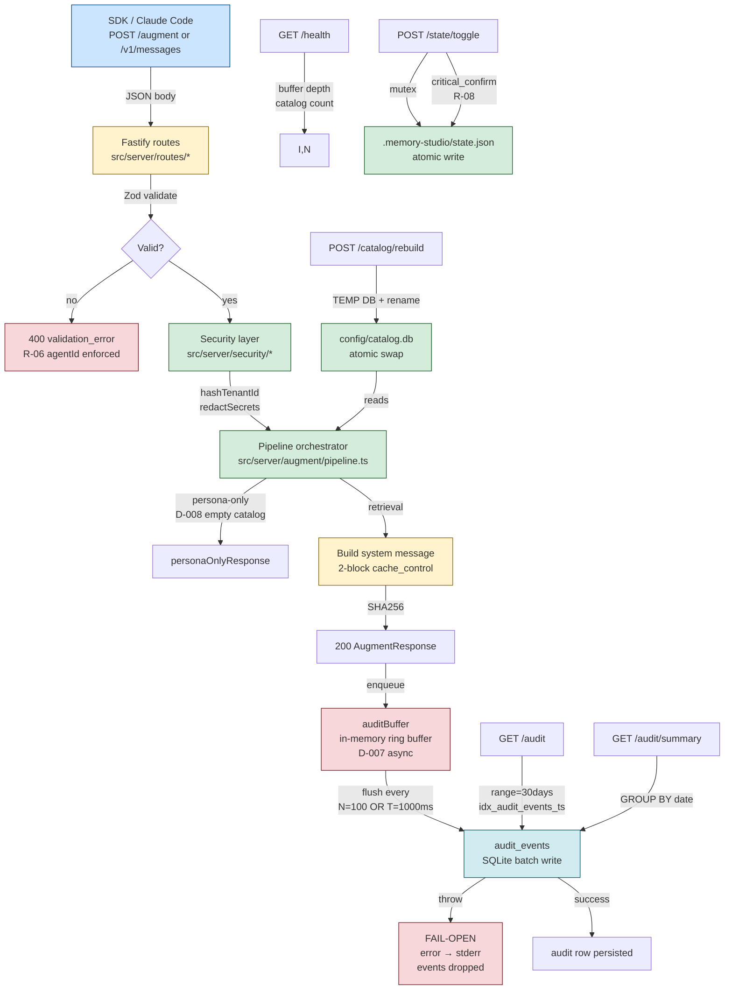

# Phase 5b — Audit + Endpoints + Security — Design

**Spec:** [`./spec.md`](./spec.md)
**Status:** Draft

---

## Architecture Overview

Phase 5b widens the server's endpoint surface from 2 to 7 (D-009) and adds the runtime pieces Phase 5a deferred: the audit async/fail-open write runtime (D-007 CRITICAL), the security redaction layer (§10.3.1-4), and the transparent `/v1/messages` proxy that lets Claude Code speak directly to Memory Studio. Phase 5a.4 flagged a real spec gap (`FingerprintSchema.agentId` was unrestricted); Phase 5b picks up the R-06 enforcement now that the proxy layer gives Phase 5b visibility into non-canonical clients.



**Server side** is what Phase 5b implements (yellow + green). **Audit write runtime** (red) is the D-007 CRITICAL runtime — every request enqueues, the buffer flushes, errors never block. **Storage** (cyan) is the existing Phase 1 schema (no migration except a perf index).

---

## Architectural Reference

> Farol nodes consumed by this design (`.specs/architecture/memory-studio.architecture.json` — stable IDs):

| Stable ID | Module | Role | Phase 5b treatment |
|---|---|---|---|
| `server` | Hot Path · Módulo 3 | Fastify · 7 ep | **IMPLEMENTS** — adds 6 auxiliary endpoints + transparent proxy |
| `sdk` | Hot Path · Módulo 3 | TS · ~50KB · zero deps | consumer (Phase 3 ships) — no SDK changes |
| `audit-buffer` | Hot Path · Módulo 3 | async+batch+fail-open | **IMPLEMENTS** — `src/server/audit/buffer.ts` |
| `cache` | Pipeline · Módulo 4 | SHA256(byte-string) | **WIRES** — proxy captures `usage.cache_read_input_tokens` |
| `state-json` | Storage · Módulo 5 | git-tracked | `/state/toggle` writes via mutex + atomic rename |
| `sqlite` | Storage · Módulo 5 | catalog+audit+intel | audit_buffer writes to `audit_events` |
| `fts5-vec` | Storage · Módulo 5 | search engine | unchanged (calibration residue) |
| `embed-model` | Storage · Módulo 5 | ONNX 384d | unchanged |

**Edges built by Phase 5b:**
- `server → audit-buffer` — `/augment` + `/v1/messages` + every endpoint enqueues audit events
- `audit-buffer → sqlite` — batch flush writes to `audit_events`
- `server → state-json` — `/state/toggle` reads+validates+atomic-writes
- `server → catalog (filesystem)` — `/catalog` reads; `/catalog/rebuild` writes via TEMP+rename
- `server → upstream-anthropic` — `/v1/messages` forwards to `MEMORY_STUDIO_ANTHROPIC_BASE_URL` (loopback only)

**Edges NOT built by Phase 5b:**
- `agents → server` via hook / MCP (v3.1+)
- Phase 6 inception híbrida
- Phase 7a materialized audit rollups

---

## File Layout (new `src/server/audit/**`, `src/server/security/**`, `src/server/routes/**` + scripts)

```
Memory-Studio/                            # repo root
├── package.json                          # ROOT: no new deps (uses pino + zod already in deps)
├── tsconfig.json                         # ROOT: unchanged
├── src/
│   ├── catalog/                          # Phase 1 — UNCHANGED except adds 1 migration
│   │   └── migrations/
│   │       └── 003_audit_events_ts_index.sql  # NEW: perf index for §10.4.3
│   ├── social-detector/                  # Phase 2 — UNCHANGED
│   ├── fingerprint/                      # Phase 2 — UNCHANGED
│   ├── search/                           # Phase 5a READS — UNCHANGED
│   └── server/                           # Phase 5a + 5b territory
│       ├── index.ts                      # MODIFIED: barrel re-exports new modules
│       ├── boot.ts                       # MODIFIED: registers new routes + audit lifecycle
│       ├── schema.ts                     # MODIFIED: FingerprintSchema.agentId → z.literal("claude-code")
│       ├── logger.ts                     # UNCHANGED
│       ├── audit/                        # NEW: Phase 5b audit runtime
│       │   ├── buffer.ts                 # In-memory ring buffer + batch flush + fail-open
│       │   ├── types.ts                  # AuditEvent, AuditRow typed shapes
│       │   ├── redact.ts                 # Placeholder secret redaction (§10.3.3)
│       │   ├── writer.ts                 # SQLite batch insert + error isolation
│       │   ├── query.ts                  # GET /audit + GET /audit/summary SQL queries
│       │   └── lifecycle.ts              # start()/stop() for boot.ts wiring
│       ├── security/                     # NEW: Phase 5b security layer
│       │   ├── tenant-hash.ts            # hashTenantId() extracted from augment.ts:51-54
│       │   ├── proxy-allowlist.ts        # Local-only enforcement (§10.3.4)
│       │   └── index.ts                  # Barrel
│       ├── routes/                       # NEW: Phase 5b endpoint handlers
│       │   ├── catalog-list.ts           # GET /catalog
│       │   ├── catalog-rebuild.ts        # POST /catalog/rebuild
│       │   ├── audit-list.ts             # GET /audit
│       │   ├── audit-summary.ts          # GET /audit/summary
│       │   ├── state-toggle.ts           # POST /state/toggle
│       │   └── messages-proxy.ts         # POST /v1/messages (transparent proxy)
│       ├── health/                       # MODIFIED: enhanced payload
│       │   └── route.ts                  # GET /health (now reports audit_buffer + catalog blocks)
│       └── augment/                      # UNCHANGED (Phase 5a)
├── scripts/                              # ROOT scripts
│   ├── augment-server.ts                 # UNCHANGED
│   ├── smoke-augment-server.mjs          # UNCHANGED
│   ├── smoke-audit-failopen.mjs          # NEW: D-007 fail-open smoke
│   ├── smoke-proxy-local-only.mjs        # NEW: §10.3.4 local-only smoke
│   └── smoke-redact.mjs                  # NEW: §10.3.3 placeholder redaction smoke
├── test/                                 # ROOT tests
│   ├── search/                           # EXISTING: unchanged
│   └── server/                           # NEW: Phase 5b server tests
│       ├── audit-buffer.test.mjs         # Buffer capacity + flush trigger + fail-open
│       ├── redact.test.mjs               # Placeholder secret redaction
│       ├── proxy-allowlist.test.mjs      # §10.3.4 enforcement
│       ├── catalog-route.test.mjs        # GET /catalog + POST /catalog/rebuild
│       ├── audit-route.test.mjs          # GET /audit + GET /audit/summary
│       ├── state-toggle.test.mjs         # POST /state/toggle (critical_confirm flow)
│       ├── messages-proxy.test.mjs       # POST /v1/messages (intercept + forward + capture)
│       └── catalog-rebuild-concurrency.test.mjs  # R-19 concurrent safety
└── docs/
    └── guides/
        └── claude-code-baseurl.md        # MODIFIED: add Phase 5b transparent proxy section
```

**Root changes (minimal):**
- `package.json` — NO new deps (uses pino + zod already in deps). Adds `smoke:audit-failopen`, `smoke:proxy-local-only`, `smoke:redact` scripts (mirroring Phase 5a.4's `smoke:augment-server` pattern).
- `src/catalog/migrations/003_audit_events_ts_index.sql` — NEW forward-only migration. The Verifier checks `git diff` to confirm Phase 1 baseline is otherwise untouched.

**New files created in Phase 5b:**
- 1 migration: `src/catalog/migrations/003_audit_events_ts_index.sql` (~5 lines)
- 6 audit modules: `src/server/audit/{buffer,types,redact,writer,query,lifecycle}.ts`
- 3 security modules: `src/server/security/{tenant-hash,proxy-allowlist,index}.ts`
- 6 route handlers: `src/server/routes/{catalog-list,catalog-rebuild,audit-list,audit-summary,state-toggle,messages-proxy}.ts`
- 3 smoke scripts: `scripts/{smoke-audit-failopen,smoke-proxy-local-only,smoke-redact}.mjs`
- 8 test files: `test/server/{audit-buffer,redact,proxy-allowlist,catalog-route,audit-route,state-toggle,messages-proxy,catalog-rebuild-concurrency}.test.mjs`

**Untouched files (Verifier scope guard):**
- `src/catalog/**` — UNCHANGED except adds 1 forward-only migration file (the migration is added, not the existing files modified)
- `src/social-detector/**`, `src/fingerprint/**`, `src/search/**` — UNCHANGED (calibration residue preserved per CALIBRATION-RESIDUE.md)
- `packages/sdk/**`, `packages/ui/**` — UNCHANGED
- `CLAUDE.md`, `.specs/STATE.md`, `.specs/ROADMAP.md`, `.specs/lessons.json` — minimal flip-the-checkbox updates (out of phase scope; the Implementer + Verifier do these via the loop's close-out pattern)

---

## Server Framework Decision (Fastify — UNCHANGED from Phase 5a)

**Decision:** **Fastify** (per PRD §8, reused from Phase 5a).

**Rationale:** No change from Phase 5a.4. Phase 5b adds new routes to the existing Fastify app. The plugin ecosystem (`@fastify/cors` if needed) was already validated in Phase 5a.4.

**Fastify version:** `^5.x` (Phase 5a.4 locked at 5.11.0; Phase 5b does not bump).

---

## Audit Async + Batch + Fail-open Runtime (D-007 CRITICAL)

The audit module is the SINGLE write path to `audit_events`. Every endpoint that mutates state (`/augment`, `/v1/messages`) enqueues into the buffer and returns immediately. The buffer flushes batched inserts to SQLite on a wall-clock timer (T=1000ms) or a count trigger (N=100), whichever fires first. SQLite write errors are caught and the batch is dropped — the request that triggered the enqueue is NEVER blocked.

```typescript
// src/server/audit/buffer.ts (pseudocode)

const FLUSH_COUNT_TRIGGER = 100;
const FLUSH_TIME_MS = 1000;
const RING_BUFFER_CAPACITY = 10_000;

export interface AuditEvent {
  readonly ts: number;
  readonly tenantIdHashed: string;
  readonly redactedPromptHash: string;
  readonly matchedIds: ReadonlyArray<string>;
  readonly pruningReasons: ReadonlyArray<string>;
  readonly latencyMs: number;
  readonly fingerprint: Readonly<Record<string, unknown>>;
  readonly payload: Readonly<Record<string, unknown>>;
  readonly eventType: 'augment' | 'messages_proxy' | 'catalog_rebuild' | 'state_toggle';
}

class AuditRingBuffer {
  private buffer: AuditEvent[] = [];
  private flushTimer: NodeJS.Timeout | null = null;
  private lastFlushTs: number | null = null;

  enqueue(event: AuditEvent): void {
    // SAFETY VALVE: drop oldest if at capacity
    if (this.buffer.length >= RING_BUFFER_CAPACITY) {
      this.buffer.shift();
      console.error(`[audit] buffer at capacity (${RING_BUFFER_CAPACITY}); oldest event dropped`);
    }
    this.buffer.push(event);
    // Count trigger
    if (this.buffer.length >= FLUSH_COUNT_TRIGGER) {
      this.flush('count-trigger');
    }
    // Time trigger (start on first enqueue)
    if (this.flushTimer === null) {
      this.flushTimer = setTimeout(() => this.flush('time-trigger'), FLUSH_TIME_MS);
    }
  }

  private async flush(reason: 'count-trigger' | 'time-trigger' | 'shutdown'): Promise<void> {
    if (this.buffer.length === 0) return;
    const batch = this.buffer.splice(0, this.buffer.length);
    if (this.flushTimer !== null) {
      clearTimeout(this.flushTimer);
      this.flushTimer = null;
    }
    try {
      await this.writer.writeBatch(batch);
      this.lastFlushTs = Date.now();
    } catch (err) {
      // FAIL-OPEN: error → stderr, batch dropped, request continues 200
      console.error(`[audit] write failed (${reason}); dropped ${batch.length} events:`, err);
      this.lastFlushTs = null; // signal stuck
    }
  }

  getDepth(): number { return this.buffer.length; }
  getLastFlushTs(): number | null { return this.lastFlushTs; }
}
```

**Key design choices:**
- **Single module-scoped instance:** the buffer lives in `src/server/audit/buffer.ts` as a module-scoped singleton. `boot.ts` calls `auditBuffer.start()` on boot and `auditBuffer.stop()` on graceful shutdown (which flushes the remainder).
- **Two trigger mechanisms:** count (N=100) AND time (T=1000ms). The timer is reset on every flush, so the cadence is "100 events within the last 1000ms OR 1000ms elapsed since the last enqueue."
- **Fail-open semantics:** the try/catch around `writer.writeBatch()` is the SINGLE place that can fail. Errors propagate to stderr with `[audit] write failed...`. The dropped batch count is logged. The next `enqueue()` succeeds (the buffer is not poisoned).
- **Safety valve overflow:** if the buffer hits `RING_BUFFER_CAPACITY` (10000), the oldest event is dropped. This is a defensive last resort — in normal operation the flush cadence keeps the buffer well under 1000 events.
- **Shutdown flush:** `boot.ts` SIGTERM handler calls `auditBuffer.stop()` which calls `flush('shutdown')` synchronously, ensuring no events are lost on clean shutdown. (Hard SIGKILL can lose events — acceptable for fail-open semantics.)

**Audit row write (writer.ts):**

```typescript
// src/server/audit/writer.ts (pseudocode)

export interface AuditWriter {
  writeBatch(events: ReadonlyArray<AuditEvent>): Promise<void>;
}

export function createBetterSqliteAuditWriter(db: Database): AuditWriter {
  const stmt = db.prepare(`
    INSERT INTO audit_events (
      ts, "tenantId_hashed", event_type, payload, fingerprint,
      matched_ids, pruning_reasons, latency_ms, redacted_prompt_hash
    ) VALUES (?, ?, ?, ?, ?, ?, ?, ?, ?)
  `);
  return {
    async writeBatch(events) {
      const tx = db.transaction((batch: ReadonlyArray<AuditEvent>) => {
        for (const e of batch) {
          stmt.run(
            e.ts, e.tenantIdHashed, e.eventType,
            JSON.stringify(e.payload), JSON.stringify(e.fingerprint),
            JSON.stringify(e.matchedIds), JSON.stringify(e.pruningReasons),
            e.latencyMs, e.redactedPromptHash,
          );
        }
      });
      tx(events); // throws → caught by buffer.flush()
    },
  };
}
```

The transaction is FAST (100 inserts in ~5ms) and the throw propagates to `buffer.flush()`'s catch.

---

## Endpoint Handler Patterns

All new endpoint handlers follow Phase 5a's `src/server/augment/route.ts` style: Zod validation, structured pino log, audit event enqueue (for mutating endpoints), and the existing fail-open semantics.

### Pattern: GET endpoint (read-only)

```typescript
// src/server/routes/catalog-list.ts (pseudocode)
export async function registerCatalogListRoute(app: FastifyInstance): Promise<void> {
  app.get('/catalog', async () => {
    // Read from SQLite (catalog table + embeddings table joined)
    // Return JSON array
  });
}
```

GET endpoints (`/catalog`, `/audit`, `/audit/summary`, `/health`) **do NOT enqueue audit events** — they're read operations. The audit log records MUTATIONS, not reads.

### Pattern: POST endpoint (state mutation)

```typescript
// src/server/routes/state-toggle.ts (pseudocode)
export async function registerStateToggleRoute(app: FastifyInstance): Promise<void> {
  const mutex = new Mutex();
  app.post('/state/toggle', async (request, reply) => {
    // Zod validate
    const parsed = StateToggleRequestSchema.safeParse(request.body);
    if (!parsed.success) { reply.code(400); return { error: ... }; }
    
    return mutex.runExclusive(async () => {
      // Read .memory-studio/state.json
      // Validate itemId against catalog
      // Check critical_confirm if needed
      // Atomic write (write-temp + rename)
      // Enqueue audit event (event_type: 'state_toggle')
      // Return 200 + response
    });
  });
}
```

### Pattern: POST `/v1/messages` (transparent proxy)

```typescript
// src/server/routes/messages-proxy.ts (pseudocode)
export async function registerMessagesProxyRoute(app: FastifyInstance, opts: { upstreamUrl: string | null }): Promise<void> {
  app.post('/v1/messages', async (request, reply) => {
    if (opts.upstreamUrl === null) {
      reply.code(503);
      return { error: 'proxy_disabled', hint: 'Set MEMORY_STUDIO_ANTHROPIC_BASE_URL' };
    }
    // Validate proxy allowlist (loopback only by default)
    const hostCheck = checkProxyAllowlist(opts.upstreamUrl);
    if (!hostCheck.allowed) {
      reply.code(502);
      return { error: 'proxy_host_not_allowed', host: hostCheck.host, hint: '...' };
    }
    
    // Intercept the system field
    const anthropicReq = request.body as AnthropicMessagesRequest;
    const systemText = extractSystemText(anthropicReq.system);
    
    // Build an internal /augment request (same process, no HTTP hop)
    const augmentReq: AugmentRequest = {
      prompt: extractFirstUserPrompt(anthropicReq.messages),
      context: null,
      fingerprint: { projectPath: '.', agentId: 'claude-code', sessionId: 'proxy', gitBranch: 'main' },
      activeCatalog: readActiveCatalogFromStateJson(),
      tenantId: 'proxy-tenant',
      schemaVersion: 3,
    };
    
    // Run the pipeline (synchronously, in-process)
    const t0 = performance.now();
    const augmentResponse = await runAugment(augmentReq, pipelineContext);
    
    // Rewrite the system field to the augmented 2-block structure
    const augmentedSystem = buildSystemMessage(augmentReq, ...).system;
    const proxiedReq = { ...anthropicReq, system: augmentedSystem };
    
    // Forward to upstream
    const upstreamRes = await fetch(opts.upstreamUrl + '/v1/messages', {
      method: 'POST',
      headers: { 'content-type': 'application/json', 'anthropic-version': anthropicReq.anthropic_version ?? '2023-06-01' },
      body: JSON.stringify(proxiedReq),
    });
    const upstreamBody = await upstreamRes.json();
    
    // Capture cache metrics
    const latencyMs = performance.now() - t0;
    auditBuffer.enqueue({
      ts: Date.now(),
      tenantIdHashed: hashTenantId('proxy-tenant'),
      redactedPromptHash: sha256Hex(systemText + JSON.stringify(anthropicReq.messages)),
      matchedIds: [...augmentResponse.matchedSkills, ...augmentResponse.matchedRules, ...augmentResponse.matchedPersonas].map(m => m.id),
      pruningReasons: extractPruningReasons(augmentResponse.pruningDecisions),
      latencyMs,
      fingerprint: { agentId: 'claude-code', source: 'proxy' },
      payload: {
        systemMessageSha256: augmentResponse.systemMessage,
        cacheReadInputTokens: upstreamBody.usage?.cache_read_input_tokens ?? null,
        cacheCreationInputTokens: upstreamBody.usage?.cache_creation_input_tokens ?? null,
        model: anthropicReq.model,
      },
      eventType: 'messages_proxy',
    });
    
    reply.code(upstreamRes.status);
    return upstreamBody;
  });
}
```

The proxy is the FIRST non-audit consumer of the audit buffer (D-007 CRITICAL). It also wires the cache metric back into the audit row (PRD §10.1 item 5).

---

## Security Layer

### `hashTenantId()` extraction

The existing helper at `src/server/augment.ts:51-54` is moved to `src/server/security/tenant-hash.ts` and re-exported. All endpoints that touch `tenantId` use the same helper for consistency:

```typescript
// src/server/security/tenant-hash.ts
import { createHash } from 'node:crypto';
export function hashTenantId(tenantId: string | undefined | null): string | null {
  if (!tenantId) return null;
  return createHash('sha256').update(tenantId, 'utf8').digest('hex').slice(0, 16);
}
```

### Placeholder redaction (R-11, §10.3.3)

```typescript
// src/server/security/redact.ts
const PLACEHOLDER_PATTERNS: ReadonlyArray<RegExp> = [
  /\$\{[A-Z_][A-Z0-9_]*\}=[^\s]+/g,     // ${SECRET_KEY}=abc123
  /\b(password|token|api_key|secret_key)\s*=\s*[^\s]+/gi,
  /sk-[A-Za-z0-9_-]{20,}/g,               // Anthropic API key format
];

export function redactPlaceholders(text: string): string {
  let redacted = text;
  for (const pattern of PLACEHOLDER_PATTERNS) {
    redacted = redacted.replace(pattern, '<REDACTED>');
  }
  return redacted;
}
```

The redaction is applied to **log lines and audit `payload` / `fingerprint` JSON fields** only. The `redactedPromptHash` is computed over the **original** prompt — redaction is for STORAGE, not for the hash input. This matches A-4 (autonomous decision in spec.md).

### Local-only proxy enforcement (R-10, §10.3.4)

```typescript
// src/server/security/proxy-allowlist.ts
const LOOPBACK_HOSTS = new Set(['127.0.0.1', 'localhost', '::1']);

export function checkProxyAllowlist(urlString: string, allowedHostsCsv?: string): { allowed: boolean; host: string | null } {
  let url: URL;
  try { url = new URL(urlString); } catch { return { allowed: false, host: null }; }
  const host = url.hostname.toLowerCase();
  
  const allowed = (allowedHostsCsv
    ? allowedHostsCsv.split(',').map(s => s.trim().toLowerCase()).filter(Boolean)
    : [...LOOPBACK_HOSTS]);
  
  // Wildcard rejected
  if (allowed.includes('*')) return { allowed: false, host };
  
  // IP literal or hostname comparison
  if (LOOPBACK_HOSTS.has(host) || allowed.includes(host)) {
    return { allowed: true, host };
  }
  return { allowed: false, host };
}
```

The check happens BEFORE the outbound request is constructed. The server refuses to forward to a non-allowlisted host (502 returned to the client, error logged).

---

## R-06 AgentId Restriction (R-12)

Phase 5a.4 flagged that `src/server/schema.ts:56-62` had `agentId: z.string()` despite the spec requiring `z.literal("claude-code")`. Phase 5b tightens:

```typescript
// src/server/schema.ts (MODIFIED)
export const FingerprintSchema = z.object({
  projectPath: z.string(),
  agentId: z.literal('claude-code'),  // ← was: z.string()
  sessionId: z.string(),
  gitBranch: z.string(),
});
```

**The schema comment at lines 12-17 documenting the MVP exception is REMOVED** — the deferral ends here. The Phase 5a.4 substitute test (`missing fingerprint → 400`) is REPLACED with the spec-correct test (`agentId: "cursor" → 400`).

The validation error message must mention `"agentId must be one of: claude-code"` to match the AC-26 spec. Zod's default literal error message is `Invalid input: expected "claude-code"` — we override with `.literal('claude-code', { errorMap: () => ({ message: 'agentId must be one of: claude-code' }) })`.

---

## Subchapter Breakdown

14 atomic tasks across 4 subchapters (matches Phase 5a's pattern; 2 Implementer batches of 8+6):

```
Subchapter 5b.1 (Audit Foundation):         T-01 → T-02 → T-03 → T-04
                                                       ↓
Subchapter 5b.2 (Read Endpoints):                  T-05 → T-06 → T-07 → T-08
                                                                              ↓
Subchapter 5b.3 (Write Endpoints + R-06):               T-09 → T-10 → T-11 → T-12
                                                                                            ↓
Subchapter 5b.4 (Transparent Proxy):                                                  T-13 → T-14
```

### Batch packing (Implementer dispatch)

| Batch | Subchapters | Tasks | Worker |
| --- | --- | --- | --- |
| **Batch 1** | 5b.1 + 5b.2 | T-01..T-08 (8 tasks) | Worker A (Implementer sub-agent) |
| **Batch 2** | 5b.3 + 5b.4 | T-09..T-14 (6 tasks) | Worker B (Implementer sub-agent) |
| **Validation** | (all) | (all 14) | Worker C (Verifier sub-agent) — fresh, evidence-or-zero |

Two batches run sequentially; Validation runs once after Batch 2 reports all-tasks-complete.

### Why 4 subchapters (not 3, not 5)

- **5b.1 Audit Foundation** is the bedrock — every endpoint depends on the audit buffer (even if some don't enqueue, the `/health` block reads `auditBuffer.getDepth()`).
- **5b.2 Read Endpoints** are pure reads (no audit, no state mutation) — they can land in parallel with 5b.3's first task if the Implementer chooses, but cleaner as a separate batch.
- **5b.3 Write Endpoints + R-06** covers `/catalog/rebuild`, `/state/toggle`, and the schema tightening. R-06 is here (not in 5b.1) because it's a schema-layer change that's logically a "write endpoint correctness" item.
- **5b.4 Transparent Proxy** is the largest single piece and has zero dependency on the other endpoints (it uses the audit buffer from 5b.1 + the schema from 5b.3). Isolating it in its own subchapter makes the failure modes clearer.

The 14-task count is borderline (SUBCHAPTER_BREAKDOWN trigger fires at >15). We're at 14, which is fine — but the Implementer might split T-04 (state-toggle sub-tasks) if it proves too coarse-grained.

---

## Test Strategy

| Layer | Test type | Coverage | Location |
|---|---|---|---|
| **Audit buffer** | unit | enqueue, capacity overflow, count trigger (N=100), time trigger (T=1000ms), fail-open on write error | `test/server/audit-buffer.test.mjs` |
| **Audit redact** | unit | Placeholder redaction patterns (R-11), edge cases (no placeholder, multiple placeholders, key overlap) | `test/server/redact.test.mjs` |
| **Proxy allowlist** | unit | Loopback allow (127.0.0.1, localhost, ::1), reject non-loopback, reject wildcard, CSV parsing | `test/server/proxy-allowlist.test.mjs` |
| **GET /catalog** | integration | Returns full catalog + embeddings metadata, empty catalog returns `[]` | `test/server/catalog-route.test.mjs` |
| **POST /catalog/rebuild** | integration | Idempotent rebuild, concurrent safety | `test/server/catalog-route.test.mjs` + `test/server/catalog-rebuild-concurrency.test.mjs` |
| **GET /audit** | integration | Returns last N rows, redacted only (no prompt field), range query, empty result | `test/server/audit-route.test.mjs` |
| **GET /audit/summary** | integration | Daily rollups, empty result, dataset across 3 dates | `test/server/audit-route.test.mjs` |
| **POST /state/toggle** | integration | On/off flow, critical_confirm flow (reject + accept), atomic write, mutex serialization | `test/server/state-toggle.test.mjs` |
| **POST /v1/messages** | integration | Forward to stub upstream, capture cache metrics, redact before audit, proxy-disabled 503, allowlist 502 | `test/server/messages-proxy.test.mjs` |
| **R-06 schema** | unit | agentId: "cursor" → 400, agentId: "claude-code" → 200 | `test/augment/schemas.test.mjs` (MODIFIED) |
| **Audit async** | integration | Real server + 100 events → flush within 100ms; 50 events → flush after 1100ms | `test/server/audit-buffer.test.mjs` |
| **Audit fail-open** | integration | Stub writer throws → events dropped, stderr captured, enqueue after error succeeds | `test/server/audit-buffer.test.mjs` + `scripts/smoke-audit-failopen.mjs` |
| **Audit perf** | benchmark | Seed 1000 rows, GET /audit?range=30days <100ms wall-clock | `test/server/audit-route.test.mjs` (perf subtest) |
| **Working set perf** | benchmark | 10000 requests over 60s, sample rss at t=0/30/60s, assert <1.5GB | `test/server/audit-buffer.test.mjs` (memory subtest) |
| **Smoke audit fail-open** | e2e | Boot server with stub writer, POST 5 /augment, assert all 200 + stderr captures | `scripts/smoke-audit-failopen.mjs` |
| **Smoke proxy local-only** | e2e | Boot with allowed URL → 200; boot with disallowed URL → 502 or startup error | `scripts/smoke-proxy-local-only.mjs` |
| **Smoke redact** | e2e | POST /augment with placeholder, assert audit row has no `abc123` anywhere | `scripts/smoke-redact.mjs` |

**Existing tests preserved:**
- All Phase 5a tests (309 root + 152 UI + 16 SDK = 477) — UNCHANGED
- `test/search/*` (Phase 1 calibration suite) — UNCHANGED
- `test/catalog/*`, `test/social-detector/*`, `test/fingerprint/*` — UNCHANGED
- `packages/sdk/test/*`, `packages/ui/test/*` — UNCHANGED

**Test count budget:** baseline 477 + new tests (~40-60 in `test/server/audit-buffer.test.mjs`, `test/server/redact.test.mjs`, `test/server/proxy-allowlist.test.mjs`, `test/server/catalog-route.test.mjs`, `test/server/audit-route.test.mjs`, `test/server/state-toggle.test.mjs`, `test/server/messages-proxy.test.mjs`, `test/server/catalog-rebuild-concurrency.test.mjs`) = target ≥520.

---

## Risks & Concerns

| Risk | Mitigation |
|---|---|
| **Audit flush race conditions (concurrent enqueue during flush)** | The flush uses `buffer.splice(0, length)` which atomically takes ownership of the current batch. New enqueues after the splice go into a fresh buffer. No locks needed; the splice is the synchronization primitive |
| **Audit buffer memory leak** | The `RING_BUFFER_CAPACITY = 10000` safety valve prevents unbounded growth. The flush cadence (N=100 or T=1000ms) keeps the buffer well below capacity in normal operation. A unit test asserts the capacity overflow behavior |
| **Proxy upstream timeout** | The proxy uses `fetch()` with a hard timeout (default 30s — configurable via `MEMORY_STUDIO_PROXY_TIMEOUT_MS`). On timeout, 504 returned to the client + audit event recorded with `latency_ms` set to the timeout duration |
| **Concurrent `/catalog/rebuild` corrupts reads** | The rebuild writes to TEMP DB + atomic rename. The mutex around the SWAP ensures only one rebuild runs at a time. Reads (`/augment`, `/catalog`) use the CURRENT DB until the swap. The 10× concurrent burst test verifies this |
| **Working set drift under sustained load** | The 60s perf test samples `process.memoryUsage().rss` at t=0/30/60s and asserts <1.5GB. The audit buffer is bounded (10000 events), the SQLite writer uses transactions (no per-event allocations beyond the row), and the proxy holds the response body only for the duration of the upstream fetch |
| **`MEMORY_STUDIO_PROXY_ALLOWED_HOSTS` bypass via DNS rebinding** | The check uses `URL.hostname` which is the literal hostname from the URL string — no DNS resolution. The forward `fetch()` does resolve DNS at request time; if the operator wants true DNS-rebinding safety, they can configure a custom `lookup` function. Out of MVP scope |
| **Audit `fingerprint.payload` JSON size** | The fingerprint is bounded (~200 bytes JSON); the payload is bounded (~500 bytes JSON for `systemMessageSha256` + cache metrics). Total audit row size stays well under 1KB. The buffer is sized for the row count, not the row size |
| **Phase 5a.4 LOW #2 flake (test #237 smoke.boot)** | Pre-existing flake; Phase 5b does not introduce a new port range. Phase 5b's smoke scripts use distinct port ranges (`scripts/smoke-audit-failopen.mjs` pins 47000-47000, `scripts/smoke-proxy-local-only.mjs` pins 47100-47199 + 47200 for the upstream stub) |
| **Concurrent `/state/toggle` corrupts state.json** | The per-process Mutex serializes the read-validate-write cycle. The atomic write (write-temp + rename) ensures no torn writes. The mutex is module-scoped (single process). Multi-process safety is deferred to v3.1+ |
| **`/catalog/rebuild` fails mid-rebuild** | The TEMP DB is `config/catalog.db.tmp`. If the rebuild throws, the TEMP DB is cleaned up (rm) and the existing `config/catalog.db` is untouched. The next rebuild creates a fresh TEMP. Verified by an integration test that stubs the embedder to throw mid-rebuild |
| **R-06 tightening breaks Phase 5a tests that use other agentIds** | The Phase 5a.4 substitute test (`missing fingerprint → 400`) is in scope. Any test that previously used `agentId: "cursor"` (none found in Phase 5a.4 baseline) would break. The Implementer audits `test/augment/*.test.mjs` for `agentId` usages and replaces non-canonical values |
| **`/v1/messages` upstream URL parsing edge cases** | `URL` constructor is strict — invalid URLs throw and are caught by the proxy allowlist check (returns 502). Path components, query strings, ports are all preserved in the forwarded request |

---

## Verification Strategy (for Verifier sub-agent)

The Verifier (Worker C) performs:

1. **Spec-anchored outcome check** — for each AC-NN in spec.md, verify the test assertion matches the spec-defined expected outcome. **Special attention:**
   - **AC-1** — verify ALL 7 endpoints are mounted (the smoke check is end-to-end via Fastify's print-routes)
   - **AC-16 / AC-17 / AC-18** — verify the D-007 CRITICAL contract holds under failure (the fail-open smoke script proves it end-to-end)
   - **AC-19** — verify the audit row's field set is EXACTLY the spec's (the integration test reads the row via direct SQLite and asserts the field list)
   - **AC-26** — verify R-06 is enforced (regression check: the Phase 5a.4 substitute test is REPLACED, not ADDED)
2. **Discrimination sensor** — inject behavior-level faults:
   - **AC-18 fail-open sensor:** stub the writer to throw on every write → events dropped, enqueue after error succeeds (kills the mutation if the buffer is poisoned or if the writer is retried)
   - **AC-26 agentId sensor:** `agentId: "claude-code"` accepts, `agentId: "cursor"` rejects, `agentId: "Claude-Code"` rejects (case-sensitive literal)
   - **AC-24 local-only sensor:** `MEMORY_STUDIO_ANTHROPIC_BASE_URL=http://localhost:1234` (allowed via `localhost`), `MEMORY_STUDIO_ANTHROPIC_BASE_URL=http://example.com` (rejected)
   - **AC-11 /health sensor:** the audit_buffer block reflects `getDepth()` accurately, not a hardcoded 0
3. **Scope guard** — `git diff <baseline>..HEAD -- src/catalog/ src/social-detector/ src/fingerprint/ src/search/ packages/sdk/ packages/ui/ CLAUDE.md` returns empty. **Exception:** the new migration `src/catalog/migrations/003_audit_events_ts_index.sql` is a NEW file (not a modification of an existing file); `git diff --stat` will show it as a new file, not a modification.
4. **Test baseline** — `npm test` reports ≥477 + new tests passing (target ≥520). No skipped/pending tests.
5. **Typecheck** — `npm run typecheck` exits 0.
6. **Smoke** — `node scripts/smoke-audit-failopen.mjs`, `node scripts/smoke-proxy-local-only.mjs`, `node scripts/smoke-redact.mjs`, `node scripts/smoke-augment-server.mjs` all exit 0.
7. **Perf** — `node --test test/server/audit-buffer.test.mjs` reports `getDepth() → 0 within 1100ms` (timer trigger); `node --test test/server/audit-route.test.mjs` (perf subtest) reports `wall-clock < 100ms for 1000-row query`.
8. **Working set** — `node --test test/server/audit-buffer.test.mjs` (memory subtest) reports `rss < 1.5GB at all checkpoints`.

A clean PASS records nothing in `LESSONS.md`. Grounded failures become project-local lessons via `scripts/lessons.py`.
