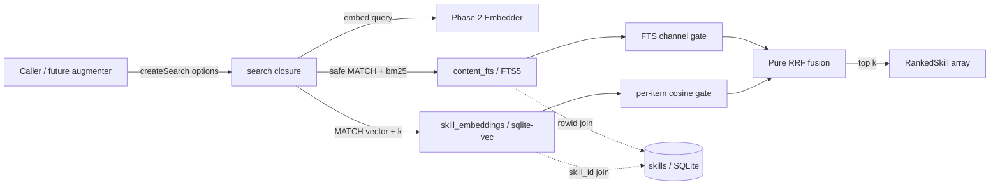
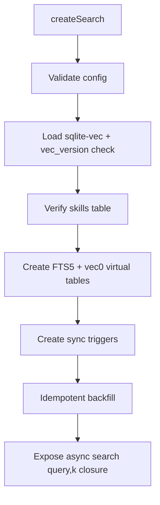

# Search / Retrieval Design

## Architectural Reference

This design implements the existing farol node **`search`** and its already-mapped persistence/engine relationships:

- `search` → `sqlite` (`query`): the library joins ranked IDs back to the existing `skills` table through the caller-owned `better-sqlite3` connection.
- `search` → `sqlite-fts5` (`FTS`): `content_fts` indexes `skills.content_yaml` and provides `bm25(content_fts)` ranking.
- `search` → `sqlite-vec` (`k-NN`): `skill_embeddings` stores `float[384]` vectors and executes cosine k-NN.

Required stable IDs cited: **`search`, `sqlite`, `sqlite-fts5`, `sqlite-vec`**.

The delivery is deliberately a **library function**, not an HTTP server. No `server` node, route, adapter, or new edge is introduced; `POST /search` remains Phase 6. Schema helpers, channel adapters and RRF are internal responsibilities of the existing `search` node, not new farol components. Therefore no architectural discovery is required and `.specs/DISCOVERIES.md` remains unchanged.

**Spec:** `.specs/features/search/spec.md`  
**Status:** Draft (autonomous planner resolution)

---

## Approach Exploration

### Recommendation — vec0 + external-content FTS5 + TypeScript RRF

Create both virtual tables in the existing SQLite connection, synchronize them from `skills` with one idempotent backfill plus triggers, query each channel independently, apply each channel's threshold, and fuse typed rank lists in a pure TypeScript RRF function.

**Why chosen:** it directly exercises both required engines, keeps SQL responsibilities narrow, makes threshold and RRF behavior independently testable, preserves the existing `Embedder` seam, and avoids modifying `src/catalog/**`.

### Alternative A — scalar cosine over `skills.embedding`

Use `vec_distance_cosine(skills.embedding, ?)` and sort every row instead of a `vec0` table.

- **Pros:** no duplicate vector storage or sync triggers.
- **Cons:** brute-force scan, does not deliver the required sqlite-vec schema/k-NN virtual table, and scales worse.
- **Decision:** rejected because it fails the explicit ROADMAP deliverable even if it would work for a 10-item fixture.

### Alternative B — one monolithic SQL CTE for FTS, vec and RRF

Build both rankings and the union score entirely in SQL.

- **Pros:** one DB round trip.
- **Cons:** couples sqlite-vec/FTS quirks to fusion policy, makes threshold branches and deterministic tie-breaking harder to test, and obscures typed error boundaries.
- **Decision:** rejected. With at most 100 candidates per channel, TypeScript fusion cost is negligible and clearer.

---

## Research Findings

Knowledge chain results:

1. **Codebase:** `better-sqlite3` is already the catalog connection; `Embedder.embed` is asynchronous and fixed at 384 dimensions; embeddings are persisted as raw `Float32Array` BLOB bytes. Runtime probing against the installed driver reports SQLite `3.49.2` with `ENABLE_FTS5=true`.
2. **Project docs:** `PLAN.md`, ROADMAP and the farol lock the stack to SQLite + FTS5 + sqlite-vec and place HTTP in Phase 6.
3. **Official sqlite-vec docs:** the Node package exposes `sqliteVec.load(db)` for `better-sqlite3`; vec0 supports `float[N] distance_metric=cosine`; k-NN uses `embedding MATCH ? AND k = ?`; and vectors can be bound as `Float32Array`/its buffer. The docs label sqlite-vec pre-v1, so the lockfile and a startup capability check are mandatory.

References:

- [sqlite-vec Node.js binding](https://alexgarcia.xyz/sqlite-vec/js.html)
- [sqlite-vec vec0 feature reference](https://alexgarcia.xyz/sqlite-vec/features/vec0.html)
- [sqlite-vec KNN queries](https://alexgarcia.xyz/sqlite-vec/features/knn.html)
- [sqlite-vec API reference](https://alexgarcia.xyz/sqlite-vec/api-reference.html)

---

## Architecture Overview



### Initialization lifecycle



Initialization is performed once per factory call, before a callable search function is returned. The caller owns connection close/lifetime.

---

## Code Reuse Analysis

### Existing Components to Leverage

| Component | Location | How to Use |
| --- | --- | --- |
| `Embedder` and `EMBEDDING_DIMENSIONS` | `src/catalog/embedder.ts` | Inject `Embedder` and use the locked 384-dimension constant; do not call `computeStubEmbedding` directly. |
| `bufferToEmbedding` storage convention | `src/catalog/writer.ts` | Reuse the established raw float32 BLOB representation concept; sqlite-vec consumes the same bytes directly. No catalog modification. |
| `skills` schema | `src/catalog/schema.ts` | Treat `id`, `slug`, `kind`, `content_yaml`, `embedding`, `hash` as source of truth. |
| Typed-error style | `src/catalog/errors.ts` | Mirror explicit class + string-union code fields, including cause, rather than throwing raw `Error`. |
| SQLite integration-test pattern | `test/catalog/schema.test.mjs`, `test/catalog/writer.test.mjs` | Fresh `:memory:` connection, real schema/driver, `try/finally db.close()`, behavior assertions. |
| Native test runner pattern | `test/**/*.test.mjs` | `node:test`, `node:assert/strict`, direct `.ts` imports, no Jest/Vitest. |

### Integration Points

| System | Integration Method |
| --- | --- |
| Catalog writes | Search-owned SQLite triggers on `skills`; no import cycle or edit under `src/catalog/`. |
| Existing DB | Caller injects the already-open `better-sqlite3` `Database`; search does not open/close files. |
| Embedder | Caller injects the existing asynchronous `Embedder` interface; Phase 9 can replace the stub without changing search. |
| Phase 5 augmenter | Will hold a configured `SearchFunction` and call only `await search(prompt, k)`. |
| Phase 6 HTTP | Will adapt request/response around the same function; no transport concern leaks into this phase. |

---

## Storage Design

### FTS5 virtual table

Logical DDL:

```sql
CREATE VIRTUAL TABLE IF NOT EXISTS content_fts USING fts5(
  content_yaml,
  content='skills',
  content_rowid='id',
  tokenize='unicode61 remove_diacritics 2'
);
```

- External-content mode avoids a second authoritative YAML copy.
- A rebuild command indexes preexisting `skills` during initialization.
- `AFTER INSERT`, `AFTER UPDATE OF content_yaml` and `AFTER DELETE` triggers maintain the FTS index using FTS5's documented external-content insert/delete protocol.
- The lexical adapter converts unique Unicode alphanumeric tokens to individually quoted literals joined by `OR`; it never passes raw user syntax to `MATCH`.
- `SELECT rowid, bm25(content_fts) ... ORDER BY bm25 ASC` yields candidate ranks; a separate `COUNT(*)` using the same expression yields the pre-limit `ftsHitCount` used by the channel gate.

### sqlite-vec virtual table

Logical DDL:

```sql
CREATE VIRTUAL TABLE IF NOT EXISTS skill_embeddings USING vec0(
  skill_id INTEGER PRIMARY KEY,
  embedding float[384] distance_metric=cosine
);
```

- Existing `skills.id` and raw `skills.embedding` are backfilled after table creation.
- INSERT/UPDATE/DELETE triggers mirror vector mutations. UPDATE uses delete-then-insert so no undocumented upsert behavior is assumed.
- Reinitialization reconciles vec IDs to `skills` deterministically (remove stale rows, then insert missing/current rows) inside the initialization transaction.
- Startup verifies `SELECT vec_version()` after `sqliteVec.load(db)`. No scalar/brute-force fallback is permitted.

### Trigger ordering and atomicity

`initializeSearchStorage(db)` loads the extension first, then runs table/trigger creation and reconciliation in a `better-sqlite3` transaction. Any DDL/backfill failure rolls back and is wrapped as `SearchError(SCHEMA_ERROR)`. The factory does not expose a half-initialized search function.

---

## Components and Interfaces

### Public contracts and errors

- **Location:** `src/search/types.ts`, `src/search/errors.ts`
- **Purpose:** Define stable input dependencies, rank rows, output DTO and typed failure codes.
- **Interfaces:**

```typescript
interface SearchOptions {
  readonly db: Database;
  readonly embedder: Embedder;
  readonly minCosineSimilarity?: number; // default 0.75
  readonly minFtsHits?: number; // default 1
}

type SearchFunction = (
  query: string,
  k: number,
) => Promise<readonly RankedSkill[]>;

interface RankedSkill {
  readonly id: number;
  readonly slug: string;
  readonly kind: SkillKind;
  readonly contentYaml: string;
  readonly hash: string;
  readonly rrfScore: number;
  readonly ftsRank?: number;
  readonly vectorRank?: number;
  readonly bm25?: number;
  readonly cosineSimilarity?: number;
}

type SearchErrorCode =
  | 'INVALID_QUERY'
  | 'INVALID_K'
  | 'INVALID_CONFIG'
  | 'INVALID_EMBEDDING'
  | 'VECTOR_EXTENSION_UNAVAILABLE'
  | 'SCHEMA_ERROR'
  | 'QUERY_ERROR'
  | 'EMBEDDING_FAILED';
```

`SearchError` stores `code` and optional `cause`; messages use query-independent text (length/type may be included, content may not).

### Search storage initializer

- **Location:** `src/search/schema.ts`
- **Purpose:** Load/capability-check sqlite-vec, create both virtual tables/triggers, and reconcile existing rows atomically.
- **Interface:** `initializeSearchStorage(db: Database): void`
- **Dependencies:** `sqlite-vec`, `better-sqlite3`, `EMBEDDING_DIMENSIONS`, `SearchError`.
- **Reuses:** Existing `skills` table and its raw embedding format.

### FTS adapter

- **Location:** `src/search/fts.ts`
- **Purpose:** Produce a safe FTS expression and return lexical candidates plus the total hit count.
- **Interfaces:**
  - `buildFtsQuery(query: string): string | undefined`
  - `queryFts(db: Database, query: string, limit: number): FtsSearchResult`
- **Result:** `{ totalHits, candidates: readonly FtsCandidate[] }`, each candidate carrying `id`, `bm25`, and 1-based `rank`.
- **Dependencies:** `content_fts`, `SearchError`.

### Vector adapter

- **Location:** `src/search/vector.ts`
- **Purpose:** Validate/bind a query embedding and return sqlite-vec k-NN candidates.
- **Interface:** `queryVector(db: Database, embedding: Float32Array, limit: number): readonly VectorCandidate[]`
- **Result:** candidate `id`, `distance`, `cosineSimilarity = 1 - distance`, and 1-based `rank`.
- **Dependencies:** `skill_embeddings`, 384-dimension constant, `SearchError`.
- **Tie-break on equal cosine distance:** sqlite-vec 0.1.9 accepts only
  `ORDER BY distance` on KNN queries, so the SQL side cannot break ties
  itself. We apply a JavaScript-side sort by `(distance ASC, skill_id ASC)`
  before assigning 1-based ranks. Two rows whose embeddings sit at
  exactly the same cosine distance come out in deterministic id order
  across repeated calls, which the threshold filter must preserve
  (search.ts applyVectorThreshold does not compact surviving ranks).

### RRF fusion

- **Location:** `src/search/rrf.ts`
- **Purpose:** Purely fuse approved rank lists, preserve channel metrics, and apply deterministic ordering.
- **Interface:** `fuseRrf(fts, vector): readonly FusedCandidate[]`
- **Algorithm:**
  1. Add `1/(60+rank)` for every channel occurrence by skill ID.
  2. Preserve rank/BM25/cosine only from supplied approved lists.
  3. Sort `rrfScore DESC`.
  4. Tie-break on best available rank ASC, then `id ASC`.
- **Dependencies:** none beyond local types.

### Search factory/orchestrator

- **Location:** `src/search/search.ts`
- **Purpose:** Validate config/input, initialize storage, embed once, query both channels, gate, fuse, hydrate metadata from `skills`, and slice top `k`.
- **Interface:** `createSearch(options: SearchOptions): SearchFunction`
- **Flow:**
  1. Factory validates config and initializes storage.
  2. Closure validates/normalizes query and `k`; computes candidate depth.
  3. Await exactly one `embedder.embed(normalizedQuery)` call; wrap failure without query content.
  4. Query FTS and vec adapters.
  5. Keep vector rows with `cosineSimilarity >= minCosineSimilarity` without re-numbering their original k-NN ranks.
  6. Keep the FTS list only when `totalHits >= minFtsHits`.
  7. Return `[]` if both approved lists are empty.
  8. Fuse, take top `k`, fetch source metadata in one bounded SQL query, and emit in fused order without embeddings.
- **Dependencies:** all search modules plus injected catalog `Embedder`.

No `src/search/index.ts` barrel is added; consumers import `createSearch` directly from `src/search/search.ts`.

---

## Threshold Strategy

```text
raw FTS list ── totalHits >= minFtsHits? ── yes ── approved FTS ranks ─┐
                         └──────── no ───────────── empty list         │
                                                                      ├─ RRF union → top k
raw vec list ─ each cosine >= minCosineSimilarity ─ approved vec ranks┘
```

This is channel-independent OR semantics:

- **Vector-only:** semantic candidate survives even with zero lexical hits.
- **FTS-only:** lexical candidates survive even when all vector scores are weak.
- **Both:** overlapping IDs receive two RRF terms and are normally promoted.
- **Neither:** clean miss returns `[]`; retrieval miss is not an error.

Boundary comparisons are inclusive. Filtering preserves original channel ranks rather than compacting them, so a raw vec rank 5 remains rank 5 after ranks 2–4 fail cosine; this prevents weak removed candidates from artificially increasing RRF weight.

---

## Data Models and Invariants

| Model | Invariants |
| --- | --- |
| `FtsCandidate` | positive integer ID/rank, finite BM25; rank reflects BM25 ASC order. |
| `VectorCandidate` | positive integer ID/rank; finite cosine distance and similarity; vector length already validated as 384. |
| `FusedCandidate` | ID unique; score finite and positive; at least one channel rank present. |
| `RankedSkill` | metadata comes from current `skills` row; no embedding; no more than `k` outputs. |
| `SearchOptions` | caller owns open DB; cosine in `[-1,1]`; FTS threshold integer `[1,1000]`. |

Candidate depth is `min(max(4*k, 20), 100)`. `k` is an integer `[1,100]`, and query length is `[1,10000]` after trim. This bounds memory/SQL work and supports the project latency budget at catalog scale.

---

## Error Handling Strategy

| Error Scenario | Handling | Caller Impact |
| --- | --- | --- |
| Empty/oversized query or invalid `k` | Throw `SearchError` with `INVALID_QUERY`/`INVALID_K` before embed/SQL. | Phase 6 can map to HTTP 400. |
| Invalid threshold config | Factory throws `INVALID_CONFIG`. | Startup/config failure, no callable function returned. |
| sqlite-vec package/load/version failure | Throw `VECTOR_EXTENSION_UNAVAILABLE` with cause. | Explicit startup failure; no silent downgrade. |
| FTS/vec table, trigger or backfill failure | Roll back and throw `SCHEMA_ERROR`. | No half-initialized service. |
| Embedder rejects/throws | Wrap as `EMBEDDING_FAILED`; omit query text. | Request fails explicitly. |
| Wrong-dimension/non-finite embedding | Throw `INVALID_EMBEDDING` before binding. | Protects native extension boundary. |
| FTS/vec/hydration SQL failure | Wrap as `QUERY_ERROR`. | No partial result. |
| No matches / no threshold pass | Return `[]`. | Normal retrieval miss, not error. |
| Missing source row during hydration | Exclude stale ID and preserve remaining order; reconciliation on next initialization repairs storage. | Bounded partial disappearance, not fabricated metadata. |

---

## Testing Strategy

- **Unit:** safe FTS query builder, config/input validation, typed errors, pure RRF formula/ties, candidate-depth calculation.
- **Integration:** real `better-sqlite3 :memory:`, FTS5 compiled into the installed driver, real sqlite-vec extension, actual virtual tables/triggers/backfill, channel SQL, hydration.
- **Corpus:** at least 10 seeded skill/rule/persona rows with controlled 384d vectors. `react-debug-01` contains the strongest lexical React-debug content and vector aligned with the injected query embedder; `search('como debugar React', 5)` must rank it first.
- **Threshold discrimination:** vector-only, FTS-only, both, neither, and exact equality boundaries.
- **Mutation targets:** invert cosine comparison, change threshold OR to AND, reverse BM25 ordering, compact vector ranks after filtering, change RRF denominator/rank base, remove deterministic ID tie-break.
- **Performance:** no ONNX model; candidate lists are bounded. Full `npm test` remains under 10 seconds.

---

## Risks & Concerns

| Concern | Location | Impact | Mitigation |
| --- | --- | --- | --- |
| sqlite-vec is pre-v1 and may change native/SQL APIs | `package.json` / planned `src/search/schema.ts` | Install or query behavior can drift across machines. | Add only official package, commit exact lockfile resolution, capability-check `vec_version()`, test the real extension on every full gate. |
| Existing catalog stores embeddings only in `skills`; search adds a second index | `src/catalog/schema.ts:20-29`, planned `src/search/schema.ts` | Stale vector/FTS rows could corrupt ranking. | Atomic initial reconciliation plus INSERT/UPDATE/DELETE triggers and explicit id-set tests; do not modify catalog writer. |
| Existing `Embedder` is async despite ROADMAP shorthand looking synchronous | `src/catalog/embedder.ts:29-32` | Literal synchronous API would couple search to current stub and block Phase 9. | Public callable remains exactly `(query, k)` but returns `Promise`; inject interface. |
| Stub embeddings are hash-like, not semantic | `src/catalog/embedder.ts:34-76` | Natural-language vector ranking is not meaningful before Phase 9. | Integration fixtures use controlled vectors/query embedder to validate engine and thresholds; lexical corpus proves end-to-end query. Do not claim semantic quality tuning. |
| Raw FTS MATCH accepts operators and malformed syntax | planned `src/search/fts.ts` | User punctuation could throw SQL errors or alter query semantics. | Extract/quote Unicode tokens and join fixed `OR`; bind as parameter; fuzz special-character tests. |
| `better-sqlite3` connection is caller-owned and synchronous | `src/catalog/schema.ts:14-17`, planned `src/search/search.ts` | Closing/reusing incorrectly causes runtime SQL errors. | Document ownership; typed wrapping; all SQL lists bounded to at most 100 candidates. |
| Current repo has no `test:integration`, lint, or build script | `package.json:7-13` | Invented gate commands would be non-runnable. | Use existing `npm test` and `npm run typecheck`; use Node's native coverage command directly. |
| Coverage baseline has integration-style tests but search has native extension startup cost | `test/catalog/*.test.mjs`, planned `test/search/` | Reopening extension excessively could threaten `<10s`. | Group related assertions per fresh DB where isolation permits, keep corpus 10–15 rows, and measure full gate. |

---

## Tech Decisions

| Decision | Choice | Rationale |
| --- | --- | --- |
| API construction | Dependency-injected `createSearch(options)` returning `(query,k) => Promise<RankedSkill[]>` | Preserves two-argument use while avoiding global DB/config state and honoring async embedder. |
| Vector index | vec0 `float[384] distance_metric=cosine` | Direct match to locked model dimension and cosine threshold. |
| Lexical index | FTS5 external-content table over `skills.content_yaml` | One source of truth and required BM25 support. |
| Index maintenance | Initialization reconciliation + SQLite triggers | Handles preexisting and future catalog rows without changing Phase 2. |
| Threshold combination | Per-channel gates, OR union | Matches “se nenhum bate” and preserves hybrid retrieval's lexical-only/semantic-only value. |
| Fusion | RRF in TypeScript, constant 60, original ranks | Small bounded lists; precise and independently testable. |
| Tie-break | RRF DESC, best rank ASC, ID ASC | Stable output for cache/repeated calls. |
| Query safety | Tokenize + quote + parameter bind | Treat user input as text, not FTS syntax. |
| HTTP | None | Pre-resolved brief assigns endpoints to Phase 6. |
| Cross-encoder | Deferred | Optional v0 item; avoids unapproved model/dependency and nondeterministic/untuned behavior now. |

All decisions are feature-local applications of existing PLAN/ROADMAP constraints; no new project-level `AD-NNN` is needed.
