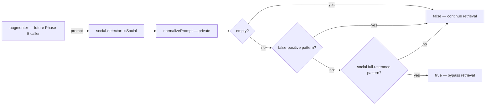

# Social Detector Design

## Architectural Reference

- **Farol node**: `social-detector` — the existing product-layer component described as the regex bypass guard.
- **Existing farol edge**: `augmenter` → `social-detector` (`scan`, security). This design supplies the callee contract for that edge; the caller-side wiring remains in Phase 5.
- **Boundary for this phase**: implement only the internals of `social-detector` plus its direct unit tests. No new stable ID, component boundary or connection is required, so no architectural discovery is emitted.

**Spec**: `.specs/features/social-detector/spec.md`  
**Status**: Approved for autonomous execution

---

## Chosen Approach

**Recommendation: ordered private regex catalogs around one pure exported function.** Normalize the prompt once, reject explicit false-positive contexts first, then test a curated list of full-utterance social patterns. Any unmatched or ambiguous input returns `false` so the future caller continues retrieval.

The autonomous dispatch removes a user confirmation gate; this option is selected because it directly implements the roadmap's regex and whitelist requirements without dependencies or a new architectural boundary.

### Alternatives Considered

| Approach | Advantages | Disadvantages | Decision |
| --- | --- | --- | --- |
| Ordered `FALSE_POSITIVE_PATTERNS` then `SOCIAL_PATTERNS` | Explicit precedence, independently reviewable rules, straightforward fixture mapping, easy safe extension | More entries than a single expression | **Selected** |
| One monolithic regex with negative lookaheads | Short call site and one regex object | Hard to review, easy to introduce precedence bugs or ReDoS, poor traceability to ≥20 patterns | Rejected |
| Token scoring / intent heuristics | Could recognize more free-form smalltalk | Adds implicit thresholds and behavior beyond the required simple regex detector | Rejected for MVP |

---

## Architecture Overview

The component is a synchronous leaf in the hot path. Internal boxes below are implementation details inside stable ID `social-detector`, not new farol components.



### Decision Flow

1. Normalize the input with Unicode NFC, outer trim, whitespace collapse, lowercase conversion, and removal of allowed terminal punctuation only.
2. Return `false` if normalization produces an empty string.
3. Evaluate the private false-positive catalog first; a match returns `false`.
4. Evaluate private, anchored social patterns; a match returns `true`.
5. Default to `false`.

`false` is deliberately fail-open **to retrieval**. The detector only bypasses work when it has a high-confidence full-utterance match.

---

## Code Reuse Analysis

### Existing Components to Leverage

| Component | Location | How to Use |
| --- | --- | --- |
| ESM named-export style | `src/index.ts` | Follow the existing TypeScript ESM and named-function export conventions; do not add a barrel. |
| Native test style | `test/smoke.test.mjs` | Use `node:test` plus `node:assert/strict` in an `.mjs` test file. |
| Test and type gates | `package.json` | Reuse `npm test` (`node --test`) and `npm run typecheck` (`tsc --noEmit`). |
| Strict compiler contract | `tsconfig.json` | Keep the implementation valid under strict mode and `noUncheckedIndexedAccess`; no config change is needed. |

There is no neighboring detector or regex utility to reuse. Introducing a shared abstraction for one feature would add a boundary without evidence.

### Integration Points

| System | Integration Method |
| --- | --- |
| Future `augmenter` | Direct synchronous call to `isSocial(prompt)`. `true` means skip skill retrieval; `false` means continue. Actual caller wiring is Phase 5. |
| Unit test runner | `test/social-detector.test.mjs` imports `src/social-detector/is-social.ts` directly and asserts spec fixtures. The active Node 22.22.2 runtime was verified to support this erasable TypeScript import. |
| Logging/telemetry | None. Prompt content must not be logged, and the function needs no observability side effect. |

---

## Components

### Public Social Detector

- **Purpose**: Return whether the complete prompt is a supported social utterance.
- **Location**: `src/social-detector/is-social.ts`
- **Interface**:
  - `isSocial(prompt: string): boolean` — synchronous, deterministic, side-effect-free public hook.
- **Dependencies**: Private normalization helper and private regex catalogs in the same file; JavaScript regex/string primitives only.
- **Reuses**: Existing ESM named-export and strict TypeScript conventions.
- **Export policy**: Export only `isSocial`; pattern catalogs and normalization remain private so tests assert behavior rather than implementation structure.

### Prompt Normalization (private)

- **Purpose**: Canonicalize harmless presentation differences while retaining signals that distinguish technical/metalinguistic prompts.
- **Location**: `src/social-detector/is-social.ts`
- **Interface**:
  - `normalizePrompt(prompt: string): string` — internal helper, not exported.
- **Ordered transformations**:
  1. `normalize('NFC')`.
  2. Trim leading/trailing whitespace.
  3. Collapse internal Unicode whitespace runs to one ASCII space.
  4. Lowercase deterministically.
  5. Remove only trailing runs of `.`, `!`, `?`, or `…`, then trim once more.
- **Must preserve**: commas, colons, semicolons, apostrophes inside words, quotes, backticks and emoji. This keeps `thanks, now refactor...` and quoted tokens distinguishable.
- **Accent handling**: do not globally strip diacritics; encode only the required unaccented PT-BR alternatives in the relevant positive regexes.

### Social Pattern Catalog (private)

- **Purpose**: Recognize the 30 positive pattern families in `spec.md`.
- **Location**: `src/social-detector/is-social.ts`
- **Shape**: immutable/read-only module-level `RegExp` collection with at least 20 entries and one spec fixture per supported family.
- **Constraints**:
  - Every positive expression is anchored to the complete normalized prompt (`^...$`).
  - Expressions use Unicode mode and never use stateful `g` or `y` flags.
  - No nested unbounded quantifiers or backtracking-heavy constructs.
  - Combining spelling/gender/accent variants in one family is allowed only when every specified fixture remains covered.

### False-Positive Catalog (private)

- **Purpose**: Force known technical, causal, identifier, translation and mixed-intent contexts to `false` before positive matching.
- **Location**: `src/social-detector/is-social.ts`
- **Shape**: immutable/read-only module-level `RegExp` collection evaluated before `SOCIAL_PATTERNS`.
- **Required context groups**:
  - causal `thanks to ...` usage;
  - social words as verbs, quoted strings, identifiers, commands or translation targets;
  - a social prefix followed by an actionable technical request;
  - prefix collisions such as `how are you handling ...`, `como vai funcionar ...` and `good morning jobs ...`.
- **Constraints**: context expressions may scan within the normalized prompt but must remain linear/safe; they must not mutate regex state.

---

## Data Models

No persisted or transport data model is introduced. The only public contract is:

```typescript
export function isSocial(prompt: string): boolean;
```

Private regex collections are static implementation data, not public models. No SQLite schema, cache key, environment variable or configuration file changes.

---

## Requirement-to-Component Mapping

| Requirement | Design element |
| --- | --- |
| SD-01, SD-02 | Anchored Social Pattern Catalog + `isSocial` positive branch |
| SD-03 | Prompt Normalization + explicit accent alternatives |
| SD-04, SD-05 | False-Positive Catalog evaluated before positive patterns |
| SD-06 | Empty/default branches and safe regex constraints |
| SD-07 | Single public pure function; private immutable internals; no product-domain imports |
| SD-08 | Direct native unit tests, typecheck and native Node coverage gate |

---

## Error Handling Strategy

| Scenario | Handling | Caller impact |
| --- | --- | --- |
| Empty, whitespace-only or punctuation-only string | Return `false` | Retrieval continues. |
| Unmatched, ambiguous or technical string | Return `false` | Retrieval continues; no context is accidentally suppressed. |
| Known false-positive context | Whitelist match returns `false` before social matching | Retrieval continues. |
| Very long valid string | Safe static regexes evaluate and default to `false`; no throw or allocation proportional to pattern count beyond normalized text | Caller receives a normal boolean. |
| Runtime non-string misuse | Outside the typed function contract; HTTP validation belongs to a later boundary | No coercion behavior is promised by this phase. |
| Internal/external dependency failure | Not applicable; the function has no dependency or I/O | No error path. |

No typed error class is needed because valid `string` inputs have a total boolean result and no expected failure state.

---

## Test Design

- **Framework/style**: native `node:test` and `node:assert/strict`, following `test/smoke.test.mjs`.
- **Location**: `test/social-detector.test.mjs`.
- **Subject**: import only the public function from `src/social-detector/is-social.ts`.
- **Behavioral fixtures**:
  - 30 positive rows from the spec;
  - two baseline technical prompts;
  - nine normalization rows;
  - one deterministic/primitive-boolean test;
  - one 100,000-character unmatched-input test;
  - 12 false-positive rows.
- **Visible discrimination**: register each fixture as its own `node:test` test/subtest so the TAP count cannot hide deleted cases.
- **No implementation mirroring**: tests do not import, count or inspect private regex arrays; each expected boolean comes from a named spec fixture.
- **No integration/e2e suite**: the function has no SQLite/ONNX/I/O boundary and the augmenter caller is outside this phase.

The final planned runner count is at least **60 passing tests**: 5 existing smoke tests plus 55 social-detector behavior tests.

---

## Risks & Concerns

| Concern | Location | Impact | Mitigation |
| --- | --- | --- | --- |
| A broad positive regex could classify a technical prompt as social | New `src/social-detector/is-social.ts` | Retrieval is bypassed and relevant context may be lost | Full-utterance anchoring, false-positive precedence, mixed-intent fixtures, and default `false`. |
| Strict patterns produce false negatives for unlisted slang/composite social messages | New `src/social-detector/is-social.ts` | Some harmless prompts still run retrieval | This is the safer failure direction; extend only through new spec fixtures and tests. |
| Unsafe regex growth could create hot-path latency/ReDoS | New `src/social-detector/is-social.ts` | Long prompts could consume excessive CPU | No nested unbounded quantifiers, no dynamic regex construction, long-input behavior test, immutable non-stateful regexes. |
| Only smoke tests exist today | `test/smoke.test.mjs` | There is no neighboring domain-test pattern to copy | Use the documented native framework and spec-driven per-fixture cases; enforce coverage natively. |
| Direct `.ts` import in `.mjs` relies on modern Node 22 type stripping | `package.json` engine range and new test file | Early Node 22 minors may not run the test file although current Node 22.22.2 does | Keep source syntax erasable, run `npm run typecheck`, verify on the active Node LTS. Tightening the global engine range is outside this phase. |
| Quantitative coverage is not exposed as an npm script | `package.json` | `npm test` alone does not enforce the documented 80% threshold | Use the verified native Node 22 coverage flags in the full gate; no dependency or manifest change required. |
| Augmenter does not yet exist | Future `src/augmenter/` | Caller-side integration cannot be exercised now | Deliver and test the clean public hook; Phase 5 owns the existing farol edge's wiring. |

---

## Tech Decisions

| Decision | Choice | Rationale |
| --- | --- | --- |
| Ambiguous-input behavior | Return `false` (continue retrieval) | Prevents false-positive bypass. |
| Match scope | Entire normalized prompt, not token containment | Social words inside technical prompts must not win. |
| Precedence | False-positive catalog before positive catalog | Explicitly satisfies whitelist behavior and future-proofs additions. |
| State | Private immutable regex collections; no `g`/`y` flags | Deterministic and concurrency-safe. |
| Public surface | One named export, no barrel | Clean future augmenter hook and minimal coupling. |
| Dependencies | None | Meets Node-only/self-hosted hot-path constraints and avoids approval. |
| Logging | None | Preserves prompt privacy and function purity. |

All decisions are feature-local implementations of existing project constraints; none establishes a new cross-feature architecture rule requiring an entry in `.specs/STATE.md`.
